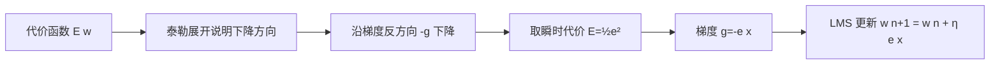

# 从分类到回归与LMS

> 本页属于：CEG5301 / Week 02
> 前置知识：[[CEG5301-讲义与笔记索引]]
> 预计阅读时间：4 分钟

为什么感知机不能做回归：因为硬限幅（hard limiter），感知机输出只能是 `1/0`。要拟合未知的多输入单输出系统，须输出连续值 `y(x)=w1x1+…+wmxm+b`。把硬限幅换成线性函数 `y=v=wᵀx`，就得到**线性神经元**，可用于回归。

**代价函数**：对样本 `(x(i),d(i))`，误差 `e(i)=d(i)−y(i)`，常用代价 `E(w)=Σ e(i)²`。不用 `Σ|e(i)|`，因为绝对值函数**不光滑（不可微）**，不利于梯度优化。

**最速下降（梯度下降）**：对连续可微的 `E(w)`，最优性必要条件为 `∇E(w)=0`，但通常直接求解困难，改用迭代下降 `E(w(n+1))<E(w(n))`。梯度 `∇E` 指向函数上升最快方向，要下降就沿反方向：`Δw(n)=−η·g(n)`，即 `w(n+1)=w(n)−η·g(n)`，其中 `g(n)=∇E(w(n))`、`η>0` 为学习率。用泰勒展开：`E(w(n+1))≈E(w(n))+(Δw)ᵀg(n)=E(w(n))−η‖g(n)‖²<E(w(n))`，故代价确实下降。

**线性最小二乘**：令误差向量 `e=d−Xw`，`X` 是 `n×(m+1)` 的回归矩阵，代价 `E=eᵀe`。用矩阵微积分链式法则：`∂E/∂e=2eᵀ`、`∂e/∂w=−X`，故 `∂E/∂w=−2eᵀX=0`，整理得 `XᵀXw=Xᵀd`。若 `XᵀX` 非奇异，则 `w=(XᵀX)⁻¹Xᵀd`，即标准线性最小二乘解；但样本数 `n` 很大时，`X` 与 `XᵀX` 可能**内存不足**，需要迭代/在线算法。

**LMS 算法**：取**瞬时代价** `E(w)=½e²(n)`，梯度 `g(n)=−e(n)x(n)`，按最速下降更新 `w(n+1)=w(n)+η·e(n)x(n)`。算法：设定学习率 `η`、初始化权重，对每个样本 `i` 计算 `e(i)=d(i)−w(i)ᵀx(i)` 并更新。这是逐样本在线学习，适合大数据。

**感知机 vs LMS**：两者都是基于误差修正（error-correction）学习的单层感知机实现。感知机用**硬限幅**激活函数做分类，LMS 用**线性神经元**做回归，更新式**相同**：`w(n+1)=w(n)+η·e(n)x(n)`。之所以不能对感知机直接做梯度下降，是因为**硬限幅不可微**。

## LMS 手算示例（课件 Two 第 61–64 页）

训练样本 `(x(i), d(i))：{(1,3.5),(1.5,2.5),(3,2),(3.5,1),(4,1)}`。令输入向量含偏置 `x=[1, x₁]`，初始权重 `w(1)=[2,0]`，学习率 `η=0.1`。

第 1 步（样本 `(1,3.5)`）：

- `y = 2×1 + 0×1 = 2`，`e = 3.5−2 = 1.5`
- `w(2) = [2,0] + 0.1×1.5×[1,1] = [2.15, 0.15]`

第 2 步（样本 `(1.5, 2.5)`）：

- `y = 2.15×1 + 0.15×1.5 = 2.375`，`e = 2.5−2.375 = 0.125`
- `w(3) = [2.15, 0.15] + 0.1×0.125×[1,1.5] = [2.1625, 0.16875]`

按此规则跑完 50 个 epoch 后，课件给出 `w'=[3.5654, −0.5309]`，即回归直线约 `y'=3.5654−0.5309x₁`（Two 第 64 页）。

## 感知机 vs LMS 对比表

| 项目 | 感知机 | LMS |
|---|---|---|
| 激活函数 | 硬限幅 | 线性函数 |
| 输出 | 1 或 0 | 连续值 |
| 任务 | 分类 | 回归/拟合 |
| 代价函数 | 无连续代价（硬限幅不可微） | 瞬时 `E=½e²` |
| 更新规则 | `w(n+1)=w(n)+ηe(n)x(n)` | 同左（形式相同） |
| 能用梯度下降推导 | 不能 | 能 |

**对应课件页**：Two 第 58–60、65–67 页；为什么不能用梯度下降推导感知机：硬限幅不可微（第 60 页）。

## 最速下降 → LMS 流程

> 图注：自绘，依据 CEG5301_Two 第 43–50、58–60 页；核对 2026-09-07。

第 3 步（样本 `(3,2)`）：`y = 2.1625×1 + 0.16875×3 = 2.66875`，`e = 2−2.66875 = −0.66875`；`w(4) = [2.1625,0.16875] + 0.1×(−0.66875)×[1,3] = [2.095625, −0.031875]`。可见误差时而为正时而为负，权重随之来回调整。

### 权重依赖

`wᵢ(n+1)=wᵢ(n)+ηe(n)xᵢ(n)`：每个权重的调整只依赖该权重所连的**输入神经元** `xᵢ` 与**输出神经元**的信息；方向沿输入向量，大小由输出误差 `e` 控制（Two 第 66 页）。

## 下一步

- 上一页：[[CEG5301-Week02-感知机学习算法与收敛]]
- 下一页：[[CEG5301-Week03-从感知机到MLP与XOR]]
- 返回：[[Home]]

## 来源与更新日志

- 来源：[CEG5301_Two.pdf](https://github.com/Kytolly/NUS-coursework-wiki/releases/download/CEG5301/CEG5301_Two.pdf)，slide 42–67。
- 2026-09-07：从 Week 2 课件拆出该主题短页。
- 2026-09-07：补齐正文至约 700–1000 字；新增 LMS 手算示例（Two 第 61–64 页）、感知机 vs LMS 对比表，并加入最速下降→LMS Mermaid 流程图。
