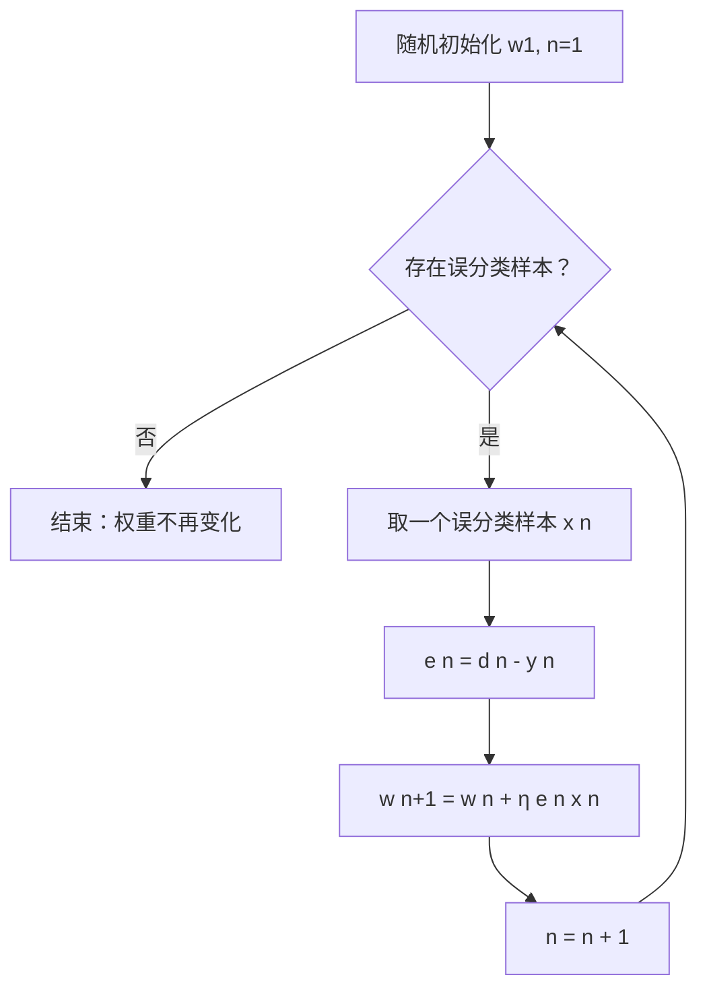

# 感知机学习算法与收敛

> 本页属于：CEG5301 / Week 02
> 前置知识：[[CEG5301-讲义与笔记索引]]
> 预计阅读时间：4 分钟

动机：若两类**线性可分**，则必存在权向量 $\mathbf{w}_0$ 使 C1 样本满足 $\mathbf{w}_0^T \mathbf{x} > 0$、C2 样本满足 $\mathbf{w}_0^T \mathbf{x} < 0$。训练问题就是找到这样一个 $\mathbf{w}$，可“试错”逐步逼近。

逐步推导：喂入样本 $\mathbf{x}$，感知机经硬限幅输出 $y \in \{0, 1\}$。**Case A**：$v = \mathbf{w}^T \mathbf{x} < 0$、$y=0$，但期望 $d=1$，需要**增大** $v$。最简单取 $\Delta \mathbf{w} = \eta \mathbf{x}$（$\eta > 0$），则 $\Delta \mathbf{w}^T \mathbf{x} = \eta \mathbf{x}^T \mathbf{x} > 0$，更新 $\mathbf{w}' = \mathbf{w} + \eta \mathbf{x}$。**Case B**：$v > 0$、$y=1$，期望 $d=0$，需要**减小** $v$，取 $\Delta \mathbf{w} = -\eta \mathbf{x}$，更新 $\mathbf{w}' = \mathbf{w} - \eta \mathbf{x}$。分类正确时（$e=0$）不更新——“没坏就不修”。

用**误差信号** $e(n) = d(n) - y(n)$ 可把两条规则统一成一条：

$$
\mathbf{w}(n+1) = \mathbf{w}(n) + \eta e(n) \mathbf{x}(n)
$$

算法步骤：随机取初始权重 $\mathbf{w}(1)$；只要存在被误分类的输入，就挑一个样本 $\mathbf{x}(n)$，计算 $e(n) = d(n) - y(n)$ 并更新权重；直到没有误分类样本为止。

**收敛定理（Rosenblatt, 1962）**：若两类线性可分，感知机训练算法在**有限步内收敛**——权重不再变化，且正确分类训练集全部元素。证明思路（可选）：对 $\|\mathbf{w}(n)\|$ 同时找上下界。**下界**：把 $\mathbf{w}(n)$ 投影到 $\mathbf{w}_0$ 方向，用 Cauchy–Schwarz 得 $\|\mathbf{w}(n+1)\| \ge \frac{n\alpha}{\|\mathbf{w}_0\|}$（$\alpha = \min |\mathbf{w}_0^T \mathbf{x}|$）。**上界**：每次更新都有 $e(n)\mathbf{w}^T(n)\mathbf{x}(n) \le 0$，故 $\|\mathbf{w}(n+1)\|^2 - \|\mathbf{w}(n)\|^2 \le \|\mathbf{x}(n)\|^2$，即 $\|\mathbf{w}(n+1)\|^2 \le n\beta$（$\beta = \max \|\mathbf{x}\|^2$）。合并两界得：

$$
\frac{n^2 \alpha^2}{\|\mathbf{w}_0\|^2} \le \|\mathbf{w}(n+1)\|^2 \le n\beta
$$

当 $n \to \infty$ 时不可能成立，所以权重必在有限步停止变化。

实际问题：若两类**非线性可分**，感知机会不断更新、不收敛；可借此判断可分性——权重收敛则可分，不停止则不可分。初始权重**随机**即可。学习率 $\eta$：理论上任意正值都收敛，但影响速度；太大可能单次更新过度、破坏已学内容甚至不收敛，太小则学习缓慢，**取中间值最佳**。

## 两种更新情形表

| 情形 | 当前输出 | 期望 $d$ | $e=d-y$ | 权重更新 $\Delta \mathbf{w}$ |
|---|---|---|---|---|
| A：要增大 $v$ | $v<0, y=0$ | 1 | +1 | $+\eta \mathbf{x}$ |
| B：要减小 $v$ | $v>0, y=1$ | 0 | −1 | $-\eta \mathbf{x}$ |
| 分类正确 | 与 $d$ 一致 | — | 0 | 不更新（“没坏就不修”） |

**对应课件页**：Two 第 28–31 页（两种情形的逐步推导）、第 31–32 页（用误差信号统一）。

## 手算一步：单样本误差修正

设输入含偏置 $\mathbf{x} = [1, x_1, x_2]^T$，初始 $\mathbf{w}(1) = [0,0,0]^T$，$\eta = 0.1$，样本 $\mathbf{x} = [1, 0.5, 0.5]^T$、期望 $d=1$（Two 第 32 页算法）：

- 前向：$v = \mathbf{w}^T(1) \mathbf{x} = 0$，$y=0$（误分类）。
- 误差：$e = d - y = 1$。
- 更新：$\mathbf{w}(2) = \mathbf{w}(1) + \eta e \mathbf{x} = [0,0,0]^T + 0.1 \times 1 \times [1, 0.5, 0.5]^T = [0.1, 0.05, 0.05]^T$。
- 再算：$v = 0.1 \times 1 + 0.05 \times 0.5 + 0.05 \times 0.5 = 0.15 > 0 \implies y=1$，该样本被正确分类。

可见只一次更新就把误分类点“拉”到正确一侧；多轮后权重不再变化即收敛。

## 算法流程图

> 图注：自绘，依据 CEG5301_Two 第 27–32、34–38 页；核对 2026-09-07。

## 学习率与收敛性补充

$\eta$ 理论上可取任意正值（线性可分时都收敛），但影响速度与稳定性：$\eta$ 太大会单次更新过度、破坏已学内容甚至不稳定；$\eta$ 太小则收敛慢（Two 第 40–41 页）。另外，若两类非线性可分，感知机将**永不停止更新**，故可把“是否停止更新”当作线性可分性的判别工具（第 39 页）。

再补一步：上例中 $\mathbf{w}(2) = [0.1, 0.05, 0.05]^T$ 已把样本 $(1, 0.5, 0.5)$ 分对；继续用同一 epoch 的其它样本，权重会继续微调，直到整个训练集不再有误分类样本为止。

## 下一步

- 上一页：[[CEG5301-Week02-感知机模型与决策边界]]
- 下一页：[[CEG5301-Week02-从分类到回归与LMS]]
- 返回：[[Home]]

## 来源与更新日志

- 来源：[CEG5301_Two.pdf](https://github.com/Kytolly/NUS-coursework-wiki/releases/download/CEG5301/CEG5301_Two.pdf)，slide 27–41。
- 2026-09-07：从 Week 2 课件拆出该主题短页。
- 2026-09-07：补齐正文至约 700–1000 字；新增两种更新情形表、单样本误差修正手算，并加入感知机学习算法 Mermaid 流程图。
