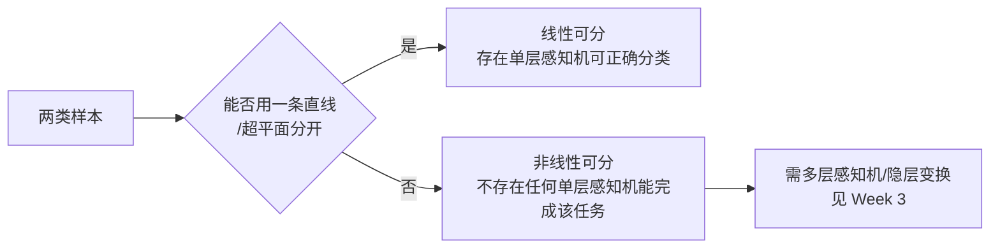

# 感知机模型与决策边界

> 本页属于：CEG5301 / Week 02
> 前置知识：[[CEG5301-讲义与笔记索引]]
> 预计阅读时间：3 分钟

神经网络靠“学习”获得知识，并把知识存进突触权重。学习分三类：**有监督**（教师给出期望输出，用**误差信号**调权重）、**强化**（用动作与环境的交互获得奖励/惩罚，无显式误差信号）、**无监督/自组织**（只依输入信号调整权重，可做聚类）。本课程会学到全部三种；感知机是最简单的网络，使用有监督的误差修正学习。

感知机模型的目标：把输入 $\mathbf{x}(n)=(x_1,\dots,x_m)^T$ 分为两类 $C_1 / C_2$。把偏置并入权重，令 $\mathbf{w}=(w_0,w_1,\dots,w_m)^T$、$x_0=+1$，则**诱导局部场**为：

$$
v(n) = \sum_{i=1}^m w_i x_i + b = \sum_{i=0}^m w_i x_i = \mathbf{w}^T \mathbf{x}
$$

输出经硬限幅：$v>0 \to C_1$（$y=1$），$v<0 \to C_2$（$y=0$）。类比：$v$ 是一张“打分”，正负号决定归哪一类。

**决策边界**是 $\mathbf{w}^T \mathbf{x}=0$。当输入维数 $m=1, 2, 3, m$ 时分别是：点、直线、平面、超平面。关键限制：单层感知机只能产生**线性边界**，不能产生非线性曲线；但给定一个超平面方程，总能构造出对应的感知机。

如何选权重有两条路。一是**离线计算**（问题简单时）：例如 NAND 门，三点 $(0,0),(0,1),(1,0)$ 归输出 1、$(1,1)$ 归 0，直线 $-x_1-x_2+1.5=0$，取 $\mathbf{w}=(1.5,-1,-1)^T$ 即可；该决策线**不唯一**。二是**学习**：从训练输入-输出对自动确定权重，这是机器学习唯一的核心问题。

两类能被一条线（高维为平面/超平面）分开，就称**线性可分**；若不可分，则**不存在**任何单层感知机完成该分类。实际输入维度常很高，例如 100×100 的图像就是 10000 维，4 维以上难以直接可视化，需要感知机学习算法来在高维空间找决策边界。

## 决策边界维度表

| 输入维数 $m$ | 决策边界形状 | 方程 |
|---|---|---|
| 1 | 点（在线上的一个点） | $w_1 x_1 + b = 0$ |
| 2 | 直线 | $w_1 x_1 + w_2 x_2 + b = 0$ |
| 3 | 平面 | $w_1 x_1 + w_2 x_2 + w_3 x_3 + b = 0$ |
| $m$ | 超平面 | $w_0 + w_1 x_1 + \dots + w_m x_m = 0$ |

**对应课件页**：Two 第 15–16 页（m=1/2/3/m 的几何形状）、第 25–26 页（高维超平面）。

## NAND 数值验证

取 $\mathbf{w}=(1.5,-1,-1)^T$，即 $b=1.5$、$w_1=-1$、$w_2=-1$，则 $v=\mathbf{w}^T \mathbf{x}=1.5-x_1-x_2$（Two 第 19–20 页）：

| $x_1$ | $x_2$ | $v$ | $y$ | 期望 |
|---|---|---|---|---|
| 0 | 0 | 1.5 | 1 | 1 |
| 0 | 1 | 0.5 | 1 | 1 |
| 1 | 0 | 0.5 | 1 | 1 |
| 1 | 1 | −0.5 | 0 | 0 |

可见该权重完美实现 NAND；但决策线不唯一（整体缩放或适当平移仍是合法解）。

## 线性可分与不可分

> 图注：自绘，依据 CEG5301_Two 第 22–24 页、CEG5301_Three 第 13–17 页；核对 2026-09-07。

## 高维输入与学习需求

实际应用中输入维数很高，例如 100×100 的灰度图像就是 10000 维；4 维及以上很难直接画出并目测决策超平面（Two 第 25–26 页）。此时无法靠“手画直线”离线选权重，只能交给感知机学习算法，从训练样本自动在高维超平面上找边界（Two 第 26 页）。

## 下一步

- 上一页：[[CEG5301-Week01-激活函数与网络结构]]
- 下一页：[[CEG5301-Week02-感知机学习算法与收敛]]
- 返回：[[Home]]

## 来源与更新日志

- 来源：[CEG5301_Two.pdf](https://github.com/Kytolly/NUS-coursework-wiki/releases/download/CEG5301/CEG5301_Two.pdf)，slide 7–26。
- 2026-09-07：从 Week 2 课件拆出该主题短页。
- 2026-09-07：补齐正文至约 700–1000 字；新增决策边界维度表、NAND 数值验证，并加入线性可分判定 Mermaid 图。
