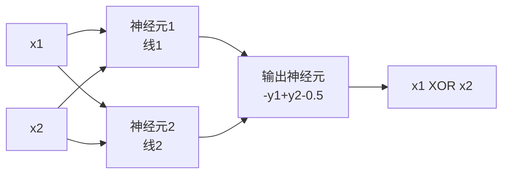

# 从感知机到MLP与XOR

> 本页属于：CEG5301 / Week 03
> 前置知识：[[CEG5301-讲义与笔记索引]]
> 预计阅读时间：2 分钟

单层感知机对**模式识别**只能产生一条**超平面**决策边界（$\mathbf{w}^T \mathbf{x} = 0$），因此要求数据**线性可分**；对**回归**则要求过程接近**线性模型**。这就是它的根本局限。

XOR 真值表中，输出为 0 的两点 $(0,0)$、$(1,1)$ 与输出为 1 的两点 $(0,1)$、$(1,0)$ 无法用一条直线分开，必须用两条：$x_1 + x_2 - 0.5 = 0$ 与 $x_1 + x_2 - 1.5 = 0$。用两个感知机分别实现这两条线，得到隐层输出 $y_1, y_2$；在 $(y_1, y_2)$ 空间中两类变得线性可分，可由输出神经元用 $-y_1 + y_2 - 0.5 = 0$ 分开。

关键思想是：**隐层把输入变换到另一个特征空间，使原本非线性可分的问题在新空间中线性可分**，再由输出层分类。这正是引入**隐层 + 非线性激活**的价值。MLP 是单层感知机的推广，由输入层、一个或多个**隐层**计算节点、输出层组成，一般采用**平滑非线性激活**，如逻辑函数 $y_j = \varphi(v_j) = \frac{1}{1 + e^{-v_j}}$。若所有神经元都是线性的，MLP 与单层感知机没有区别，因此非线性激活不可或缺。

## XOR 真值表与隐层输出

| $x_1$ | $x_2$ | $y_1$（线1：$x_1+x_2-0.5=0$） | $y_2$（线2：$x_1+x_2-1.5=0$） | 隐层空间 $(y_1,y_2)$ | 期望 XOR |
|---|---|---|---|---|---|
| 0 | 0 | 0 | 0 | (0,0) | 0 |
| 0 | 1 | 0 | 1 | (0,1) | 1 |
| 1 | 0 | 0 | 1 | (0,1) | 1 |
| 1 | 1 | 1 | 1 | (1,1) | 0 |

在隐层输出空间 $(y_1,y_2)$ 中，两类可由直线 $-y_1+y_2-0.5=0$ 分开，因此输出神经元只需一个线性/阶跃组合即可（Three 第 14–17 页）。

## XOR 网络结构图

> 图注：自绘，依据 CEG5301_Three 第 15–17 页；核对 2026-09-07。

## 为什么必须引入非线性激活

若网络中所有神经元都是**线性**的，则无论叠加多少层，整体都等价于一个单层线性感知机（Three 第 19 页）。引入非线性（如逻辑函数 $y_j = \frac{1}{1+e^{-v_j}}$）后，隐层能把原空间映射到新的特征空间，使原本非线性可分的问题在新空间中线性可分——这正是 MLP 的核心。

## 为什么 XOR 曾“杀死”感知机

1969 年 Minsky 与 Papert 证明单层感知机无法解决 XOR，曾导致神经网络进入近十年的“黑暗时代”（见 [[CEG5301-Week01-为什么需要神经网络]]）。XOR 的意义在于揭示：只靠一条线性超平面远远不够，必须引入**隐层 + 非线性激活**。

## 层数与推广

该 XOR 网络含**一个隐层 + 一个输出层**；由于输入层源节点不参与计算，按课件“只数计算节点层”的约定，它是一个 **2 层**前馈网络（Three 第 17 页）。推广到一般 MLP：输入层、一个或多个**隐层**、输出层；隐层数由目标函数可分解的层级数决定（详见 [[CEG5301-Week04-隐层设计与选择]]）。

## 下一步

- 上一页：[[CEG5301-Week02-从分类到回归与LMS]]
- 下一页：[[CEG5301-Week03-反向传播算法]]
- 返回：[[Home]]

## 来源与更新日志

- 来源：[CEG5301_Three.pdf](https://github.com/Kytolly/NUS-coursework-wiki/releases/download/CEG5301/CEG5301_Three.pdf)，slide 4–19。
- 2026-09-07：从 Week 3 课件拆出该主题短页。
- 2026-09-07：补齐正文至约 700–1000 字；新增 XOR 真值表（含隐层输出验证）、XOR 网络结构 Mermaid 图，并强调非线性激活的必要性。
