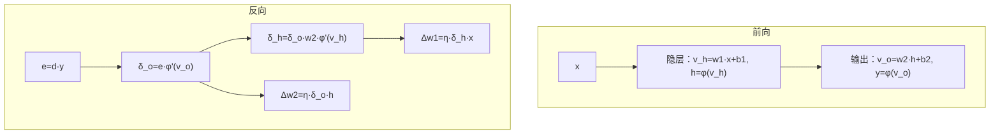

# 反向传播算法

> 本页属于：CEG5301 / Week 03
> 前置知识：[[CEG5301-讲义与笔记索引]]
> 预计阅读时间：3 分钟

反向传播（Back-Propagation, BP）用于训练三层 MLP（一个输出层 + 两个隐层）。对第 q 个输入模式，代价函数取输出误差平方和：

```
E = ½ Σ_j (d_qj − x_out,j^(3))² = ½ Σ_j e_qj²
```

权重更新与 LMS 同源：`Δw_ji^(s) = −η ∂E/∂w_ji^(s)`（`s = 1,2,3` 为层号）。

链式法则用于逐层展开代价对权重的依赖：`∂f/∂t = (∂f/∂x)(∂x/∂t) + (∂f/∂y)(∂y/∂t)`。

输出层的局部误差为 `δ_j^(3) = e_qj φ'(v_j^(3))`，更新式 `Δw_ji^(3) = η δ_j^(3) x_out,i^(2)`。隐层的“期望输出”未知，局部误差须从右侧层**递归估计**：

```
δ_j^(s) = ( Σ_k δ_k^(s+1) w_kj^(s+1) ) φ'(v_j^(s))
```

更新式与输出层同形 `Δw_ji^(s) = η δ_j^(s) x_out,i^(s−1)`，差别只在 `δ` 的来源。

BP 包含两个过程：**前向**逐层计算各神经元输出与误差信号；**反向**从输出层向首个隐层递归计算 δ 并更新权重。之所以叫“反向传播”，正因为误差从输出层传回输入层；它是**梯度下降**的一个特例。

为提速可加**动量项**：

```
Δw_ji(n) = −η ∂E/∂w_ji + α Δw_ji(n−1)
```

`α > 0` 为动量常数（遗忘因子）。连续两次迭代同号时 `Δw` 增大，动量加速稳定下降方向的收敛；异号时 `Δw` 减小，起稳定作用。

停止准则：整训集**均方误差**小于阈值；**epoch 数**达阈值；每 epoch 均方误差的**绝对变化率**足够小；**权重与偏置稳定**（epoch = 完整呈现训练集一遍）。

BP 步骤：① 初始化权重与偏置；② 呈现一个 epoch，逐样本做前向与反向；③ 前向计算误差信号；④ 反向计算 `δ` 并按广义 delta 规则更新权重；⑤ 未满足停止准则则回到 ②③④。

## BP 符号表

| 符号 | 含义 | 课件页 |
|---|---|---|
| d_qj | 第 q 个输入模式下第 j 个输出神经元的期望输出 | Three 第 21 页 |
| x_out^(s) | 网络第 s 层的实际输出 | 第 20–21 页 |
| e_qj | 输出误差 `d_qj − x_out,j^(3)` | 第 21 页 |
| δ_j^(s) | 第 s 层第 j 个神经元的局部误差 | 第 23–26 页 |
| η / α | 学习率 / 动量常数（遗忘因子） | 第 31 页 |
| E | 代价函数 `½ Σ_j e_qj²` | 第 21 页 |

## BP 手算示例（1-1-1 三层网络）

取输入 `x=1`，隐层权重 `w₁=0.5`、偏置 `b₁=0`，输出权重 `w₂=1.0`、偏置 `b₂=0`，激活均为 sigmoid `φ(v)=1/(1+e^{-v})`，`η=0.1`，期望 `d=1`（依据 Three 第 21–26 页公式）：

**前向**：`v_h=0.5×1+0=0.5`，`h=φ(0.5)=0.6225`；`v_o=1.0×0.6225+0=0.6225`，`y=φ(0.6225)=0.6508`；`e=d−y=0.3492`。

**反向**：`δ_o = e·y(1−y)=0.3492×0.6508×0.3492=0.0793`；`δ_h = δ_o·w₂·h(1−h)=0.0793×1.0×0.6225×0.3775=0.0186`。

**更新**：`Δw₂=η·δ_o·h=0.1×0.0793×0.6225=0.00494`，`w₂'≈1.00494`；`Δw₁=η·δ_h·x=0.1×0.0186×1=0.00186`，`w₁'≈0.50186`。

> 图注：自绘（演示算例），依据 CEG5301_Three 第 21–26 页公式；核对 2026-09-07。

## 反向传播信号流图


> 图注：来源 CEG5301_Three.pdf 第 30 页；核对 2026-09-07。

## 前向/反向两趟



> 图注：自绘，依据 CEG5301_Three 第 20–26、30 页；核对 2026-09-07。

## 附：sigmoid 导数与学习率

对逻辑函数 `φ(v)=1/(1+e^{-v})`，有 `φ'(v)=φ(v)(1−φ(v))`，因此输出层与隐层局部误差只需用到 `φ` 与 `1−φ`，计算非常方便（Three 第 21–26 页）。BP 本质是梯度下降：小学习率不易“跳错”但学得很慢；加入动量项 `α·Δw(n−1)` 后，方向一致时加速下降、方向反复时起稳定作用（第 31–32 页）。

## 下一步

- 上一页：[[CEG5301-Week03-从感知机到MLP与XOR]]
- 下一页：[[CEG5301-Week03-MLP能力与局限]]
- 返回：[[Home]]

## 来源与更新日志

- 来源：[CEG5301_Three.pdf](https://github.com/Kytolly/NUS-coursework-wiki/releases/download/CEG5301/CEG5301_Three.pdf)，slide 20–34。
- 2026-09-07：从 Week 3 课件拆出该主题短页。
- 2026-09-07：补齐正文至约 700–1000 字；新增 BP 符号表、1-1-1 网络手算示例、前向/反向两趟 Mermaid 图，并嵌入原图 fig-003（CEG5301_Three 第 30 页）。
