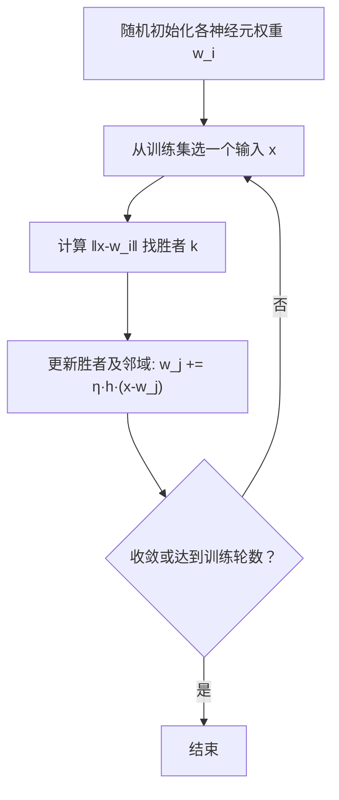

# 自组织映射SOM

> 本页属于：CEG5301 / Week 04
> 前置知识：[[CEG5301-讲义与笔记索引]]
> 预计阅读时间：5 分钟

## 动机：大脑的特征映射

大脑神经元**排列有序**：映射中相邻的区域，对应感觉输入空间或运动输出空间中的相邻区域。SOM 要回答的问题是——这种拓扑组织是否完全由基因决定？它又如何从**学习/自组织**中涌现？

## 结构

SOM 是一个**二维神经元阵列**（lattice）。每个神经元 $j$ 有权重向量 $\mathbf{w}_j = [w_{j1}, \dots, w_{jn}]$，并与网格中所有神经元有加权连接；输入向量 $\mathbf{x} = [x_1, \dots, x_n]$ 连接到所有神经元。

类比：像一张地图，每个格子是一个神经元，权重就是它“记住”的输入。

## 算法概述

① 随机初始化所有权重；② 从训练集选一个输入 $\mathbf{x}$；③ 把 $\mathbf{x}$ 与各神经元权重 $\mathbf{w}_j$ 比较，确定**胜者**；④ 更新胜者及其邻域神经元，使它们更像 $\mathbf{x}$；⑤ 调整学习率与邻域函数；⑥ 重复 ②—⑤ 直到收敛（权重不再明显变化）或达到训练轮数。

## SOM 形成的三个过程

1. **竞争（Competition）**：连续输入空间被映射到离散输出空间，找**最佳匹配神经元**：
   $i(\mathbf{x}) = \arg\min_j \|\mathbf{x} - \mathbf{w}_j\|$
   （欧氏距离最小者获胜）。
2. **合作（Cooperation）**：胜者确定一个**拓扑邻域**中心；神经生物学证据表明，越靠近胜者的神经元受激发越强，因此用随距离衰减的**邻域函数** $h(n)$ 描述相互影响。
3. **自适应（Weight Adaptation）**：
   $\Delta \mathbf{w}_j(n) = \eta(n) h_{j,i(\mathbf{x})}(n) (\mathbf{x} - \mathbf{w}_j(n))$
   胜者权重向量向 $\mathbf{x}$ 移动；邻域内神经元也向 $\mathbf{x}$ 移动，**越远变化越小**。

## 算法总结

对 $n$ 维输入空间、$m$ 个输出神经元：

1. 随机初始化各神经元权重 $\mathbf{w}_i$；
2. **采样**：从训练集选择输入 $\mathbf{x}$；
3. 确定胜者 $k$：$\|\mathbf{w}_k - \mathbf{x}\| = \min_i \|\mathbf{w}_i - \mathbf{x}\|$；
4. 更新胜者邻域内所有权重：$\mathbf{w}_j(n+1) = \mathbf{w}_j(n) + \eta(n) h_{j,k}(n) (\mathbf{x} - \mathbf{w}_j(n))$；
5. 满足收敛判据则停止，否则回到 2。

> SOM **实现简单**，但一般情形下其数学性质**难以分析**。

## 示例：上下文图（Contextual Maps）

Kohonen（2001）把动物名字与属性（大小、2/4 腿、毛、蹄、鬃毛、羽毛、狩猎、跑、飞、游等 0/1 特征）喂给 SOM。训练后**按相似性自动分组**：鸟（鸽、鸡、鸭、鹅、猫头鹰、鹰）聚在一起，哺乳动物（狐、狗、狼、猫、虎、狮、马、斑马、牛）聚在一起——说明 SOM 真能把数据组织起来。

## SOM 结构图

> 图注：来源 CEG5301_Four.pdf 第 57 页；核对 2026-09-07。

## SOM 手算示例（来自课件架构图）

课件以 2 维输入（客户年龄与收入）为例：$\mathbf{x}=[30, 50000]$。初始化一个 $10 \times 10$ 的 SOM（100 个神经元），每个神经元 $j$ 有 2 维权向量，如 $\mathbf{w}_1=[25,65000]$、$\mathbf{w}_2=[45,40000]$、…、$\mathbf{w}_{100}=[35,60000]$（Four 第 57 页）。

**Step 1 找 BMU**：对每个神经元 $j$ 计算 $d_j = \|\mathbf{x} - \mathbf{w}_j\|$，距离最小者（设为神经元 37）即胜者。

**Step 2 更新**：$\mathbf{w}_j^{\text{new}} = \mathbf{w}_j^{\text{old}} + \eta(t) \cdot h(i,\text{BMU},t) \cdot (\mathbf{x} - \mathbf{w}_j^{\text{old}})$，其中 $\eta(t)$ 为学习率、$h$ 为邻域函数（通常高斯）、$\mathbf{x} - \mathbf{w}_j^{\text{old}}$ 为输入与权重的差。胜者与邻域神经元都朝 $\mathbf{x}$ 移动，越远变化越小。

> 图注：自绘（演示），依据 CEG5301_Four 第 57 页；核对 2026-09-07。

## SOM 算法流程

> 图注：自绘，依据 CEG5301_Four 第 56、58、62 页；核对 2026-09-07。

## SOM 与其他网络对比

| 网络 | 学习类型 | 是否需期望输出 | 主要用途 |
|---|---|---|---|
| 感知机 / LMS | 有监督 | 需要 | 分类 / 回归 |
| MLP + BP | 有监督 | 需要 | 分类 / 函数逼近 |
| SOM | 无监督 / 自组织 | 不需要 | 聚类 / 降维 / 特征映射 |

> **Open**：课件未给出邻域函数 $h(t)$ 与学习率 $\eta(t)$ 的具体衰减公式，仅说明常用高斯邻域与随机/序列采样，因此不展开。

## 下一步

- 上一页：[[CEG5301-Week04-泛化过拟合与正则化]]
- 下一页：[[CEG5301-当前进度与待补内容]]
- 返回：[[Home]]

## 来源与更新日志

- 来源：[CEG5301_Four.pdf](https://github.com/Kytolly/NUS-coursework-wiki/releases/download/CEG5301/CEG5301_Four.pdf)，slide 54–64（SOM 动机、结构、算法、示例）。
- 2026-09-07：从 Week 4 课件拆出该主题短页。
- 2026-09-07：补齐正文至约 700–1000 字；新增 SOM 手算示例（X=[30,50000]）、SOM 算法流程 Mermaid 图、SOM 与其他网络对比表，并嵌入原图 fig-004（CEG5301_Four 第 57 页）。
