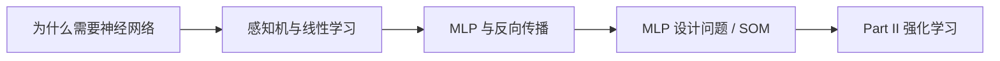
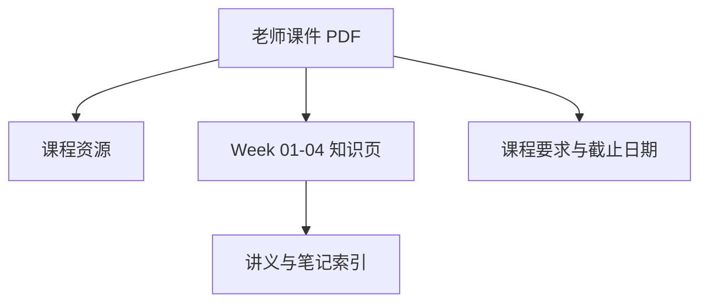

# CEG5301 课程总览

> 本页属于：CEG5301 课程入口
>
> 前置知识：无
>
> 预计阅读时间：5 分钟

## 课程范围

CEG5301 *Machine Learning with Applications*（机器学习及其应用）围绕神经网络基础与强化学习两大块展开。当前 Wiki 覆盖 Part I 的 Week 1–4（截至 2026-09-07），知识点按周拆页，来源以老师课件 PDF 为准，个人双语笔记仅作辅助核对。

| 项目 | 当前状态 |
|---|---|
| 课程进度 | Week 4（Part I） |
| 讲义覆盖 | Week 01–04，已按主题拆页 |
| 课程结构 | Part I：神经网络基础 / Part II：强化学习 |
| 当前 assessment | CA 50% + Final 50% |
| 材料版本 | AY2026/27 |

## 课程结构

- **Part I — Fundamentals of Neural Networks（神经网络基础）**，Prof. Fan Shi，6 周；本批覆盖 Week 1–4。
- **Part II — Reinforcement Learning（强化学习）**，Prof. Zhao Lin，6 周；尚未进入本批。

## 考核与工具

| 项目 | 信息 |
|---|---|
| 总成绩 | CA 50% + Final 50% |
| CA 构成 | 25%：Part I 三次作业；25%：Part II 两次作业 |
| Final | 50%，期末考试 |
| 仿真工具 | Python 深度学习框架（如 PyTorch），或 MATLAB Deep Learning Toolbox |
| 参考资料 | 例如 *Probabilistic Artificial Intelligence*（Krause & Hübotter，arXiv:2502.05244） |

## 课程主线

图 1：CEG5301 Part I 四讲主线（自制，依据课件整理；2026-09-07）。

## 资料与页面关系

图 2：CEG5301 页面关系（自制；2026-09-07）。

## 快速入口

- [[CEG5301-课程资源总览]]：老师课件、个人笔记入口。
- [[CEG5301-课程要求与截止日期]]：考核构成与开放问题。
- [[CEG5301-讲义与笔记索引]]：以课件为准的 Week 01–04 主题拆分页。
- [[CEG5301-当前进度与待补内容]]：已完成、待补内容与开放问题。

## 来源

- 课件目录：[CEG5301 Assets Release](https://github.com/Kytolly/NUS-coursework-wiki/releases/tag/CEG5301)（Part I Week 1–4 课件 PDF 原件）。
- 个人笔记：[CEG5301 Assets Release](https://github.com/Kytolly/NUS-coursework-wiki/releases/tag/CEG5301)（双语 week-01–04 笔记，仅作参考）。
- 核对日期：2026-09-07（按所给课件与笔记整理）。

## 下一步

- 上一页：[[Home]]
- 下一页：[[CEG5301-课程资源总览]]
- 返回：[[Home]]

## 更新日志

- 2026-09-07：建立课程入口，覆盖 Part I Week 1–4 并记录当前状态。
