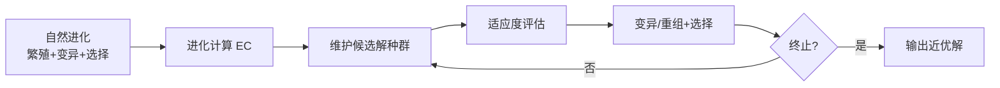
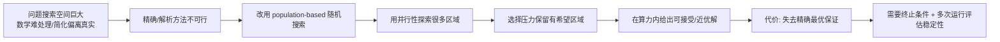

# 进化计算导论

> 本页属于：CEG5302 / Lecture 01
>
> 前置知识：[[CEG5302-Lecture-Index]]
>
> 预计阅读时间：9 分钟

## 🎯 学习目标（Learning Objectives）

学完本页，你应该能：

1. 用自己的话说明「进化计算（EC）是什么、它解决哪一类问题、为什么不用精确方法」。
2. 说清 EC 的历史谱系：Turing 的“genetical or evolutionary search”预言 → Rechenberg(ES)/Fogel(EP)/Holland(GA)/Koza(GP) → Differential Evolution。
3. 解释「种群+变异/重组+选择」这一统一框架，并把它映射到自然进化的三要素。
4. 判断一个问题是否适合用 EC（大搜索空间、可接受近似解、建模困难、多参数/多目标等）。
5. 理解 exploration ↔ exploitation 的权衡及其后果（premature convergence vs 运行变慢）。

## 什么是进化计算

进化计算（Evolutionary Computation, EC）是一类受自然进化启发的搜索与优化算法。它不直接构造单个解，而是维护一组候选解（population），通过反复评估、选择和变异/重组逐步改善群体。EC 的目标通常是复杂搜索空间中的高质量、可接受或近似最优解，不保证每次都找到精确的全局最优解。（Lecture 1, slides 14, 21, 34–36, 68–69）

## 历史先驱

📘 Source：课件把 EC 的历史分成两段来讲述——**一位“预言的先驱”（Alan Turing）**，以及**四类公认的算法开山之作**。（Lecture 1, slides 11–12, 69）

### Alan Turing：提前预言“进化式搜索”

Alan Turing（1912–1954）是 AI 与现代计算机科学的奠基人，British mathematician / computer scientist / philosopher / codebreaker（二战）。课件特别指出：他提出了 **Turing Test** 来评估机器智能，并**引入了“genetical or evolutionary search”这一概念**，从而**预见到了现代进化计算**。（Lecture 1, slide 11）

💡 Interpretation：在 1950 年前后（Holland 的 GA 还要等 20 多年），Turing 已经意识到「算法的核心不一定是直接设计解，而是**让一组候选结构在某种选择压力下演化**」。这为后来 EC 把算法当作“搜索过程”而非“一步求解”埋下伏笔。

### 四类经典算法（+Evolutionary Strategies）

| 先驱 | 提出者（年份） | 一句话定位 |
|---|---|---|
| Evolutionary Strategies（进化策略） | Rechenberg（1964） | 主要用 mutation（自适应的 $\sigma$）做实值搜索 |
| Evolutionary Programming（进化规划） | Fogel 等（1965） | 主要靠 mutation，不用 recombination |
| Genetic Algorithms（遗传算法） | Holland（1975） | bit-string + crossover + mutation + 比例选择 |
| Genetic Programming（遗传规划） | Koza（1992） | 在**树**上演化程序/公式 |

- **历史坡度**：1964/1965/1975/1992 依次出现；1990 年代 EC 领域“bloomed”，出现大量变体与应用。（Lecture 1, slide 12）
- **补充**：Lecture 2 的 EA 家族列表在以上基础上又加入 **Differential Evolution**。（Lecture 2b, slide 12）
- **共同点**：它们的编码方式与算子不同（bit-string / 实数向量 / 树 / 有限状态机），但都遵循「种群 + 变异/重组 + 选择」的进化式搜索逻辑。

> 🔍 Inference：因此学习 EC 时，与其把 GA/ES/EP/GP 当四门独立算法背，不如当成「同一个循环在不同 representation 上的实例化」——这正好是第 3 讲（表示与变异）和第 4 讲（选择）的主线。

## EC 的统一框架

无论具体是 GA、ES、EP 还是 GP，进化计算都共享同一条思路：用「种群 + 变异/重组 + 选择」反复迭代，而不是单点改进。通用伪代码如下（Lecture 2b, slides 29–36 的补充，本页先给概念框架）：

```text
初始化并评估种群 P
while 终止条件未满足:
    按适应度从 P 选父代（进入 mating pool）
    用 recombination/mutation 生成 offspring
    评估 offspring
    从 parents + offspring 中选 survivors 形成下一代
    P = survivors
```

下图给出从「自然进化」到「进化计算」的映射链（自制，依据课件第 17–23、33–36 页；核对 2026-09-07）：



> [!QUESTION] Q-CEG5302-W01-1
> **Context:** EC 是随机搜索家族；它在「什么都可能」的问题上未必优于随机游走（No Free Lunch 定理在第 2、4 周提及）。
> **Question:** 如何为具体问题加入问题知识（memetic GA）以在保持泛化性的同时优于随机搜索？这与“随机搜索平均最优”是否冲突？
> **Status:** Open

## 为什么使用 EC

### 真实问题的性质：为什么经典方法会失效

📘 Source：课件把真实计算问题刻画为三件事（Lecture 1, slide 34）：**① 要在大量可能性中搜索**（例：在成千上万条交易规则中，找一条最能预测金融市场涨跌的规则集）；**② 搜索空间太大，按我们的一生都搜不完**→ 这类问题更适合**并行**处理；**③ 数学上难以处理**。

💡 Interpretation——经典算法方法的两个致命局限（Lecture 1, slide 34）：

- **经典方法常常无法触及真正的原始问题**（“classic methods often fail to address the real problem at hand”）；
- **为迁就算法而做的简化，会得到“正确问题”的“正确答案”，但那个问题并不是真实问题**——课件原话为 **“Simplification leads to the right answer to the wrong problem.”**

> 📘 这正是用 EC 的根本动机：当**为了能用解析/精确方法而被迫简化问题、导致答案偏离真实问题**时，EC 愿意保留问题原来的复杂面貌，用“搜索”去换“更贴近真实”。

### 为什么“进化”会成为好的问题求解模型

📘 Source（Lecture 1, slides 35（“Why Evolution Proves to be a Good Model”）、21、69）：

1. **进化本质上是一种从大量可能性中找“最优/近优”解的搜索方法**；
2. **进化是并行的**——无数物种、个体同时被测试与改变（对应 EA 的 population 并行探索）；
3. **进化能在变化的环境中设计出新奇解**（对应 adaptive landscape 与 anytime 行为）；
4. 关键思想是：**“Instead of designing the solution directly, we let solutions evolve.”**——我们不是去“设计解”，而是让解在种群中演化出来。

### 因果链：EC 的代价与理由



**图：为什么用 EC（自制，依据 Lecture 1 slides 34–36、Lecture 2a slides 39,44；核对 2026-09-09）。** 关键因果：**并不是** EC 一定优于精确法，而是**当精确法不可行/被简化扭曲**时，EC 用“并行探索 + 选择压力 + 可接受的近优解”换取“能真正处理原始问题”。

### EC 与随机搜索、与专用算法的关系（全局性能）

📘 Source（Lecture 2b, slides 71–72）：

- **EAs 通常优于无引导的 random search**；但**针对特定问题专门设计的算法可以做得更好**，只是只能用于它设计的那类问题。
- **No Free Lunch（无免费午餐）**：不存在一个 black-box 算法，能在“所有问题”上平均优于 random walk。所以“EAs 优于 random search”不能无条件成立。
- **解决方案——Memetic GA**：把**问题特有知识（problem-specific knowledge）**嵌入 EA，使其在**特定问题**上优于 random search；代价是只适用于该问题。

> 🔍 这解释了为什么 EC 开篇反复强调“先确认问题 formulation 与 evidence 是否支持用 EC”，而不是“有现成实现就直接套用”。

进化与优化之间的隐喻映射（Lecture 1, slide 21; Lecture 2a, slide 43）：

| 自然进化 | 计算问题求解 |
|---|---|
| Environment（环境） | Problem（问题） |
| Individual（个体） | Candidate solution（候选解） |
| Fitness（适应度） | Quality of solution（解质量） |

### 探索与开发的平衡

EC 在运行中同时进行**探索（exploration，尝试新区域）**与**开发（exploitation，深挖有希望区域）**。开发过强会过早陷入局部最优；探索过强会显著拉长运行时间、收敛变慢。（Lecture 1, slides 34–36; Lecture 2a, slides 48–49）

适合优先考虑 EC 的情形包括：

- 搜索空间很大；
- 只需满意的近似解；
- 解法本身尚未明确；
- 多个参数需要同时优化；
- 问题很难数学化描述；
- 多个目标与约束相互作用。

以上是适用性条件，不是 EC 一定优于专用算法的证明。

## 核心结论

- EC 以 population 搜索，而不是只沿单一路径搜索。
- Fitness 引导搜索；随机选择与 variation 保留探索能力。
- 最关键的工程设计点是 representation、evaluation、constraints、variation、survivor policy 与 termination。
- EC 用搜索灵活性换取较弱的精确最优保证。
- 使用 EC 之前，先确认问题 formulation 与 evidence 是否支持它，而不是因为有现成实现就直接套用。

## Exam Checklist（考试自查）

- **必须理解**：为什么真实问题会“搜索空间大 / 数学难处理 / 简化会答错”；为什么 EC 用 population + 并行 + 选择压力；exploration↔exploitation 的权衡。
- **必须记忆**：EC 定义；自然进化三要素与计算对应；四类历史先驱（+ Turing 的“genetical or evolutionary search”）；No Free Lunch 的含义；Memetic GA 的作用。
- **了解即可**：Turing Test 的细节、各先驱的算子差异（第 3 讲再展开）。
- **明确 out of scope（课件）**：本讲不要求证明 No Free Lunch；不要求背各 EA 的完整变体清单。

## 下一步

- 上一页：[[CEG5302-Lecture-Index]]
- 下一页：[[CEG5302-Lecture01-Evolution-Metaphor-and-Basic-Cycle]]
- 返回：[[Home]]

## 来源与更新日志

- 来源：[Lecture 1 - Introduction (D Srinivasan) 13Aug26.pdf](https://github.com/Kytolly/NUS-coursework-wiki/releases/download/CEG5302/Lecture.1.-.Introduction.D.Srinivasan.13Aug26.pdf)（扫描版）、[Lecture 2a-Introduction_20Aug2026.pdf](https://github.com/Kytolly/NUS-coursework-wiki/releases/download/CEG5302/Lecture.2a-Introduction_20Aug2026.pdf)，slides 14–36（对应 EC 框架/隐喻），slide 引用以个人笔记 `notes/lecture/lecture-01-introduction-zh.md` 记录为准。
- 2026-09-03：从 Lecture 1 拆出“进化计算导论”短页。
- 2026-09-07：扩写统一框架、伪代码、术语映射表与探索/开发说明，新增 EC 映射链 Mermaid 图。
- 2026-09-09：新增学习目标；历史扩展（Turing 预言 + 1940s 原点 + 各算法定位）；补充“真实问题性质/经典方法局限/进化作为求解模型”的动机与因果链、EC vs 随机搜索 vs 专用算法；新增 Exam Checklist。
