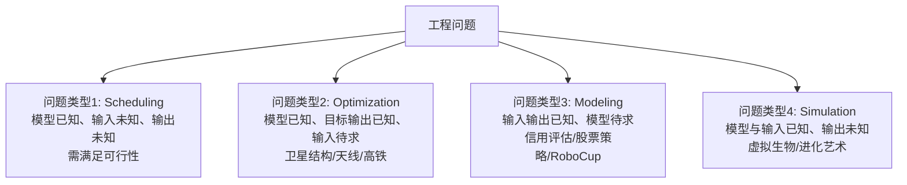

# 四类问题与工程应用

> 本页属于：CEG5302 / Lecture 01
>
> 前置知识：[[CEG5302-Lecture01-Evolution-Metaphor-and-Basic-Cycle]]
>
> 预计阅读时间：12 分钟

## 🎯 学习目标（Learning Objectives）

学完本页，你应该能：

1. 区分四类问题（Scheduling / Optimization / Modeling / Simulation），并说明每一类中 `input / model / output` 哪一格未知。
2. 给每类问题各举 2–3 个课件里的工程例子，并说清“为什么 EA 适合这类问题”。
3. 解释四类问题如何统一到 `input → model → output` 框架以及与 `optimization` 的关系。
4. 说明一个问题的共同结构（representation + objective/fitness + constraints + variation + selection → 一组多样高质量解）。
5. 判断“为什么 EA 往往擅长这类复杂问题”（能同时探索很多解、随时间适应），而不是“保证全局最优”。

## 四类问题

> 📘 Source（Lecture 1, slides 48–66）。这四类可以从 `input → model → output` 里“哪一格未知”来快速区分。

### Problem type 1: Scheduling

**定义**：需要在巨大组合搜索空间里，找到满足**多个竞争性质量指标**且**可行（feasible）**的安排。（Lecture 1, slides 48–50）

- **特点**：搜索空间极大；“好”由多个互相竞争的 criteria 共同定义；schedule 必须可行；**搜索空间中大部分是不可行的**。
- **例子（课件）**：
  - **University timetabling（大学排课）**：Objective = 生成无冲突课表，最大化教室/教师/时段的利用；问题高度受限且组合化，规模变大时传统优化越来越难；EA 能高效探索大量可能课表，找到高质量、可用的解。（slides 48–49）
  - **Airline scheduling（航班调度）**：在机场跑道上给航班排序并安排运行时间，考虑多种运行约束——包括**把不同机队分配给成千上万个航班（connectivity constraints）**、**为每架飞机找航线**、**满足维护要求**、**给每个航班配机组**。（slide 50）
- **💡 为什么 EA 适合**：Scheduling 的可行域可能只占搜索空间很小一部分，而且“好”是多个目标（成本、时间、公平）的权衡——正好是 population-based 并行探索 + constraint handling 能发力的场景。

### Problem type 2: Optimization 与 design

**定义**：**模型已知，目标输出已知，需要反求输入（decision variables）**；即 `input=UNKNOWN, model=KNOWN, output=KNOWN(目标)`。（slides 51–58）

- **例子（课件）**：
  - **Satellite structure（卫星结构，NASA）**：演化出能**最大化振动隔离**的结构设计；`Evolving: design structures`；`Fitness: vibration resistance`；课件称之为“演化式创造力”，并把“人类设计的三维桁架模型”与“EA 演化出的优化模型”对比——**结构拓扑优化**得到更轻、更高效的结构。（slides 52–53）
  - **Antenna design（天线，NASA ST5）**：小卫星天线有极苛刻的辐射方向图要求；这个复杂形状由 EA 找出，**EA 设计胜过人类专家设计**；ST5 于 2006-03-22 成功发射并完成运行期。（slide 54）
  - **High-speed trains（日本高铁）**：目标是在降低阻力和噪声的同时达到最高速度；**个体 = 设计**。课件给出两张列车外形并提问：**“哪一张是由 genetic algorithm 设计的？”**——答案是 **(A) 是 GA 新设计，(B) 是专家旧设计**。（slides 55–57）
  - **Series N700 新干线**：下一代车头由 EA 设计，兼顾 300 km/h 的气动性能与 Series 700 的座位容量、宽敞内饰。（slide 58）
- **💡 为什么 EA 适合**：此类问题 forward model 难以求逆（slide 13），又常是“外形/结构”这类**离散+连续混合、高度非线性**的设计空间；EA 能并行试很多形状并用 fitness 引导，从而发现人类专家没想到的“更优”设计。

### Problem type 3: Modeling

**定义**：**输入、输出已知，模型未知**；需要找到能复现 input→output 行为的函数/规则集/程序。（slides 59–62）

- **例子（课件）**：
  - **Loan applicant credibility（银行贷款申请者信用）**：英国银行用 EC 演化出**信用评估模型**，预测新申请者还款行为；`Evolving: prediction models`；`Fitness: model accuracy on historical data`。（slide 60）
  - **Stock trading algorithms（股票交易算法）**：环境=市场，种群=交易算法；`Individual = Trading Algorithm`；EA 帮助识别最佳买卖点以最大化利润。（slide 61）
  - **RoboCup Soccer game strategies（RoboCup 足球决策策略）**：演化出用于 RoboCup 的**决策系统（规则与策略）**。（slide 62）
- **💡 建模可转成 optimization**：把“模型在历史/已知 data 上的预测误差”当作 objective 去最小化。被进化的 individual 是**模型**，fitness 衡量预测或决策表现。（这为第 2 讲 “Modeling 可转化为 optimization” 及 Li-ion 电池 RC 等效电路参数拟合例子打底。）

### Problem type 4: Simulation 与生成式系统

**定义**：**模型、输入已知，输出未知**——正向计算某个场景下的结果；常用于动态环境下的 “what-if”。（slides 63–66）

- **例子（课件）**：
  - **Karl Sims’ virtual creatures（虚拟生物）**：EA 生成自主的三维虚拟生物，**无需繁琐的用户规格/设计/算法知识**；除了复杂身体，还带有极其复杂的神经网络，能在环境里移动与感知。（slide 64）
  - **Steven Rooke’s evolutionary art**：用 **genetic programming** 演化出“显示图片的程序”。不是写一个显示漂亮图片的程序，而是**演化出能生成图片的程序**；程序越好看，其 fitness 越高；每次运行演化出的图片都不同。（slide 65）
  - **Evolution of computer graphics（计算机图形演化）**：进一步说明“生成式/演化式”系统能产生非人工直接设计的作品。（slide 66）
- **💡 为什么 EA 适合**：当 fitness 无法用解析公式、只能由**人类的审美/偏好**或**仿真器的输出**给出时，EA 依然能把“好坏”变成一个可比较的数值来引导搜索。

### 一个小问题（课件 slide 44 的课堂式提问）

> “为什么 evolutionary algorithms 往往擅长复杂优化问题？”
> A. 它们每次都能保证精确全局最优
> B. **它们能一次探索很多解并随时间适应** ✅
> C. 它们用确定性规则、从而确保收敛
> D. 它们不需要评估解

💡 答案是 **B**：EA 不是保证最优（排除 A），不是纯确定性（排除 C），也一定需要评估解（排除 D）；其优势在于**并行探索 + 随时间适应**。

## 四类问题的统一框架

四类问题都可以放进 `input → model → output` 三角结构（依据课件第 48、51、59、63 页整理；核对 2026-09-07）：



| 问题类型 | 课件页 | 关键特征 | 典型应用 |
|---|---|---|---|
| Scheduling | 48–50 | 搜索空间极大，需多个竞争指标 + 可行性 | 排课、航班调度 |
| Optimization | 51–58 | 给定模型与目标，反求输入 | 卫星/天线/高铁 N700 |
| Modeling | 59–62 | 由输入输出反推模型 | 信用评估、股票、RoboCup |
| Simulation | 63–66 | 由模型+输入推输出（what-if） | 虚拟生物、进化艺术 |

## 工程应用的共同结构

```text
candidate representation
    + objective / fitness
    + feasibility constraints
    + variation and selection
    -> 一组多样且高质量的候选方案
```

课件列举了课表安排、项目分配、交通控制与事故检测、家庭能源调度、可再生能源与储能、EV 充电、市场投标和多目标工程设计。以下是讲师“做过/探索过”的应用，每个都同时给出 **Objective** 与 **为什么用 EA**（Lecture 1, slides 37–45）：

| 应用 | Objective（objective） | 为什么用 EA |
|---|---|---|
| University timetabling | 生成无冲突课表，最大化资源利用 | 高度约束+组合，规模增大后传统优化困难；EA 探索大量可行课表 |
| Project allocation | 按偏好/约束匹配学生与项目 | 组合匹配、多约束 |
| Optimizing traffic signals | 动态调整信号配时，减少拥堵/延误/排放 | 交通模式动态且相互影响，难以手调最优；EA 可自适应复杂交通 |
| Traffic incident detection | 从传感器/摄像头数据快速辨识事故 | 数据噪声、不完整、多变；EA 识别信息模式并优化检测模型 |
| Smart home energy management | 协调家电、EV 充电、储能以省电费、保舒适 | 多柔性负荷在时变电价/可再生/用户偏好下调度 |
| Optimizing renewable power & storage | 决定可再生+储能的规模/布点/运行 | 可再生不确定性、网络约束、需求与储能运行复杂交互；EA 无需简化假设 |
| EV charging strategies | 规划充电时间与地点，降成本、减电网压力 | 数千辆 EV 到达时间/电量/偏好不同；需协调大量充电排程 |
| Optimal bidding（competitive markets） | 在不确定价格/竞争下最大化收益、控风险 | 高度非线性、不确定、战略复杂；EA 探索替代竞价策略 |
| Multi-objective design | 在成本/性能/可靠性/环境间找最优权衡 | 多个冲突目标、单一最优一般不存在；EA 生成多样化 Pareto 最优解 |

对于成本、可靠性、性能、环境影响等互相冲突的目标，合理结果常常是一组 **Pareto trade-off solutions**，而不是一个对所有决策者都最好的解。这与第 2 讲的 multi-objective optimization 呼应（见 [[CEG5302-Lecture02-Problem-Types-and-Single-Objective]] 的姊妹概念，详见 Lecture 2b）。

## Exam Checklist（考试自查）

- **必须理解**：四类问题各自的 `input/model/output` 未知格；为什么 EA 适合 scheduling/optimization/modeling/simulation；为什么答案选“能同时探索很多解并随时间适应”。
- **必须记忆**：每类至少一个代表性例子（排课/航班；NASA 卫星/天线、日本高铁；信贷/股票/RoboCup；虚拟生物/演化艺术）；`input→model→output` 三角。
- **了解即可**：各应用的具体 Objective 描述、N700/ST5 的年份细节。
- **明确 out of scope**：本讲不要求给出具体 schedule/design 的算法实现（第 3 讲表示、第 5 讲约束处理才展开）。

## 下一步

- 上一页：[[CEG5302-Lecture01-Evolution-Metaphor-and-Basic-Cycle]]
- 下一页：[[CEG5302-Lecture02-Problem-Types-and-Single-Objective]]
- 返回：[[Home]]

## 来源与更新日志

- 来源：[Lecture 1 - Introduction (D Srinivasan) 13Aug26.pdf](https://github.com/Kytolly/NUS-coursework-wiki/releases/download/CEG5302/Lecture.1.-.Introduction.D.Srinivasan.13Aug26.pdf)（扫描版），slides 37–66；slide 引用以个人笔记 `notes/lecture/lecture-01-introduction-zh.md` 记录为准。
- 2026-09-03：从 Lecture 1 拆出“四类问题与工程应用”短页。
- 2026-09-07：新增四类问题统一框架 Mermaid 图与问题类型/应用对照表。
- 2026-09-09：新增学习目标；四类问题逐类补齐“定义 + 课件例子细节 + 为什么 EA 适合”；新增 slide 44 课堂式提问解读；“工程应用”扩展为 Objective/缘起列表；新增 Exam Checklist。
