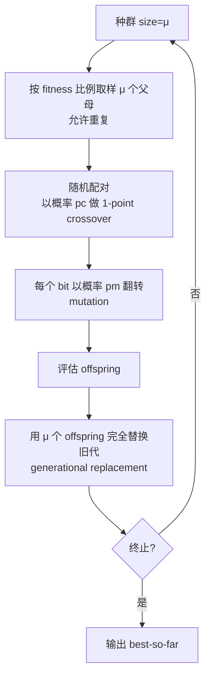

# Canonical GA 与手算示例

> 本页属于：CEG5302 / Lecture 02
>
> 前置知识：[[CEG5302-Lecture02-EA-Seven-Components]]
>
> 预计阅读时间：14 分钟

## 🎯 学习目标（Learning Objectives）

学完本页，你应该能：

1. 默写 Canonical (Simple) GA 的 5 个组件（bit-string、1-point crossover、bit-flip mutation、fitness-proportional selection、generational replacement）。
2. 完整手算 $\max f(x)=x^2, x \in [0,31]$：编码 → FPS 概率/期望次数 → RWS 选出 mating pool → 1-point crossover → mutation → 重评估 → 下一代。
3. 区分“期望选中次数”与“实际选中次数”，并解释为什么单代波动不说明算法失败。
4. 解释 **anytime behavior** 与“早期提高快、后期增量小”给终止条件带来的启示。
5. 理解 No Free Lunch 与 Memetic GA 的含义。

## Canonical genetic algorithm

| 组件 | Canonical choice |
|---|---|
| Representation | bit strings |
| Parent selection | fitness-proportional sampling with replacement |
| Recombination | one-point crossover with probability $p_c$ |
| Mutation | independent bit flip with probability $p_m$ |
| Survivor selection | generational replacement |

（Lecture 2b, slides 53–56）

对 $\mu$ 个个体的 population：先按 fitness-proportional sampling 取出允许重复的 $\mu$ 个 parents，随机配对，按 $p_c$ 进行 crossover，再按 $p_m$ 对每个 bit mutation，最后用 $\mu$ 个 offspring 构成下一代。

Canonical GA 的单代流程（自制，依据课件第 54–57 页；核对 2026-09-07）：



伪代码（依据第 54–56 页整理；核对 2026-09-07）：

```text
P ← 随机初始化 μ 个 5-bit 个体
while 未满足终止条件:
    M ← 依 fitness 比例从 P 取 μ 个（允许重复）
    for each 随机配对 (p1, p2) in M:
        if rand < p_c: offspring ← 单点交叉(p1, p2)
        else:          offspring ← 复制 parent
        for each bit:  if rand < p_m: 翻转该 bit
    下一代 ← 全部 offspring
```

## 手算示例：最大化 $f(x)=x^2$, $x \in [0,31]$

> 🧪 这是全课程最重要的**可跟手算**示例（Lecture 2b, slides 58–66）。目标：**maximise $f(x)=x^2$**，其中 $x$ 是整数、$x \in [0,31]$。

### 第 0 步：编码（representation）

用 **5-bit binary** 把整数 phenotype 映射为 bit-string genotype。$12 \to 01100$，$13 \to 01101$，等等。这样 $[0,31]$ 的每个整数都有唯一 genotype（合法性+完备性）。

### 第 1 步：随机初始 population（4 个个体）

| Genotype | $x$ | Fitness $x^2$ | 选择概率 $p_i=f_i/\sum f$ | 期望次数 $p_i \times 4$ |
|---|---:|---:|---:|---:|
| `01101` | 13 | 169 | $169/1170 \approx 0.144$ | 0.58 |
| `11000` | 24 | 576 | $576/1170 \approx 0.492$ | 1.97 |
| `01000` | 8 | 64 | $64/1170 \approx 0.055$ | 0.22 |
| `10011` | 19 | 361 | $361/1170 \approx 0.309$ | 1.23 |
| **合计** | — | $\sum f = 1170$ | 1.00 | 4.00 |

> 📘 **Fitness-proportional selection**：$p_i = \frac{f(i)}{\sum_{j \in P} f(j)}$。$f$ 越大，被选中概率越高。

### 第 2 步：用“转轮盘”似的比例抽样选出 $\mu=4$ 个 parents（允许重复）

按 $p_i$ 随机抽样一次，得 **mating pool = {个体 1, 个体 2, 个体 2, 个体 4}**。注意这是**一次随机实现**；并不是说它精确等于期望次数。

- **期望次数 ≠ 实际次数**：个体 3 期望 0.22，但这次实际被选 0 次；个体 2 期望 1.97，实际被选 2 次。这只是**抽样方差**，不代表算法出错。

### 第 3 步：随机配对 + 1-point crossover

把 mating pool 随机配对（例如 `(1,2)` 与 `(2,4)`），对每对以概率 $p_c$ 做**单点交叉**（随机选切点，交换尾部）。

**配对 (1,2)**：`01101` × `11000`，切点在第 3 位后（`011|01` 与 `110|00`）→ 交换尾部得
`01100`（$x=12$）与 `11001`（$x=25$）。fitness：144、625。

**配对 (2,4)**：`11000` × `10011`，切点在第 2 位后（`11|000` 与 `10|011`）→
`11011`（$x=27$）与 `10000`（$x=16$）。fitness：729、256。

> 这是课件 slide 65 图示的一种可能 pairing。切点、配对都是随机的，所以不同运行结果不同。

### 第 4 步：mutation（每 bit 以 $p_m$ 翻转）

假设这次随机翻到了两个位：
- 第一个 offspring `01100` → 翻转第 1 位 → `11100`（$x=28, f=676$）
- 第四个 offspring `10000` → 翻转第 4 位 → `10010`（$x=18, f=324$）

另外两个 `11001`、`11011` 未变。**最终下一代 fitness：676, 625, 729, 324**（平均比上一代 169/576/64/361 明显更好）。

### 第 5 步：generational replacement

用这 4 个 offspring **完全替换**上一代（generational replacement），进入下一代。循环直到终止条件。

### 从手算示例提炼的要点

1. **表示是关键**：5-bit 编码把整数 $[0,31]$ 映射为 32 个可搜索的基因型；每个 $x$ 有唯一 genotype，保证合法性与完备性。
2. **FPS 是“比例选择”**：概率 $p_i=f_i/\sum f_j$ 只依赖绝对 fitness 的比值，因此 fitness 相近时选择压力会快速下降（见 [[CEG5302-Lecture02-Problem-Types-and-Single-Objective]] 的优化形式与 [[CEG5302-Lecture04-Population-Models-FPS-and-Ranking]] 的 FPS 讨论）。
3. **变异注入新基因**：crossover 只重组父代已有 bit；若一次 crossover 后 offspring fitness 没提高，小概率的 bit-flip 仍可能把某个位翻到更优值，因此 mutation 对保持搜索多样性不可或缺（见 [[CEG5302-Lecture03-Binary-and-Integer-Representation]]）。
4. **期望次数 vs 实际次数**：$\text{期望次数} = p_i \cdot \mu$，但某一次抽样（mating pool = {1,2,2,4}）只是随机实现，个体 3 被抽 0 次不代表算法失败；**单代样本太小，不足以判断是否收敛**——需要看多代或 diversity/停滞指标。

## EA 行为与限制

（Lecture 2b, slides 67–72）

### 演化的阶段（slides 68–69）

> 📘 **图意**：课件给出两个 fitness landscape 快照——**开始时个体随机散布在整个搜索空间**，**接近结束时聚集到（局部/全局）极大值**。这正是“population-based”与“单点爬山”的区别：它同时到处试，再慢慢收拢。

- 回顾 **exploration vs exploitation**：**太多 exploitation 会找到 local minima；太多 exploration 会不合理地增加运行时间**。

### Anytime behavior（slide 70）

> 📘 **图意**：`Best fitness in population`（纵轴）对 `Time/iterations`（横轴）——**早期快速上升，之后增量变小**。因此**任何时刻停止都能拿到一个（可能次优的）解**（anytime behaviour）。这解释了为什么需要**合适的终止条件**：无限跑下去收益递减。

- 搜索开始时 population 通常分布较广，之后可能聚集到一个或多个 peaks。
- EA 具有 **anytime behavior**：中途停止也能返回 best-so-far，但不一定是最优解。
- 早期 improvement 通常较快，后期逐渐变慢，因此需要预算、停滞和 diversity 相关的 termination。
- 适合的问题上 EA 通常比无引导 random search 更有结构；但针对特定问题设计的算法可能更强。
- **No Free Lunch**：没有 black-box optimizer 能在所有问题上都占优（因此“EAs 通常优于 random search”不能无条件成立）。
- 加入领域知识的 **memetic algorithm** 可改善特定问题表现，但不是普遍保证。

## Exam Checklist（考试自查）

- **必须手算**：$\max x^2, x \in [0,31]$ 的一代——编码、FPS 概率/期望次数、RWS 选 mating pool、1-point crossover、mutation、重评估。
- **必须理解**：为什么“期望次数≠实际次数”；为什么单代波动不代表失败；crossover 只重组已有 bit、mutation 才引入新 bit。
- **必须记忆**：Canonical GA 五个组件；anytime behavior；No Free Lunch；Memetic GA 的作用。
- **了解即可**：RWS 的精确实现（第 4 讲再展开）；切点/配对的具体随机实现。
- **明确 out of scope**：本讲不要求证明 crossover 的收敛性，也不要求比较不同 $p_c/p_m$ 的定量效果。

## 下一步

- 上一页：[[CEG5302-Lecture02-EA-Seven-Components]]
- 下一页：[[CEG5302-Lecture03-Representation-Concepts-and-Criteria]]
- 返回：[[Home]]

## 来源与更新日志

- 来源：[Lecture 2b-EA components_20Aug2026.pdf](https://github.com/Kytolly/NUS-coursework-wiki/releases/download/CEG5302/Lecture.2b-EA.components_20Aug2026.pdf)，slides 53–72。
- 2026-09-03：从 Lecture 2b 拆出“Canonical GA 与手算示例”短页。
- 2026-09-07：新增 Canonical GA 单代流程 Mermaid 图与伪代码，补充期望选中次数说明。
- 2026-09-09：新增学习目标；把“手算示例”扩成 5 步完整可跟手算（编码→FPS 概率/期望次数→RWS→1-point crossover pairing→mutation→重评估）；补充“期望次数 vs 实际次数”、crossover 配对推导（按课件图示反推一种可能）；补充“演化阶段”与“anytime behavior”图意；新增 Exam Checklist。
