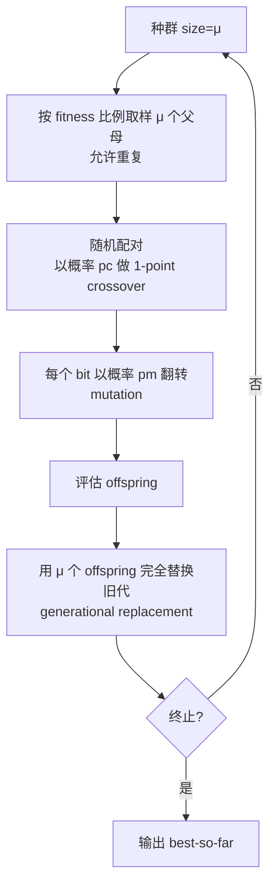

# Canonical GA 与手算示例

> 本页属于：CEG5302 / Lecture 02
>
> 前置知识：[[CEG5302-Lecture02-EA七大组件]]
>
> 预计阅读时间：9 分钟

## Canonical genetic algorithm

| 组件 | Canonical choice |
|---|---|
| Representation | bit strings |
| Parent selection | fitness-proportional sampling with replacement |
| Recombination | one-point crossover with probability `p_c` |
| Mutation | independent bit flip with probability `p_m` |
| Survivor selection | generational replacement |

（Lecture 2b, slides 53–56）

对 `μ` 个个体的 population：先按 fitness-proportional sampling 取出允许重复的 `μ` 个 parents，随机配对，按 `p_c` 进行 crossover，再按 `p_m` 对每个 bit mutation，最后用 `μ` 个 offspring 构成下一代。

Canonical GA 的单代流程（自制，依据课件第 54–57 页；核对 2026-09-07）：



伪代码（依据第 54–56 页整理；核对 2026-09-07）：

```text
P ← 随机初始化 μ 个 5-bit 个体
while 未满足终止条件:
    M ← 依 fitness 比例从 P 取 μ 个（允许重复）
    for each 随机配对 (p1, p2) in M:
        if rand < p_c: offspring ← 单点交叉(p1, p2)
        else:          offspring ← 复制 parent
        for each bit:  if rand < p_m: 翻转该 bit
    下一代 ← 全部 offspring
```

## 手算示例

目标：对整数 `x ∈ [0,31]` 最大化 `f(x)=x^2`，使用 5-bit encoding。（Lecture 2b, slides 58–66）

初始 population：

| Genotype | x | Fitness | 选择概率 | 实际选中次数 |
|---|---:|---:|---:|---:|
| `01101` | 13 | 169 | 0.14 | 1 |
| `11000` | 24 | 576 | 0.49 | 2 |
| `01000` | 8 | 64 | 0.06 | 0 |
| `10011` | 19 | 361 | 0.31 | 1 |

抽到的 mating pool 是 individuals `1,2,2,4`。一种随机 crossover 结果为 `01100, 11001, 11011, 10000`，fitness 为 `144, 625, 729, 256`；之后 mutation 将第一个和第四个字符串变为 `11100` 与 `10100`，最终 fitness 为 `676, 625, 729, 324`。

期望选中次数 = 概率 × 种群大小（4）：个体 1 期望 `0.14×4=0.56`，个体 2 为 `0.49×4=1.96`，个体 3 为 `0.06×4=0.24`，个体 4 为 `0.31×4=1.24`；实际抽样得到 `1,2,2,4` 只是其中的一次随机实现，因此**expected count 不等于 actual count**；一代中个别个体变差不代表算法失败。crossover 后 fitness 提升（144→676、256→324 等），说明“两段较优串的混合 + 少量变异”可以带来整体改善；但单代样本太小，不足以作为是否收敛的判据。（Lecture 2b, slides 64–66）

### 从手算示例提炼的要点

1. **表示是关键**：5-bit 编码把整数 `[0,31]` 映射为 32 个可搜索的基因型；每个 `x` 有唯一 genotype，保证合法性与完备性。
2. **FPS 是“比例选择”**：概率 `p_i=f_i/Σf_j` 只依赖绝对 fitness 的比值，因此 fitness 相近时选择压力会快速下降（见 [[CEG5302-Lecture02-问题类型与单目标优化]] 的优化形式与 [[CEG5302-Lecture04-种群管理模型与FPS及Ranking]] 的 FPS 讨论）。
3. **变异注入新基因**：crossover 只重组父代已有 bit；若一次 crossover 后 offspring fitness 没提高，小概率的 bit-flip 仍可能把某个位翻到更优值，因此 mutation 对保持搜索多样性不可或缺（见 [[CEG5302-Lecture03-Binary与Integer表示]]）。

## EA 行为与限制

（Lecture 2b, slides 67–72）

- 搜索开始时 population 通常分布较广，之后可能聚集到一个或多个 peaks。
- EA 具有 **anytime behavior**：中途停止也能返回 best-so-far，但不一定是最优解。
- 早期 improvement 通常较快，后期逐渐变慢，因此需要预算、停滞和 diversity 相关的 termination。
- 适合的问题上 EA 通常比无引导 random search 更有结构；但针对特定问题设计的算法可能更强。
- **No Free Lunch**：没有 black-box optimizer 能在所有问题上都占优。
- 加入领域知识的 **memetic algorithm** 可改善特定问题表现，但不是普遍保证。

## 下一步

- 上一页：[[CEG5302-Lecture02-EA七大组件]]
- 下一页：[[CEG5302-Lecture03-表示的概念与选择准则]]
- 返回：[[Home]]

## 来源与更新日志

- 来源：[Lecture 2b-EA components_20Aug2026.pdf](https://github.com/Kytolly/NUS-coursework-wiki/releases/download/CEG5302/Lecture.2b-EA.components_20Aug2026.pdf)，slides 53–72。
- 2026-09-03：从 Lecture 2b 拆出“Canonical GA 与手算示例”短页。
- 2026-09-07：新增 Canonical GA 单代流程 Mermaid 图与伪代码，补充期望选中次数说明。
