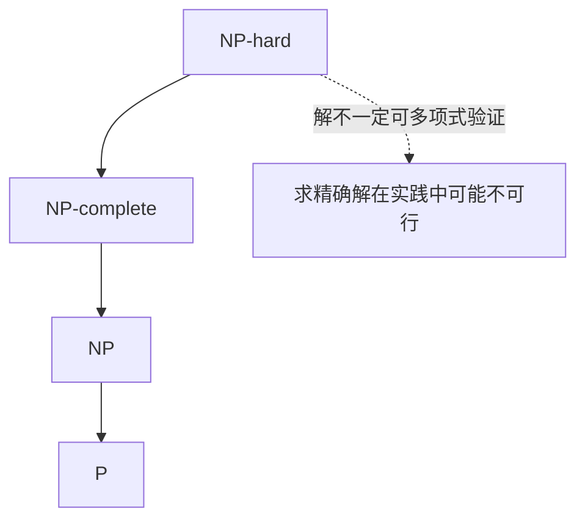

# 计算复杂度与进化计算动机

> 本页属于：CEG5302 / Lecture 02
>
> 前置知识：[[CEG5302-Lecture02-Problem-Types-and-Single-Objective]]
>
> 预计阅读时间：10 分钟

## 🎯 学习目标（Learning Objectives）

学完本页，你应该能：

1. 说清 P/NP/NP-complete/NP-hard 的直觉区别，并解释“为什么工程实践中可能求不出精确最优”。
2. 解释数值优化 vs 组合优化、维度灾难（解数目随变量指数增长）的含义。
3. 区分 heuristic / meta-heuristic / adaptive landscape，并知道 EC 属于 meta-heuristic。
4. 复述“为什么需要 EC”的三类理由，以及“Anything that works, works”背后的对“近优解”的接受。
5. 说明 EC 与 Swarm Intelligence 的共同点（exploration/exploitation）与不同点（跨世代 vs agent foraging）。

## 计算复杂度

课件以高层次方式区分四类问题，工程关注点是“能否在可用时间内找到解”：（Lecture 2a, slides 33–35）

- **P**：可在 polynomial time 求解。
- **NP**：候选解可在 polynomial time 验证。
- **NP-complete**：属于 NP，且所有 NP 问题都可在 polynomial time 归约到它。
- **NP-hard**：至少和 NP-complete 一样难，但解不一定能在 polynomial time 内验证。

课程强调的实际含义是：当组合搜索空间和维度增大时，精确搜索可能在可用时间内不可行（curse of dimensionality）。（Lecture 2a, slides 35–37）

问题类之间的包含关系（依据课件第 34–35 页整理；核对 2026-09-07）：

- **数值优化（numerical optimisation）**：搜索空间由连续变量定义；**组合优化（combinatorial optimisation）**：搜索空间由离散变量（布尔/整数）定义，如 MILP、MINLP。（slide 33）
- **维度灾难（curse of dimensionality）**：变量越多或解空间越大，所需求解器能力越强；**解的数目呈指数增长**（`number of solutions` 随 `number of variables` 爆炸）。（slides 36–37）

> 💡 **图意：`Number of solutions` → `Number of variables` 的指数曲线**意味着：多一个变量，可能就要多扫一个数量级的候选解。这就是为什么“能用多项式算法”在工程上也可能被维度压垮。

### 问题求解的困难维度（slide 37）

课件把“为什么需要好的求解器”归纳为 4 个叠加的困难来源：

1. **巨量搜索空间**（vast search space）；
2. **需要满足 1 或多个约束**；
3. **一个或多个互相冲突的目标**；
4. **目标函数可能有非线性、不连续**（non-linearities, discontinuities）。

> 🔍 这四个维度正好对应后面讲次：1→表示与 landscape（L3）、2→约束处理（L5）、3→多目标/项目（L2b/L6+）、4→实值/排列难度（L3）。

## 相关术语

（Lecture 2a, slides 40–41）

- **Heuristic**：针对特定问题的 trial-and-error 方法，通常是 one-off 算法。
- **Metaheuristic**：可适配多个问题的通用搜索框架，是实现 heuristic 的框架。
- **Adaptive landscape**：solution space 或 objective 随时间/步骤变化的 landscape；当前最优解在若干步后可能不再最优。

三种术语对照（依据课件第 40–43 页整理；核对 2026-09-07）：

| 术语 | 定义 | 组合/框架 |
|---|---|---|
| Heuristic | 针对特定问题的 trial-and-error 方法 | one-off 算法 |
| Meta-heuristic | 问题无关的通用搜索框架 | 实现启发式的框架 |
| EC metaphor | Environment=Problem；Individual=Candidate solution；Fitness=Quality | 自然与搜索的映射 |

## 为什么需要进化计算

（Lecture 2a, slides 39, 43–44）

### 态度转变：接受“更好/近优”

📘 Source（slide 39）：**“We no longer care about ‘optimal’ or ‘perfect solution’. Anything that works, works! Go for ‘better’, ‘near-optimal’.”**

💡 这句话是 EC 的立场分水岭：精确方法追求**“全局最优”**，但在 NP-hard/巨维搜索空间里“全局最优”常常不现实；EC 愿意把目标降级为**“足够好、能用”**，从而换取**在合理时间内找到可接受的解**。

### 三层理由

📘 Source（slides 43–44）：

- **技术需求**：
  1. **自动化问题求解**的需求（随计算机使用与算力增长）；
  2. **问题复杂度增加**；
  3. 需要**更少定制、更通用**的求解器（通用性/泛化）。
- **自然界是最好的求解器之一**：**人脑**以及**创造了人脑的自然进化**，是自然界最强大的问题求解器（“nature’s most powerful problem solvers”），值得模仿。
- **人类好奇心**：对自然进化的好奇，可以用计算机测试关于进化的 what-if 场景（例如**多亲本繁殖 multi-parent reproduction**）。

EC 隐喻的对应关系：（Lecture 2a, slides 42–43）

| 自然进化 | 问题求解 |
|---|---|
| Environment | Problem |
| Individual | Candidate solution |
| Fitness | Quality of solution |

### 历史时间线（slide 45）

- **1940s**：出现初始的 **genetical / evolutionary search** 算法（Turing 的“genetical or evolutionary search”思想萌芽）。
- **1960s**：Evolutionary Programming、Genetic Algorithm、Evolutionary Strategies 被提出。
- **1990s**：Genetic Programming 被提出。

> 🔍 可与 [[CEG5302-Lecture01-Introduction-to-EC]] 的历史表互参：那里讲具体算法/年份，这里讲“三个阶段”。

### EC 如何应对 NP-hard

NP-hard 问题在理论上无法保证在多项式时间内求出精确最优解；EC 的应对思路是把目标从“最优”降级为“更好/近优”：在大搜索空间内用种群并行探索 + 选择压力保留有希望区域，在可用算力内快速给出可接受解（Lecture 2a, slides 39, 44）。代价是不再有精确最优保证，因此需要配合终止条件（如最大 evaluation 数或停滞阈值）来收敛。（见 [[CEG5302-Lecture02-EA-Seven-Components]]）

## EC 与 Swarm Intelligence

Swarm Intelligence（SI）模拟相互作用的同质 agents 及其觅食行为。**Swarm** 是一群“无序运动的个体/对象”，也就是一群**相互作用的同质 agent**；SI 算法模仿这些个体的**觅食行为**，把**食物质量当作搜索空间中的解质量**，从而用来做优化。（Lecture 2a, slides 46–47）

- **例子**：Particle Swarm Optimization（PSO）、Ant Colony Optimization（ACO）、Firefly Algorithm。
- **EC vs SI**（slide 49 的“Courtesy of ChatGPT”对比）：
  - **EC** 更强调**跨世代的继承、变异和选择**（population 演化为子代）；
  - **SI** 更强调**同一群体内 agent 之间的相互作用/觅食**，不强调“世代遗传”。
- **共同点**：两者都需平衡 **exploration**（探索新区域，避免过早收敛）与 **exploitation**（深入利用当前有希望区域）。Exploitation 过多可能陷入 local optimum；exploration 过多会增加运行时间并延迟精炼。（slides 48–49）

> 💡 注意：EC 与 SI 都被课件归入“nature-inspired / meta-heuristic”。本项目（NSGA-II）属于 **EC**（进化算法），而不是 SI。

## Exam Checklist（考试自查）

- **必须理解**：P/NP/NPC/NPH 的直觉差别；维度灾难；heuristic vs meta-heuristic；为什么接受“近优解”；EC vs SI。
- **必须记忆**：`Anything that works, works`；四类困难来源（大空间/约束/冲突目标/非线性不连续）；1940s→1960s→1990s 时间线。
- **了解即可**：NP 类别的正式归约证明、SI 算法的具体细节。
- **明确 out of scope**：本讲不要求严格证明 P⊂NP；不为 EC 的“优于随机搜索”给出严格论证（参见 No Free Lunch 讨论）。

## 下一步

- 上一页：[[CEG5302-Lecture02-Problem-Types-and-Single-Objective]]
- 下一页：[[CEG5302-Lecture02-EA-Seven-Components]]
- 返回：[[Home]]

## 来源与更新日志

- 来源：[Lecture 2a-Introduction_20Aug2026.pdf](https://github.com/Kytolly/NUS-coursework-wiki/releases/download/CEG5302/Lecture.2a-Introduction_20Aug2026.pdf)，slides 33–49。
- 2026-09-03：从 Lecture 2a 拆出“计算复杂度与进化计算动机”短页。
- 2026-09-07：新增复杂度包含关系 Mermaid 图、数值/组合优化说明与术语对照表。
- 2026-09-09：新增学习目标；补充“问题求解 4 个困难维度”、维度灾难指数图意；动机部分扩展“Anything that works”立场 + 技术/自然/好奇心三层理由 + 历史时间线；EC vs SI 加“觅食/同质 agent”定义；新增 Exam Checklist。
