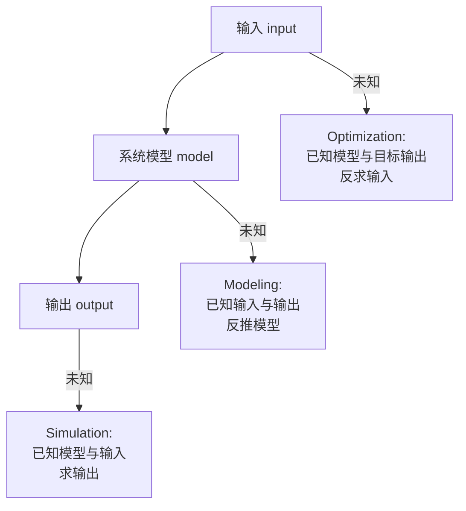

# 问题类型与单目标优化

> 本页属于：CEG5302 / Lecture 02
>
> 前置知识：[[CEG5302-Lecture01-Problem-Types-and-Applications]]
>
> 预计阅读时间：13 分钟

## 🎯 学习目标（Learning Objectives）

学完本页，你应该能：

1. 用 `input→model→output` 判断 modeling / simulation / optimization 三类问题。
2. 说清 modeling 如何转成 optimization（以 Li-ion 电池等效电路拟合为例），以及 simulation 为什么便宜。
3. 复述「单目标 minimization / maximization / 约束」的形式化写法（$\min f(\mathbf{x}) \text{ s.t. } g_i(\mathbf{x}) \le 0, h_j(\mathbf{x}) = 0$）。
4. 用新加坡→罗马机票例子说明「加约束会把最优解变不可行」。
5. 解释 multi-objective optimisation（MOO）入门（iPhone 例子）与 `Pareto trade-off`，并理解它是项目 Part-I（NSGA-II）的前置。

## Modeling、simulation 与 optimization

把工程系统抽象为 `input -> model -> output`。问题类型取决于未知量：（Lecture 2a, slides 7–14）

根据哪个元素未知，可快速判断问题类型（自制，依据课件第 7–14 页；核对 2026-09-07）：

| 问题 / Problem | Input | Model | Output | 目标 |
|---|---|---|---|---|
| Modeling / system identification | 已知 | **未知** | 已知 | 推断能复现 input-output 行为的模型 |
| Simulation | 已知 | 已知 | **未知** | 计算指定场景下的结果 |
| Optimization | **未知** | 已知 | 目标已知 | 搜索产生目标结果的 inputs/decisions |

### 三类问题的直觉与 Li-ion 电池例子

> 💡 课程用 **Li-ion 电池**贯穿「建模→仿真→优化」三种视角，帮助看清同一系统在不同目标下的角色。

- **Modeling（建模/系统辨识）**：已知输入（电流、温度）与输出（电压），求模型。`Current` 和 `Temperature` 输入 → 模型 → `Voltage`。建模可转成 optimization：把 **“模型误差”** 当作要最小化的量；在 Li-ion 例子中，**改变 RC 等效电路参数**，使 **measured voltage 与 model-predicted voltage 之差**最小。（Lecture 2a, slides 10–11）
- **Simulation（仿真）**：已知模型与输入，求输出。**比物理实验便宜得多**——每个 Li-ion cell 成本 `$4`，每包 240 个 cell，测试机 `$10,000`。（Lecture 2a, slide 12）
- **Optimization（优化）**：已知模型与目标输出，求输入。例如：**什么电流、电压、温度，能在 1000 次循环后产生最高的放电容量**？（Lecture 2a, slide 13）

> 📘 **关键结论（slide 14）**：在计算模型里，我们是从 input 算 output，**这个 forward model 不容易直接求逆**。所以：
> - **Simulation 很容易——等输出就好；**
> - **Optimization / Modeling 难得多——需要在很可能巨大的 search space 里“搜索”**；
> - 因此优化/建模本质上可看成**搜索问题**，而搜索空间就是“我们到哪里找解”。

### 一个完整的单目标例子：新加坡→罗马机票

> 🧪 Source（Lecture 2a, slides 16–18）——三个 set-up 逐步引入一个约束，看它如何改变“最优解”。

**Set-up 1：目标 = 最小化成本，其他约束无。**
- 解空间：所有从新加坡飞罗马的航司/航班（可能经停不同机场）：Singapore Airlines、British Airways、Qatar Airways、Emirates 等。
- 最优解：**最便宜的航班**（可能 1–2 次中转，如 Scoot 到雅典、再 Ryan Air 到罗马）。

**Set-up 2：目标 = 最小化旅行时间，其他约束无。**
- 最优解：**任何直飞航班**（如 Singapore Airlines）。

**Set-up 3：目标 = 最小化旅行时间，但加一个约束：每位乘客成本 < $2,000。**
- 此时 **Singapore Airlines（$3,000/人）变得不可行（infeasible）**；
- 但 **British Airways 可能提供 1 次中转、每位 $1,800**，成为新的可行最优。

> 💡 这个例子直观说明：① 目标与解空间的组合决定了“最优”；② **约束的引入会使原来最优解变成不可行**，从而把最优推到另一条可行路径上；③ 这是第 5 讲“约束处理”与 `feasible region` 的本质。**

## 单目标优化

一个 minimization 问题可写成 $\min f(\mathbf{x})$，其中 $\mathbf{x}$ 是 decision variable，$f(\mathbf{x})$ 是 objective function；constraints 定义 feasible region。（Lecture 2a, slides 16–22）

- **Constraint** 是“满足/不满足”的二元判断；**objective** 以非二元数值评价可行解。（Lecture 2a, slides 19）
- 可以把满足的约束数量作为 objective，从而把 constraint satisfaction 转化为 optimization，但这种转换可能丢失违反程度和约束重要性的差异，除非额外设计权重或 penalty。（Lecture 2a, slide 20）
- **Maximization 与 minimization** 可通过把 objective 乘以 $-1$ 相互转换。（Lecture 2a, slide 21）

### 示例

$f(x) = x^3 + x^2 - 4x$。无约束时 $x \to -\infty$ 使函数无下界（global minimum 在 $-\infty$）；加入 $-2 \le x \le 2$ 后 feasible region 有界，约束下最优解发生变化，stationary local minimum 约为 $x \approx 0.868$、$f(x) \approx -2.06$。（Lecture 2a, slides 23–28）

> 💡 **这组 slide 的教学顺序（slides 23–28）很关键**：
> 1. 先看无约束：$x^3+x^2-4x$ 在 $x \to -\infty$ 时趋向 $-\infty$，**global minimum 在 $-\infty$**（无下界）。
> 2. 找到**局部最小值**在 $x \approx 0.868, f \approx -2.06$。
> 3. 加上约束 $-2 \le x \le 2$，**可行域 $\mathcal{F} = [-2, 2]$**，其余为 infeasible。
> 4. **之前那个局部最小值，现在成了全局最小值**——因为 $x \to -\infty$ 那个点已经不可行。
> 5. 课件结论：**“The global minimum always is one of the local minima.”**（全局最优必是某个局部最优；而约束决定“哪些局部最优还可行”。）

> 🔍 这为 **约束改变最优解的定义**（第 5 讲）和 **fitness landscape 上的峰与可行域**（第 3 讲表示偏差）打下直觉底座。

### 单目标优化的形式表示

一般最小化问题写为（Lecture 2a, slides 22, 29）：

$$
\begin{aligned}
\min_{\mathbf{x}} \quad & f(\mathbf{x}) \\
\text{subject to} \quad & g_i(\mathbf{x}) \le 0, \quad i = 1, 2, \dots, m \quad (\text{不等式约束}) \\
& h_j(\mathbf{x}) = 0, \quad j = 1, 2, \dots, p \quad (\text{等式约束})
\end{aligned}
$$

其中 $\mathbf{x}$ 是决策变量向量。约束是“满足/不满足”的二元判断，目标函数则是可以比较优劣的数值；把约束满足数当作目标，可把约束满足问题转化为优化问题，但会丢失违反程度信息（lecture 2a, slides 19–24）。

> [!QUESTION] Q-CEG5302-W02-1
> **Context:** 单目标优化把建模/仿真问题统一为“在一个巨大搜索空间里搜索”。但不同问题类型对搜索空间的结构要求不同。
> **Question:** 在建模问题中，用“预测误差”作目标时，如何同时保证模型不过拟合历史数据？
> **Status:** Open

## Multi-objective optimisation（MOO）入门

> 📘 Source（Lecture 2b, slides 4–7）。这部分其实在 Lecture 2b 开头、进入 EA 组件之前先给 MOO 一个直观，为后续多目标讲次与**项目 Part-I（NSGA-II / ZDT3）**铺垫。

**为什么要 MOO？** 单目标只有一个目标函数；但很多真实问题有 **2 个或 3 个**想要同时优化的目标，而且它们常常**互相冲突**。课件用“买 iPhone”当例子（slides 4–5）：

- **目标 1**：满足使用需求——双卡（所有 iPhone 都有）、屏幕尺寸、相机数量。
- **目标 2**：成本越低越好。
- **两个极端解**：
  - **iPhone Pro Max**：3 相机、最大屏幕，但**成本最高**；
  - **iPhone SE（去年款）**：1 相机、最小屏幕，成本最低（约 1/4）。
- **核心诉求（slide 6）**：我们希望优化算法告诉我们**潜在的 trade-off 解**，然后我们自己按其他主观需求挑一个；而不是算法直接给出“唯一最好”。

**术语边界（slide 6）**：

- **MOO**：≥ 2 个目标，目标之间互相 trade off。
- **Many-objective optimisation**：MOO 的一个特例，**目标 > 3**。**本模块不涉及 many-objective**（“We will not deal with these in this module”）。

**与单目标的关系（slide 4）**：之前我们讨论的是 single-objective problems；MOO 是它的推广。对 MOO，一个解通常不会在所有目标上都最好，因此合理结果是一组 **Pareto trade-off solutions**——这正是 [[CEG5302-Lecture01-Problem-Types-and-Applications]] 提到的“成本/性能/环境影响等冲突目标”。

> 💡 **为什么现在提 MOO**：① 它解释了 EA 为什么常被用于“多个冲突目标”的工程设计（并行生成一组多样解）；② 它是项目 Part-I 的直接前置——你要实现 **NSGA-II**，在 **ZDT3** 上找 **Pareto 前沿**；③ 第 5 讲“基于支配的约束处理”也是借 MOO 的思想（把‘可行’当成一个目标）。

## 优化问题的常见类型

（Lecture 2a, slide 30）

| 类型 | 说明 |
|---|---|
| Linear | 目标与约束均为线性 |
| Mixed-integer linear (MILP) | 至少一个 integer 变量 |
| Non-linear | 部分目标/约束非线性，求解复杂得多 |
| Mixed-integer non-linear (MINLP) | 非线性且至少一个 integer 变量 |

## Exam Checklist（考试自查）

- **必须理解**：三类问题在 `input/model/output` 上的差异；建模→优化的转化；为什么优化是“搜索问题”；加约束会改变最优解（机票例子）。
- **必须手算**：$f(x) = x^3+x^2-4x$ 在无约束（global min 在 $-\infty$）与加 $-2 \le x \le 2$（全局最优变为 $x \approx 0.868, f \approx -2.06$）下如何变化。
- **必须记忆**：单目标形式 $\min f(\mathbf{x}) \text{ s.t. } g_i(\mathbf{x}) \le 0, h_j(\mathbf{x}) = 0$；$-1$ 转换 max/min；MOO 定义与 many-objective（>3 目标，out of scope）。
- **了解即可**：Li-ion 电池的 \$4 / \$240 / \$10,000 具体数字、iPhone 例子细节。
- **明确 out of scope**：many-objective optimisation（目标>3）不在本模块范围内。

## 下一步

- 上一页：[[CEG5302-Lecture01-Problem-Types-and-Applications]]
- 下一页：[[CEG5302-Lecture02-Computational-Complexity-and-EC-Motivation]]
- 返回：[[Home]]

## 来源与更新日志

- 来源：[Lecture 2a-Introduction_20Aug2026.pdf](https://github.com/Kytolly/NUS-coursework-wiki/releases/download/CEG5302/Lecture.2a-Introduction_20Aug2026.pdf)，slides 7–30。
- 2026-09-03：从 Lecture 2a 拆出“问题类型与单目标优化”短页。
- 2026-09-07：新增三类问题类型 Mermaid 图、形式化约束优化表示与说明问答。
- 2026-09-09：新增学习目标；三类问题扩展（Li-ion 建模/仿真/优化贯穿、forward model 难求逆、搜索问题定性）；新增新加坡→罗马机票完整例子；补充 $f(x)=x^3+x^2-4x$ 的教学顺序与“全局最优必为某个局部最优”结论；新增 MOO 入门（iPhone 例子、many-objective out of scope、项目 Part-I 关联）；新增 Exam Checklist。
