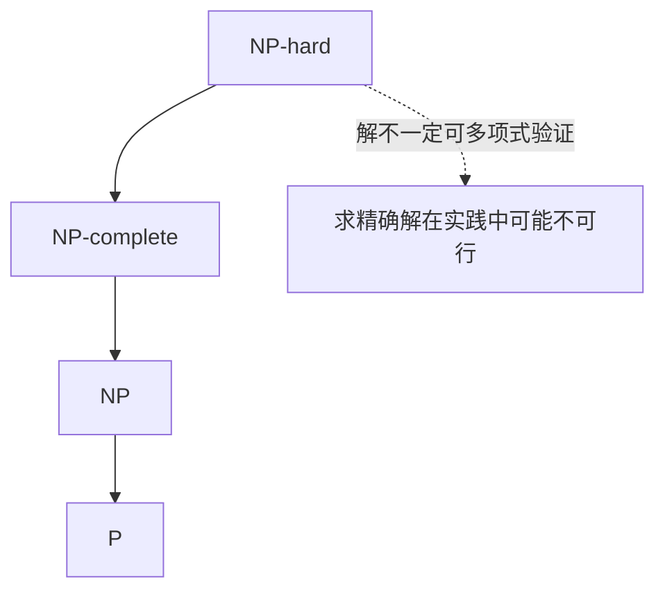

# 计算复杂度与进化计算动机

> 本页属于：CEG5302 / Lecture 02
>
> 前置知识：[[CEG5302-Lecture02-问题类型与单目标优化]]
>
> 预计阅读时间：7 分钟

## 计算复杂度

课件以高层次方式区分四类问题，工程关注点是“能否在可用时间内找到解”：（Lecture 2a, slides 33–35）

- **P**：可在 polynomial time 求解。
- **NP**：候选解可在 polynomial time 验证。
- **NP-complete**：属于 NP，且所有 NP 问题都可在 polynomial time 归约到它。
- **NP-hard**：至少和 NP-complete 一样难，但解不一定能在 polynomial time 内验证。

课程强调的实际含义是：当组合搜索空间和维度增大时，精确搜索可能在可用时间内不可行（curse of dimensionality）。（Lecture 2a, slides 35–37）

问题类之间的包含关系（依据课件第 34–35 页整理；核对 2026-09-07）：

- **数值优化（numerical optimisation）**：搜索空间由连续变量定义；**组合优化（combinatorial optimisation）**：搜索空间由离散变量（布尔/整数）定义，如 MILP、MINLP。（slide 33）
- **维度灾难（curse of dimensionality）**：变量越多或解空间越大，所需求解器能力越强；解的数目呈指数增长。（slides 36–37）

## 相关术语

（Lecture 2a, slides 40–41）

- **Heuristic**：针对特定问题的 trial-and-error 方法，通常是 one-off 算法。
- **Metaheuristic**：可适配多个问题的通用搜索框架，是实现 heuristic 的框架。
- **Adaptive landscape**：solution space 或 objective 随时间/步骤变化的 landscape；当前最优解在若干步后可能不再最优。

三种术语对照（依据课件第 40–43 页整理；核对 2026-09-07）：

| 术语 | 定义 | 组合/框架 |
|---|---|---|
| Heuristic | 针对特定问题的 trial-and-error 方法 | one-off 算法 |
| Meta-heuristic | 问题无关的通用搜索框架 | 实现启发式的框架 |
| EC metaphor | Environment=Problem；Individual=Candidate solution；Fitness=Quality | 自然与搜索的映射 |

## 为什么需要进化计算

（Lecture 2a, slides 39, 43–44）

- 不再关心“最优/完美解”，接受 “better、near-optimal”——“Anything that works, works”。
- 自动化问题求解的需求、问题复杂度增加、需要更少定制、更通用的求解器。
- 自然进化（它创造了人脑）是自然界最强大的问题求解器之一，值得模仿。

EC 隐喻的对应关系：（Lecture 2a, slides 42–43）

| 自然进化 | 问题求解 |
|---|---|
| Environment | Problem |
| Individual | Candidate solution |
| Fitness | Quality of solution |

### EC 如何应对 NP-hard

NP-hard 问题在理论上无法保证在多项式时间内求出精确最优解；EC 的应对思路是把目标从“最优”降级为“更好/近优”：在大搜索空间内用种群并行探索 + 选择压力保留有希望区域，在可用算力内快速给出可接受解（Lecture 2a, slides 39, 44）。代价是不再有精确最优保证，因此需要配合终止条件（如最大 evaluation 数或停滞阈值）来收敛。（见 [[CEG5302-Lecture02-EA七大组件]]）

## EC 与 Swarm Intelligence

Swarm Intelligence（SI）模拟相互作用的同质 agents 及其觅食行为，例如 Particle Swarm Optimization、Ant Colony Optimization、Firefly Algorithm。（Lecture 2a, slides 46–47）

- EC 更强调跨世代的继承、变异和选择。
- 两者都需平衡 **exploration**（探索新区域，避免过早收敛）与 **exploitation**（深入利用当前有希望区域）。Exploitation 过多可能陷入 local optimum；exploration 过多会增加运行时间并延迟精炼。（Lecture 2a, slides 48–49）

## 下一步

- 上一页：[[CEG5302-Lecture02-问题类型与单目标优化]]
- 下一页：[[CEG5302-Lecture02-EA七大组件]]
- 返回：[[Home]]

## 来源与更新日志

- 来源：[Lecture 2a-Introduction_20Aug2026.pdf](https://github.com/Kytolly/NUS-coursework-wiki/releases/download/CEG5302/Lecture.2a-Introduction_20Aug2026.pdf)，slides 33–49。
- 2026-09-03：从 Lecture 2a 拆出“计算复杂度与进化计算动机”短页。
- 2026-09-07：新增复杂度包含关系 Mermaid 图、数值/组合优化说明与术语对照表。
