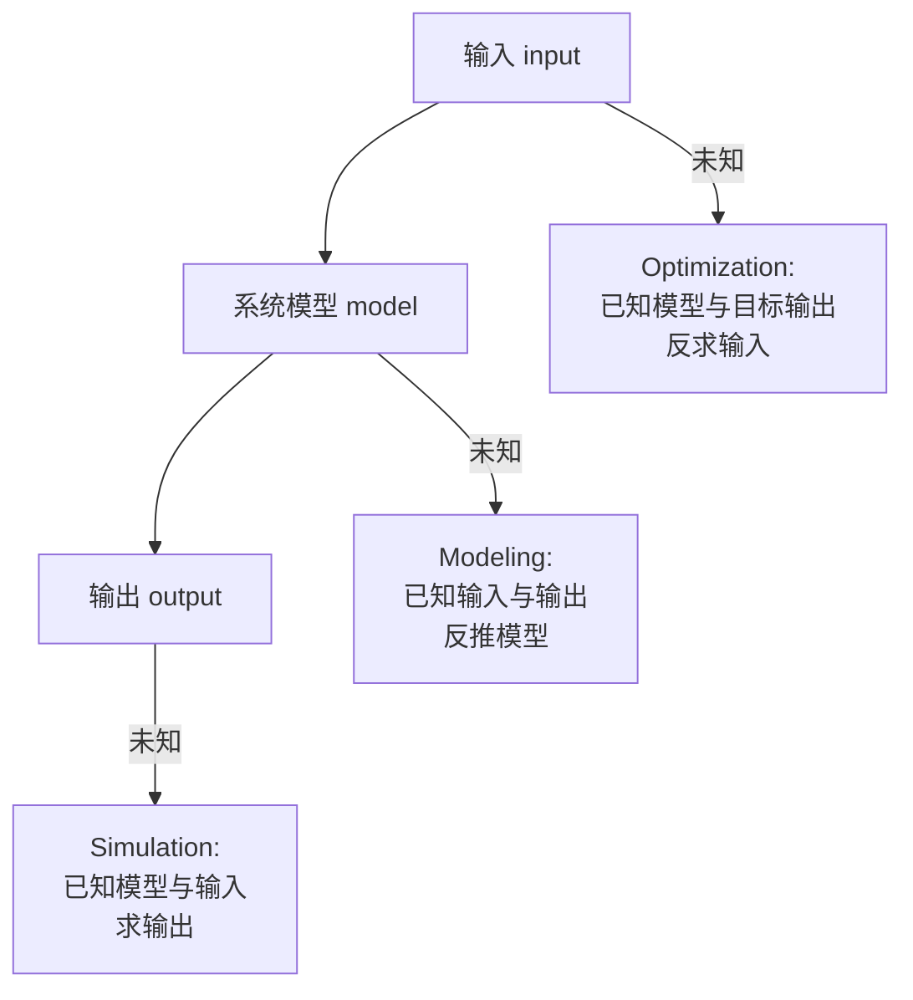

# 问题类型与单目标优化

> 本页属于：CEG5302 / Lecture 02
>
> 前置知识：[[CEG5302-Lecture01-四类问题与工程应用]]
>
> 预计阅读时间：8 分钟

## Modeling、simulation 与 optimization

把工程系统抽象为 `input -> model -> output`。问题类型取决于未知量：（Lecture 2a, slides 7–14）

根据哪个元素未知，可快速判断问题类型（自制，依据课件第 7–14 页；核对 2026-09-07）：



| 问题 / Problem | Input | Model | Output | 目标 |
|---|---|---|---|---|
| Modeling / system identification | 已知 | **未知** | 已知 | 推断能复现 input-output 行为的模型 |
| Simulation | 已知 | 已知 | **未知** | 计算指定场景下的结果 |
| Optimization | **未知** | 已知 | 目标已知 | 搜索产生目标结果的 inputs/decisions |

- **Modeling** 可以转化为 optimization：为模型设置参数，以预测误差为 objective 并最小化。Li-ion cell 例子用等效电路参数拟合 measured voltage 与 predicted voltage 的差异。（Lecture 2a, slides 10–11）
- **Simulation** 是正向计算，比物理实验便宜得多：每个 Li-ion cell 成本 $4，每包 240 个 cell，测试机 $10,000。（Lecture 2a, slide 12）
- **Optimization** 中 forward model 不容易直接求逆，modeling 与 optimization 都需要在很大的 search space 中搜索。（Lecture 2a, slides 13–14）

## 单目标优化

一个 minimization 问题可写成 `min f(x)`，其中 `x` 是 decision variable，`f(x)` 是 objective function；constraints 定义 feasible region。（Lecture 2a, slides 16–22）

- **Constraint** 是“满足/不满足”的二元判断；**objective** 以非二元数值评价可行解。（Lecture 2a, slides 19）
- 可以把满足的约束数量作为 objective，从而把 constraint satisfaction 转化为 optimization，但这种转换可能丢失违反程度和约束重要性的差异，除非额外设计权重或 penalty。（Lecture 2a, slide 20）
- **Maximization 与 minimization** 可通过把 objective 乘以 `-1` 相互转换。（Lecture 2a, slide 21）

### 示例

`f(x) = x^3 + x^2 - 4x`。无约束时 `x -> -∞` 使函数无下界（global minimum 在 -∞）；加入 `-2 <= x <= 2` 后 feasible region 有界，约束下最优解发生变化，stationary local minimum 约为 `x ≈ 0.868`、`f(x) ≈ -2.06`。（Lecture 2a, slides 23–28）

### 单目标优化的形式表示

一般最小化问题写为（Lecture 2a, slides 22, 29）：

```text
min_x  f(x)
subject to:
  g_i(x) <= 0,   i = 1, 2, ..., m   (不等式约束)
  h_j(x)  = 0,   j = 1, 2, ..., p   (等式约束)
```

其中 `x` 是决策变量向量。约束是“满足/不满足”的二元判断，目标函数则是可以比较优劣的数值；把约束满足数当作目标，可把约束满足问题转化为优化问题，但会丢失违反程度信息（lecture 2a, slides 19–24）。

> [!QUESTION] Q-CEG5302-W02-1
> **Context:** 单目标优化把建模/仿真问题统一为“在一个巨大搜索空间里搜索”。但不同问题类型对搜索空间的结构要求不同。
> **Question:** 在建模问题中，用“预测误差”作目标时，如何同时保证模型不过拟合历史数据？
> **Status:** Open

## 优化问题的常见类型

（Lecture 2a, slide 30）

| 类型 | 说明 |
|---|---|
| Linear | 目标与约束均为线性 |
| Mixed-integer linear (MILP) | 至少一个 integer 变量 |
| Non-linear | 部分目标/约束非线性，求解复杂得多 |
| Mixed-integer non-linear (MINLP) | 非线性且至少一个 integer 变量 |

## 下一步

- 上一页：[[CEG5302-Lecture01-四类问题与工程应用]]
- 下一页：[[CEG5302-Lecture02-计算复杂度与进化计算动机]]
- 返回：[[Home]]

## 来源与更新日志

- 来源：[Lecture 2a-Introduction_20Aug2026.pdf](https://github.com/Kytolly/NUS-coursework-wiki/releases/download/CEG5302/Lecture.2a-Introduction_20Aug2026.pdf)，slides 7–30。
- 2026-09-03：从 Lecture 2a 拆出“问题类型与单目标优化”短页。
- 2026-09-07：新增三类问题类型 Mermaid 图、形式化约束优化表示与说明问答。
