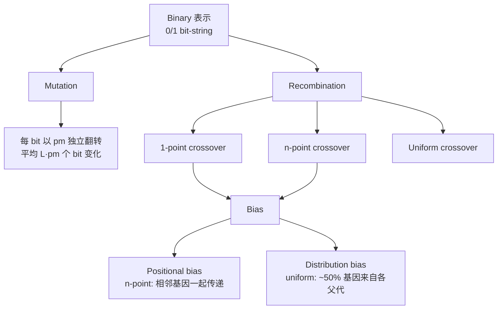

# Binary 与 Integer 表示

> 本页属于：CEG5302 / Lecture 03
>
> 前置知识：[[CEG5302-Lecture03-Representation-Concepts-and-Criteria]]
>
> 预计阅读时间：13 分钟

## 🎯 学习目标（Learning Objectives）

学完本页，你应该能：

1. 说明 binary 表示适合什么（Boolean 决策、knapsack、多整数拼接），并指出历史上“把 binary 当唯一选择”是错误的起点。
2. 解释 **Hamming distance / Hamming cliff**（`6:0110,7:0111,8:1000`）为什么会让一次 bit 翻转造成大的数值/ fitness 跳变，及 Gray code 如何缓解。
3. 写出 1-point / n-point / uniform crossover 的规则，并用一个随机 mask 实际算一遍 uniform crossover。
4. 区分 positional bias 与 distribution bias，并判断何时该用哪一种。
5. 对 integer 表示区分 **cardinal（无序）** 与 **ordinal（有序）**，并据此选 random resetting 还是 creep mutation。

## Binary 表示

Bit-string 编码，传统上被 GA 当作多数问题的唯一选择（历史起点，但并非总是正确）。适合需要 Boolean 决策的问题，例如 **knapsack**：对每个 item 用 1 表示入选、0 表示不选。多个整数也可各自用相同位数编码后拼接。（Lecture 3, slides 13–15）

> 📘 **示例（slide 13）**：`4-bit string = 1 0 1 1`；`7-bit string = 0 1 1 1 0 1 0`。
> **拼接示例（slide 15）**：两个整数 `4` 和 `5` → `0100 0101`。每个整数用相同位数编码，拼接成完整 genotype。
> **位数换算（slide 15）**：**一个 80 位的 bit string** 可以表示 **10 个 8-bit 整数（每个 256 个值）**，或 **5 个 16-bit 实数**。

- **Hamming distance**：相邻整数通常 Hamming distance 不为 1（3:`011` 与 4:`100` 距离为 3）。（slides 16–17）

> 🧪 **为什么一次 mutation 会造成高方差（slide 17）**：考虑 `6:0110, 7:0111, 8:1000`。
> - 从 `6(0110)` 变到 `7(0111)` 只需 **1 bit 翻转**（`0110→0111`）；
> - 从 `7(0111)` 变到 `8(1000)` 需要 **3 bit 翻转**（Hamming 3）。
> 所以**一个随机 bit 翻转**很可能是“小步”（6→7），而**几乎不可能**一次就“跨过边界”（7→8）。若用 binary 表示连续变量，相邻整数之间可能有“悬崖”，使得一次 mutation 的 fitness 变化**高度不均匀**。

> 💡 **Gray cod** 使**相邻整数在 binary 表示下 Hamming distance = 1**，缓解上述高方差；但要注意它只是把“数值相邻”映射为“编码相邻”，并不能完全消除表示 bias。

### Mutation

每个 bit 以概率 $p_m$ 独立翻转，长度为 $L$ 的串平均改变 $L \cdot p_m$ 个 bit。mutation rate 的选取依赖目标：（slides 18–19）

- 若需要所有个体都有高 fitness，用低 rate（避免随机 mutation 损失 fitness）。
- 若只需单个最优个体，用高 rate（保证 exploration）。
- Aggressive 的 selection 政策可以保护高质量个体不被丢失。

### Recombination

三种：（slides 20–24）

- **1-point crossover**：随机切点 $r \in [1, L-1]$，交换尾段。
- **n-point crossover**：随机选 $n$ 个切点（$n=2$ 时有两个切点）。
- **Uniform crossover**：每个 gene 独立处理，用 $[0,1]$ 随机串决定继承哪位父代（通常 $< 0.5$ 取父代 1）；第二个 offspring 取反。

> 🧪 **Uniform crossover 手算（slide 24）**：设随机串为 $[0.3, 0.6, 0.1, 0.4, 0.8, 0.7, 0.3, 0.5, 0.3]$，阈值 0.5。则：
> - $<0.5$ 的位置（0.3, 0.1, 0.4, 0.3, 0.3）取**父代 1**；
> - $\ge 0.5$ 的位置（0.6, 0.8, 0.7, 0.5）取**父代 2**。
> 第二个 offspring 做**相反选择**。这样每个 gene 独立决定来源，**没有位置 bias**。

### 两种 bias

（slide 25）

- **Positional bias**：n-point 倾向把串中相邻 gene 一起传递；uniform 没有该 bias。
- **Distributional bias**：uniform 平均从每位父代传约 50% gene，无法把某位父代大量 co-adapted gene 一起传下去。

若某些 bit 需要一起保留（如 knapsack 中需成组保留的相似 items），应使用带 positional bias 的 n-point crossover。（slide 26）

### 二进制表示的技术总览

（自制，依据课件第 13–26 页；核对 2026-09-07）

| 算子 | 规则 | 关键性质 | 参考页 |
|---|---|---|---|
| 1-point crossover | 随机切点 $r \in [1, L-1]$，交换尾段 | 位置 bias 强 | 21 |
| n-point crossover | 随机 $n$ 个切点 | 位置 bias，可保留相邻块 | 22, 25–26 |
| Uniform crossover | 每位独立 $[0,1]$ 阈值选父代 | 无位置 bias，分布 bias | 23–25 |
| Bit-flip mutation | 每 bit 以 $p_m$ 翻转 | 平均改变 $L \cdot p_m$ 个 bit | 18 |

**数值示例（knapsack）**：4 件物品价值 $[8, 5, 3, 9]$、成本 $[4, 3, 1, 6]$、成本上限 $c_{\max}=7$。`1010` 表示选物品 1、3，价值 $8+3=11$、成本 $4+1=5$ 可行；`0101` 表示选物品 2、4，价值 $5+9=14$、成本 $3+6=9$ 超出上限不可行。bit 串一个 1/0 翻转即对应“选入/剔除某物品”的单基因改变。（依据 slide 14 思想举例）

## Integer 表示

当 decision variables 本身取整数值，或只能取有限可数个值（如 {gold, silver, platinum, diamond} → {1,2,3,4}）时，直接在整数上操作比转成 binary 更自然。需考虑这些值是否有序（ordinal）。（slides 27–28）

### Mutation

（slides 28–31）

- **Random resetting**：每个 gene 以概率 $p_m$ 从允许值集合随机取新值；适合序无关的 cardinal 集合。
- **Creep mutation**：对 ordinal 属性，以概率 $p$ 加小的正/负增量（从关于 0 对称的分布采样）；多产生小变化，步长由分布决定。可同时使用 “little creep” 与 “big creep”，也可与 random resetting 组合。

### Recombination

与 binary 相同（1-point、n-point、uniform）。（slide 32）

**Integer 表示要点**：当变量是无序的离散值集合（如金银铂钻 → {1,2,3,4}）时，**任意整数标签均可**（`{1,2,3,4}` 与 `{4,3,2,1}` 都合法），因此用 **random resetting** 最自然；当变量是有序属性（如工序编号）时，**creep mutation** 只作小幅 ± 改动更合适。整数之间没有二进制那样的 Hamming 问题，重组交换“基因块”仍能保留一定构建块，所以可直接复用二进制的 crossover（这也是课件 slide 32 的讨论结论）。（依据 slides 28–32 整理；核对 2026-09-09）

> 💡 **“要不要考虑顺序？”** 是 integer 表示的核心判断（slide 28）：如果变量是无序 cardinal 集合，那么**改变整数标签不影响可行性**（金=1 或 金=4 都一样）；如果变量是 ordinal（工序、档位），改变数值大小会影响语义，此时用 random resetting 可能把 5 步工序跳到 1 步，而 creep 更符合“小幅渐进”。

## Exam Checklist（考试自查）

- **必须理解**：binary 的 Hamming cliff 与 Gray code；uniform crossover 的 mask 机制；positional vs distributional bias；integer 的 cardinal vs ordinal。
- **必须手算**：给定随机 mask 做 uniform crossover；给定 `6/7/8` 判断一次 bit 翻转的影响；knapsack 例子的价值/成本判断。
- **必须记忆**：`3=011,4=100`（Hamming=3）与 `6→7`（Hamming=1）、`7→8`（Hamming=3）；`1-point/n-point/uniform crossover` 规则；random resetting vs creep。
- **了解即可**：Gray code 的精确编码表。
- **明确 out of scope**：本讲不要求证明“binary+Gray”一定优于整数/实数表示。

## 下一步

- 上一页：[[CEG5302-Lecture03-Representation-Concepts-and-Criteria]]
- 下一页：[[CEG5302-Lecture03-Real-Valued-Mutation]]
- 返回：[[Home]]

## 来源与更新日志

- 来源：[Lecture 3-Representation and Variation_27Aug2026.pdf](https://github.com/Kytolly/NUS-coursework-wiki/releases/download/CEG5302/Lecture.3-Representation.and.Variation_27Aug2026.pdf)，slides 12–32。
- 2026-09-03：从 Lecture 3 拆出“Binary 与 Integer 表示”短页。
- 2026-09-07：新增二进制算子技术总览 Mermaid 图、二进制/整数算子对照表与 knapsack 数值示例，补充整数表示要点。
- 2026-09-09：新增学习目标；补充 bit-string/拼接/80 位换算示例、`6/7/8` Hamming 悬崖手算、uniform crossover 随机 mask 手算、integer cardinal/ordinal 判断；新增 Exam Checklist。
