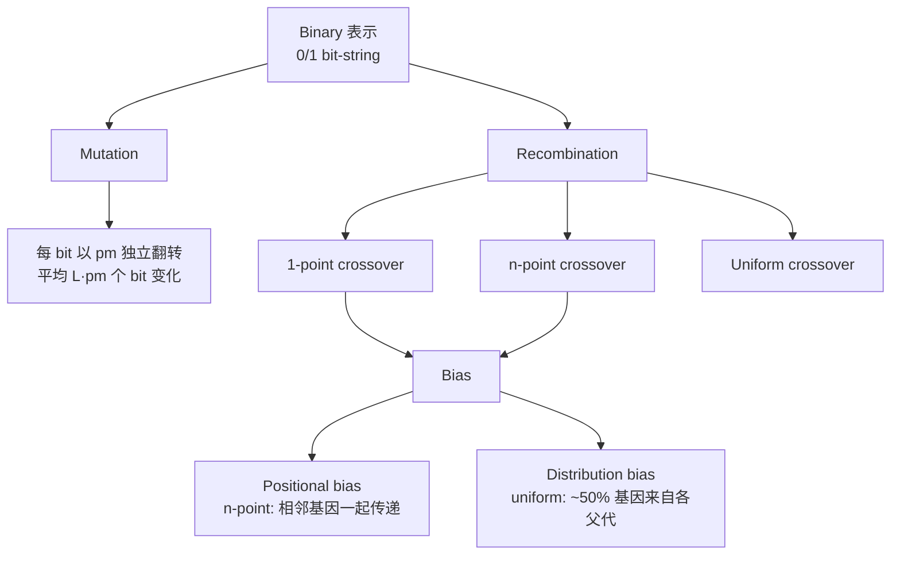

# Binary 与 Integer 表示

> 本页属于：CEG5302 / Lecture 03
>
> 前置知识：[[CEG5302-Lecture03-表示的概念与选择准则]]
>
> 预计阅读时间：9 分钟

## Binary 表示

Bit-string 编码，传统上被 GA 当作多数问题的唯一选择（历史起点，但并非总是正确）。适合需要 Boolean 决策的问题，例如 **knapsack**：对每个 item 用 1 表示入选、0 表示不选。多个整数也可各自用相同位数编码后拼接（如 4、5 → `0100 0101`）。（Lecture 3, slides 13–15）

- **Hamming distance**：相邻整数通常 Hamming distance 不为 1（3:`011` 与 4:`100` 距离为 3）。**Grey coding** 使相邻整数在编码上只差 1 bit，可缓解单次 mutation 带来的高方差。（slides 16–17）

### Mutation

每个 bit 以概率 `p_m` 独立翻转，长度为 L 的串平均改变 `L·p_m` 个 bit。mutation rate 的选取依赖目标：（slides 18–19）

- 若需要所有个体都有高 fitness，用低 rate（避免随机 mutation 损失 fitness）。
- 若只需单个最优个体，用高 rate（保证 exploration）。
- Aggressive 的 selection 政策可以保护高质量个体不被丢失。

### Recombination

三种：（slides 20–24）

- **1-point crossover**：单切点交换后缀。
- **n-point crossover**：随机选 n 个切点。
- **Uniform crossover**：每个 gene 独立处理，用 [0,1] 随机串决定继承哪位父代（通常 < 0.5 取父代 1）；第二个 offspring 取反。

### 两种 bias

（slide 25）

- **Positional bias**：n-point 倾向把串中相邻 gene 一起传递；uniform 没有该 bias。
- **Distributional bias**：uniform 平均从每位父代传约 50% gene，无法把某位父代大量 co-adapted gene 一起传下去。

若某些 bit 需要一起保留（如 knapsack 中需成组保留的相似 items），应使用带 positional bias 的 n-point crossover。（slide 26）

### 二进制表示的技术总览

（自制，依据课件第 13–26 页；核对 2026-09-07）

| 算子 | 规则 | 关键性质 | 参考页 |
|---|---|---|---|
| 1-point crossover | 随机切点 `r∈[1,L-1]`，交换尾段 | 位置 bias 强 | 21 |
| n-point crossover | 随机 `n` 个切点 | 位置 bias，可保留相邻块 | 22, 25–26 |
| Uniform crossover | 每位独立 `[0,1]` 阈值选父代 | 无位置 bias，分布 bias | 23–25 |
| Bit-flip mutation | 每 bit 以 `p_m` 翻转 | 平均改变 `L·p_m` 个 bit | 18 |

**数值示例（knapsack）**：4 件物品价值 `[8, 5, 3, 9]`、成本 `[4, 3, 1, 6]`、成本上限 `c_max=7`。`1010` 表示选物品 1、3，价值 `8+3=11`、成本 `4+1=5` 可行；`0101` 表示选物品 2、4，价值 `5+9=14`、成本 `3+6=9` 超出上限不可行。bit 串一个 1/0 翻转即对应“选入/剔除某物品”的单基因改变。（依据 slide 14 思想举例）

## Integer 表示

当 decision variables 本身取整数值，或只能取有限可数个值（如 {gold, silver, platinum, diamond} → {1,2,3,4}）时，直接在整数上操作比转成 binary 更自然。需考虑这些值是否有序（ordinal）。（slides 27–28）

### Mutation

（slides 28–31）

- **Random resetting**：每个 gene 以概率 `p_m` 从允许值集合随机取新值；适合序无关的 cardinal 集合。
- **Creep mutation**：对 ordinal 属性，以概率 `p` 加小的正/负增量（从关于 0 对称的分布采样）；多产生小变化，步长由分布决定。可同时使用 “little creep” 与 “big creep”，也可与 random resetting 组合。

### Recombination

与 binary 相同（1-point、n-point、uniform）。（slide 32）

**Integer 表示要点**：当变量是无序的离散值集合（如金银铂钻 → {1,2,3,4}）时，任意整数标签均可，因此用 random resetting 最自然；当变量是有序属性（如工序编号）时，creep mutation 只作小幅 ± 改动更合适。整数之间没有二进制那样的 Hamming 问题，重组交换“基因块”仍能保留一定构建块，所以可直接复用二进制的 crossover。（依据 slides 28–31 整理；核对 2026-09-07）

## 下一步

- 上一页：[[CEG5302-Lecture03-表示的概念与选择准则]]
- 下一页：[[CEG5302-Lecture03-Real表示的变异]]
- 返回：[[Home]]

## 来源与更新日志

- 来源：[Lecture 3-Representation and Variation_27Aug2026.pdf](https://github.com/Kytolly/NUS-coursework-wiki/releases/download/CEG5302/Lecture.3-Representation.and.Variation_27Aug2026.pdf)，slides 12–32。
- 2026-09-03：从 Lecture 3 拆出“Binary 与 Integer 表示”短页。
- 2026-09-07：新增二进制算子技术总览 Mermaid 图、二进制/整数算子对照表与 knapsack 数值示例，补充整数表示要点。
