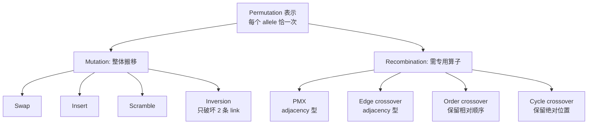
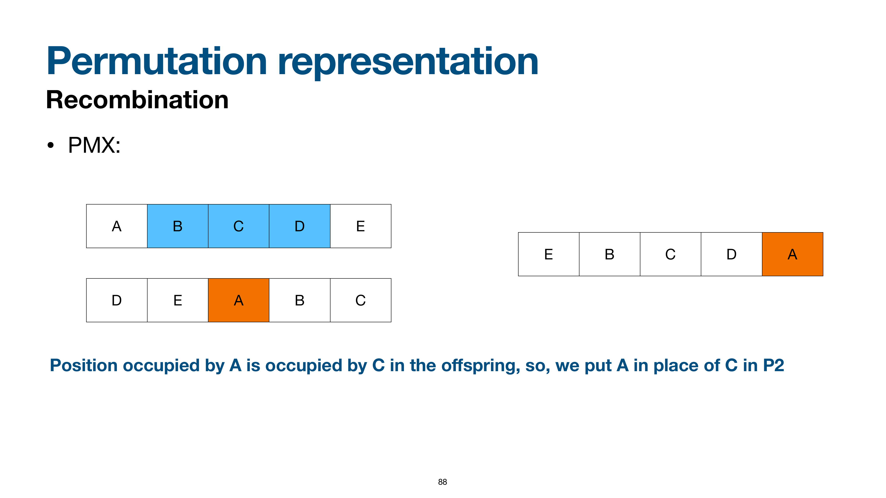

# Permutation 表示

> 本页属于：CEG5302 / Lecture 03
>
> 前置知识：[[CEG5302-Lecture03-Real-Valued-Recombination]]
>
> 预计阅读时间：15 分钟

## 🎯 学习目标（Learning Objectives）

学完本页，你应该能：

1. 说明为什么 permutation 表示**不能直接用 integer/binary 的变异/重组**（每个 allele 恰一次，直接交换会重复/缺失）。
2. 区分 **order 重要**（scheduling）与 **adjacency 重要**（TSP）、以及两种排列书写约定。
3. 手算 swap / insert / scramble / inversion 四种 mutation，并说明各自破坏多少条 adjacency link。
4. **完整手算 PMX**（P1=`A B C D E`, P2=`D E A B C`），并理解它为何“不具备 respect 性质”。
5. 解释 edge-3 / order / cycle crossover 的思想与适用场景。

## 表示与问题

用于“顺序本身重要”的问题，如 **TSP**（给定城市列表，找访问每城一次并返回起点、且最短的巡回）与 scheduling。它与 integer/binary 的关键区别是：**每个 allele 必须恰好出现一次**，不允许重复。（Lecture 3, slides 68–71）

> 💡 **为什么不能直接借用 integer 技术？（slide 70 的 discussion）**：integer / bit-string 表示**允许 allele 重复**（`111`、`{1,2,1}` 都是合法 genotype）。但 permutation 中**每个可能 allele 必须恰好出现一次**——如果直接像 binary 那样交换子串，就会得到像 `A B A B C` 这样的**重复/缺失**串，不再是合法排列。所以必须为 permutation **专门设计**变异与重组算子。

- 两类问题（slide 72）：**order 重要**（如生产调度 scheduling）与 **adjacency 重要**（如 TSP）。
  - **Production scheduling（slide 73）**：要排**不同机器处理不同产品**的顺序；可能有**工序间依赖**（Process-1 必须在 Process-2 前），各工序的**setup time**不同。
  - **TSP（slide 74）**：给城市列表，求**访问每城一次、返回原城市**的最短巡回。
- 表示歧义（slides 74–75）：若起点无关，$\{1,2,3,4\}$ 与 $\{2,3,4,1\}$、$\{3,4,1,2\}$、$\{4,1,2,3\}$ 等**旋转等价**；若方向也无关，$\{4,3,2,1\}$ 也等价。
- 两种书写约定（slide 76）：设 4 城 $\{A,B,C,D\}$，排列 $\{3,1,2,4\}$：
  - **第 $i$ 个元素 = “该位置发生的事件”**（adjacency 型，最常用）：$\{C,A,B,D\}$——第 3 位城市最先，然后第 1、2、4 位。
  - **第 $i$ 个元素 = “该事件发生的位置”**（position 型）：$\{B,C,A,D\}$——B 在第 1 位、C 在第 2 位、A 在第 3 位、D 在第 4 位。

## Permutation 表示的关键点

排列表示与整数/二进制的最大差异是**每个 allele 恰好出现一次**，因此不能直接交换子串，否则可能重复或缺失。（依据课件第 71、83 页整理；核对 2026-09-07）

## Mutation

不能逐 allele 独立处理，要整体搬移：（slides 77–82）

- **Swap**：随机交换两个 gene 的值。例：`A B C D E → A D C B E`（交换第 2、4 位）。
- **Insert**：随机选两个 gene，把第二个移到第一个旁边，其余顺移。例：`A B C D E → A B D C E`（把第 4 位 `D` 移到第 3 位 `C` 旁，`C` 顺移）。
- **Scramble**：整条染色体或随机子段被打乱。例：`A B C D E → A C D B E`（打乱第 2–5 位）。
- **Inversion**：随机选两个位置，反转两者之间的顺序。例：`A B C D E → A D C B E`（反转第 2–4 位）。

> 💡 **link（邻接边）破坏问题（slide 81）**：swap / insert / scramble 都会**破坏大量 link**（一个排列里的相邻关系）。对 **adjacency 型（TSP）** 问题，link 直接对应“路程”，破坏越多，后代越可能“绕远路”。**Inversion 只断开 2 条 link**（只反转两断点之间的顺序，两端之外的邻接保留）——所以课件说“**只破坏 2 条 link :)**”，适合 adjacency 型问题。

## Recombination

不能直接交换子串，否则破坏“每个 allele 恰好一次”：（slides 83–97）

> 📘 先看为什么直接交换会坏（slide 83）：把 P1=`A B C D E` 与 P2=`D E A B C` 的前 3 位交换，会得到 `A B A B C`——A、B 重复，D、E 缺失。所以必须用**保排列性质**的专有算子。

### PMX（Partially Mapped Crossover）——完整手算例子⭐⭐

> 🧪 本例子取自课件 slides 85–89，是**全课程最重要、最常考**的排列重组手算之一。设 P1=`A B C D E`，P2=`D E A B C`。

1. **选两个切点**，把 P1 的切点段拷入 offspring。例如切点在第 2 与第 5 位之间，切点段为 P1 的 **`B C D`**（位置 2–4）。offspring = `[?, B, C, D, ?]`。
2. **看 P2 中与切点段对应的位置**：P2 位置 2–4 = `E A B`；其中 `B` 已在 offspring，`E`、`A` 尚未拷贝。
3. **对 `E` 做映射填位**：`E` 在 P2 中位于位置 2；offspring 位置 2 放的是 `B`（来自 P1）；`B` 在 P2 中位于位置 4；offspring 位置 4 放的是 `D`（来自 P1）；`D` 在 P2 中位于位置 1；offspring 位置 1 目前为空 → 把 **`E` 填到位置 1**。offspring = `[E, B, C, D, ?]`。
4. **对 `A` 做映射**：`A` 在 P2 中位于位置 3；offspring 位置 3 是 `C`；`C` 在 P2 中位于位置 5；位置 5 空 → 把 **`A` 填到位置 5**。offspring = `[E, B, C, D, A]`。

> ✅ **child1 = `E B C D A`**（即课件里“Position of E is occupied by B … put E into the position vacated by B … but occupied by D … put in the place of D in second parent”）。

#### 课件原图对照：PMX 算子映射流程 (Slide 88)

> **Figure Object: Slide 88**
> - **Source**: `Lecture 3-Representation and Variation_27Aug2026.pdf` Slide 88
> - **Locator**: Slide 88 "Permutation representation: PMX"
> - **Explanation**: 展示了当子代位置 2 被父代 1 的 `B` 占据时，通过父代 2 与父代 1 的对应关系形成映射链（`E` -> `B` -> `D` -> 位置 1），最终将 `E` 成功填入合法空位的完整追踪过程。
> - **What to notice**: 映射过程是确定性的置换循环查找（Cycle trace），保证了每个排列符号在生成的子代中出现且仅出现一次，完全杜绝了等位基因重复与遗漏。

5. **第二个 child 用“父代角色互换”**再算一遍（P1'=`D E A B C`，P2'=`A B C D E`，同样切点段为 `E A B`）：
   - 切点段 `E A B`（位置 2–4）。offspring = `[?, E, A, B, ?]`。
   - P2' 对应位置 2–4 = `B C D`；`B` 已在，`C`、`D` 待填。
   - `C`：在 P2' 位置 3；offspring 位置 3 是 `A`；`A` 在 P2' 位置 1（空）→ 填 `C` 到位置 1。
   - `D`：在 P2' 位置 4；offspring 位置 4 是 `B`；`B` 在 P2' 位置 2；offspring 位置 2 是 `E`；`E` 在 P2' 位置 5（空）→ 填 `D` 到位置 5。
   - **child2 = `C E A B D`**。

> 📘 **PMX 的性质（slide 90）**：
> - **保留 P1 的绝对位置**（切点段原样拷入）+ **保留 P2 的部分位置信息**；
> - **保留很多 link**（适合 adjacency 型）；
> - 但是 **PMX 不具备 respect 性质**——两父代**共有的 trait 不一定保留在 offspring** 里（而 binary/integer crossover 具备此性质）。所以不能用“总共有某个子串”来预期 PMX 一定保留它。

- **Edge crossover**：更适合 adjacency 型；尽量只用两父代中出现的边构造 offspring，常用变体 edge-3 保证公共边被保留、最小化外来边；每对父代只产一个 child。算法（slide 92）：建 edge table → 随机选初始元素 → 移除对当前元素的引用 → 若有公共边选公共边，否则选“自身 list 最短”的条目，打平随机；遇到空 list 再另选端点/随机。（slides 91–93）
- **Order crossover**：拷 P1 切点段，再从 P2 的第二个切点起按序填入未用值（可环绕），保留 P2 的相对顺序。（slides 94–95）
- **Cycle crossover**：按 cycle 交替复制，最大化保留元素出现位置的绝对信息。算法（slide 96）：从 P1 第一个未用位置/allele 开始，看同一位置 P2 的 allele，跳到 P1 中相同 allele 所在位置……直到回到起点，形成一个 cycle；交替把 cycle 填入 offspring。（slides 96–97）

> 🧪 **Order crossover 示例（slides 94–95）**：课件用 P1=`A B C D E`、P2=`D E A B C` 演示：把 P1 的切点段（`A B C`）拷入 child，再从 P2 的第二个切点之后按序把未用值（`D E`）填入，得到 child=`A B C D E`；第二个 child 则以角色互换得到 `C D A B E`。目的是**保留 P2 的相对顺序**。

## 算子特性对比

（依据课件第 78–97 页整理；核对 2026-09-07）

| 算子 | 顺序/邻接 | 破坏 link 数 | 备注 |
|---|---|---|---|
| Swap/Insert/Scramble | 通用 | 多 | 不适合 adjacency 型 |
| Inversion | adjacency | 2 | 只反转两点间排序 |
| PMX | adjacency | 保留许多 link | 不具备 respect 性质 |
| Edge-3 | adjacency | 尽量用父母边 | 每对父母只产 1 子 |
| Order | order | 保留相对顺序 | 从 P2 环绕填未用值 |
| Cycle | order/位置 | 保留绝对位置 | 交替复制 cycle |

**TSP 示例**：城市 $\{1,2,3,4\}$，巡回 $1\to 2\to 3\to 4\to 1$。起点无关 → $\{2,3,4,1\}$ 等价；方向无关 → $\{4,3,2,1\}$ 也等价。因此 TSP 的评价应只比环的边/成本，而不是字符串本身；这也是为什么 PMX/Edge 这类“面向邻接”的算子更有用。（依据 slides 74–76、84–93 整理）

## Exam Checklist（考试自查）

- **必须手算**：PMX（P1=`A B C D E`, P2=`D E A B C`）得到 child1=`E B C D A`、child2=`C E A B D`；swap/insert/scramble/inversion 各一例。
- **必须理解**：为什么不能直接交换子串（重复/缺失）；order vs adjacency；PMX 为什么不具备 respect；inversion 只破坏 2 条 link。
- **必须记忆**：$\{3,1,2,4\}$ 两种书写约定；TSP 旋转/方向等价；PMX/Edge/Order/Cycle 各自保留什么。
- **了解即可**：Edge crossover 的 edge table 细节（课件明确不属于 learning objectives）。
- **明确 out of scope**：edge crossover 详细实现、PMX 的严格映射证明。

## 下一步

- 上一页：[[CEG5302-Lecture03-Real-Valued-Recombination]]
- 下一页：[[CEG5302-Lecture03-Tree-Representation-and-Crossover-Conclusions]]
- 返回：[[Home]]

## 来源与更新日志

- 来源：[Lecture 3-Representation and Variation_27Aug2026.pdf](https://github.com/Kytolly/NUS-coursework-wiki/releases/download/CEG5302/Lecture.3-Representation.and.Variation_27Aug2026.pdf)，slides 68–97。
- 2026-09-03：从 Lecture 3 拆出“Permutation 表示”短页。
- 2026-09-07：新增 Permutation 算子总览 Mermaid 图、算子特性对比表与 TSP 示例。
- 2026-09-09：新增学习目标；补充“为什么不能借用 integer 技术”、scheduling/TSP 两类问题与 `{3,1,2,4}` 两种书写约定、四种 mutation 的具体串示例与 link 破坏分析、PMX **完整手算（child1/child2）**与 Edge/Order/Cycle 算法步骤；新增 Exam Checklist。
