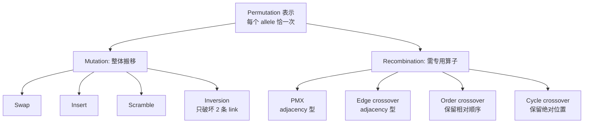

# Permutation 表示

> 本页属于：CEG5302 / Lecture 03
>
> 前置知识：[[CEG5302-Lecture03-Real表示的重组]]
>
> 预计阅读时间：9 分钟

## 表示与问题

用于“顺序本身重要”的问题，如 **TSP**（给定城市列表，找访问每城一次并返回起点、且最短的巡回）与 scheduling。它与 integer/binary 的关键区别是：**每个 allele 必须恰好出现一次**，不允许重复。（Lecture 3, slides 68–71）

- 两类问题：**order 重要**（如 scheduling）与 **adjacency 重要**（如 TSP）。（slide 72）
- 表示歧义：若起点无关，`{1,2,3,4}` 与 `{2,3,4,1}` 等旋转等价；若方向也无关，`{4,3,2,1}` 也等价。（slides 74–75）
- 两种书写约定：第 i 个元素表示“该位置发生的事件”（adjacency 型），或“该事件发生的位置”（position 型）。（slide 76）

## Permutation 表示的关键点

排列表示与整数/二进制的最大差异是**每个 allele 恰好出现一次**，因此不能直接交换子串，否则可能重复或缺失。（依据课件第 71、83 页整理；核对 2026-09-07）

## Mutation

不能逐 allele 独立处理，要整体搬移：（slides 77–82）

- **Swap**：随机交换两个 gene 的值。
- **Insert**：随机选两个 gene，把第二个移到第一个旁边，其余顺移。
- **Scramble**：整条染色体或随机子段被打乱。
- 上述三种会破坏大量 adjacency；对 adjacency 型问题用 **Inversion mutation**：反转两个位置之间的顺序，只破坏 2 条 link。

## Recombination

不能直接交换子串，否则破坏“每个 allele 恰好一次”：（slides 83–97）

- **PMX（Partially Mapped Crossover）**：适合 adjacency 型问题。随机选两个切点，把 P1 的切点段拷入 offspring；再按 P2 中该段未出现的元素做映射填位。它保留 P1 的绝对位置与 P2 的部分位置信息，但**不具备 respect 性质**——两父代共有的 trait 不一定保留在 offspring 中（binary/integer 的 crossover 具备该性质）。（slides 84–90）
- **Edge crossover**：更适合 adjacency 型；尽量只用两父代中出现的边构造 offspring，常用变体 edge-3 保证公共边被保留、最小化外来边；每对父代只产一个 child。（slides 91–93）
- **Order crossover**：拷 P1 切点段，再从 P2 的第二个切点起按序填入未用值（可环绕），保留 P2 的相对顺序。（slides 94–95）
- **Cycle crossover**：按 cycle 交替复制，最大化保留元素出现位置的绝对信息。（slides 96–97）

## 算子特性对比

（依据课件第 78–97 页整理；核对 2026-09-07）

| 算子 | 顺序/邻接 | 破坏 link 数 | 备注 |
|---|---|---|---|
| Swap/Insert/Scramble | 通用 | 多 | 不适合 adjacency 型 |
| Inversion | adjacency | 2 | 只反转两点间排序 |
| PMX | adjacency | 保留许多 link | 不具备 respect 性质 |
| Edge-3 | adjacency | 尽量用父母边 | 每对父母只产 1 子 |
| Order | order | 保留相对顺序 | 从 P2 环绕填未用值 |
| Cycle | order/位置 | 保留绝对位置 | 交替复制 cycle |

**TSP 示例**：城市 `{1,2,3,4}`，巡回 `1→2→3→4→1`。起点无关 → `{2,3,4,1}` 等价；方向无关 → `{4,3,2,1}` 也等价。因此 TSP 的评价应只比环的边/成本，而不是字符串本身；这也是为什么 PMX/Edge 这类“面向邻接”的算子更有用。（依据 slides 74–76、84–93 整理）

## 下一步

- 上一页：[[CEG5302-Lecture03-Real表示的重组]]
- 下一页：[[CEG5302-Lecture03-Tree表示与Crossover一般结论]]
- 返回：[[Home]]

## 来源与更新日志

- 来源：[Lecture 3-Representation and Variation_27Aug2026.pdf](https://github.com/Kytolly/NUS-coursework-wiki/releases/download/CEG5302/Lecture.3-Representation.and.Variation_27Aug2026.pdf)，slides 68–97。
- 2026-09-03：从 Lecture 3 拆出“Permutation 表示”短页。
- 2026-09-07：新增 Permutation 算子总览 Mermaid 图、算子特性对比表与 TSP 示例。
