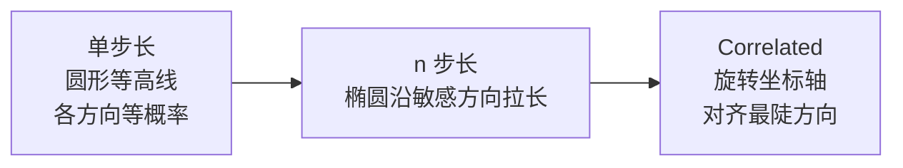
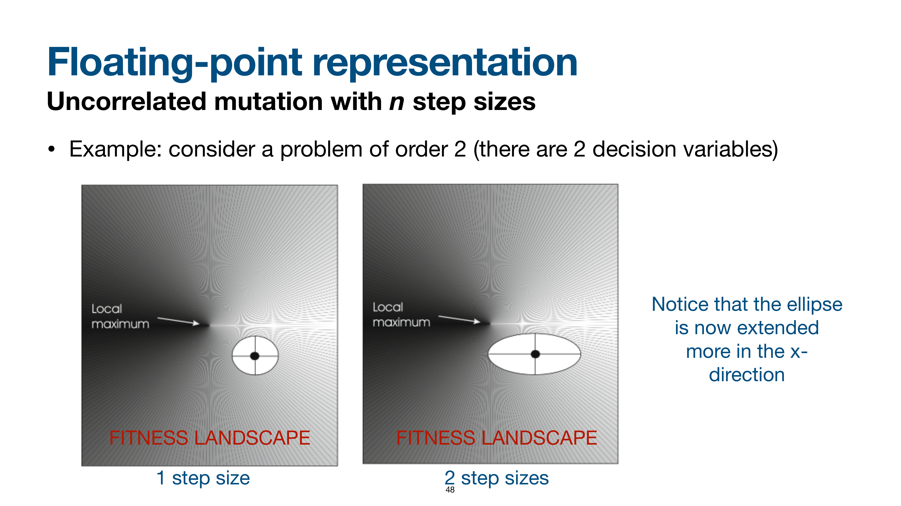
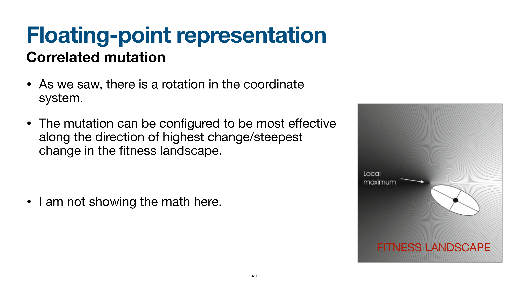

# Real 表示的变异

> 本页属于：CEG5302 / Lecture 03
>
> 前置知识：[[CEG5302-Lecture03-Binary-and-Integer-Representation]]
>
> 预计阅读时间：13 分钟

## 🎯 学习目标（Learning Objectives）

学完本页，你应该能：

1. 说出 real 表示下 mutation 的通用形式（$[x_1, \dots, x_n] \to [x_1', \dots, x_n']$，$x_i \in [L_i, U_i]$）。
2. 区分 uniform / non-uniform（Gaussian、Cauchy）/ polynomial / self-adaptive 变异，并说明各自是否需要 mutation 概率、步长参数是什么。
3. 解释 **mutation step size（$\sigma$）** 的几何意义：单步长 → 圆形等概率；n 步长 → 椭圆沿敏感维度拉伸；correlated → 坐标旋转。
4. 解释为什么用 **lognormal 乘子**更新 $\sigma$（小改更常见、$\sigma>0$、中位数=1、平均中立）。
5. 知道什么时候用 single step size / n step sizes / correlated。

## Real / Floating-point 表示

染色体为实值向量 $[x_1, \dots, x_n]$，$x_i \in \mathbb{R}$，用于连续 decision variables（如吊臂长度与缆绳长度）。mutation 把 $[x_1, \dots, x_n]$ 变为 $[x_1', \dots, x_n']$，各分量有下/上界 $[L_i, U_i]$。（Lecture 3, slides 33–36）

> 📘 **为什么前文 mutation 策略不适用**（slide 36）：real 表示是连续变量，**前面讲的 bit-flip / 整数 resetting / creep 的“逐位”语义不再适用**；数学上是对整个实值向量做变换，并受 $[L_i, U_i]$ 约束。

## Real 表示的变异技术总览

（自制，依据课件第 36–52 页；核对 2026-09-07）

```mermaid
flowchart TD
  A["Real 变异<br/>x_i ∈ [L_i, U_i]"] --> B[Uniform mutation<br/>x_i' 从 [L_i,U_i] 均匀采样]
  A --> C[Non-uniform mutation<br/>小改动为主]
  A --> D["Polynomial mutation (PM)"]
  A --> E[Self-adaptive mutation<br/>σ 进染色体]
  C --> C1[Gaussian<br/>均值 0, 用户 σ]
  C --> C2[Cauchy<br/>更厚尾部, 大改动更多]
  E --> E1[单步长<br/>1 个 σ]
  E --> E2[n 步长<br/>每维 σ_i]
  E1 --> E3[Correlated<br/>旋转坐标]
  E2 --> E3
```

## Uniform mutation

$x_i'$ 从 $[L_i, U_i]$ 均匀采样，通常配合逐位置 mutation 概率。（slides 36–37）

## Non-uniform mutation

以小幅变化为主（类似整数 creep）。（slides 38–42）

- **Gaussian**：在当前值上加一个均值 0、用户指定标准差的 Gaussian 量，必要时裁剪到 $[L_i, U_i]$。约 2/3 采样落在 $\pm 1$ 个标准差内（多为小变化），但尾部非零，故仍有概率产生大变化。
- **Cauchy**：尾部比 Gaussian 更厚，增大出现大 mutation 的概率。
- 标准差即 **mutation step size**，本身已是变异幅度的控制参数，故不必再设 mutation 概率（或设为 1）。

### Polynomial mutation

（slides 40–41）

$$
x'_i = x_i + (x_i^U - x_i^L) \cdot \delta_i
$$

其中 $u_i \in [0,1]$，$\eta_m$（polynomial distribution index）是用户参数：

$$
\delta_i = \begin{cases}
(2u_i)^{\frac{1}{\eta_m+1}} - 1, & u_i < 0.5 \\
1 - (2(1-u_i))^{\frac{1}{\eta_m+1}}, & u_i \ge 0.5
\end{cases}
$$

**数值示例（PM）**：设 $x_i=0.5$，$x_i^L=0$，$x_i^U=1$，$\eta_m=2$。若 $u_i=0.5$，则 $\delta_i=1-(2(1-0.5))^{1/3}=1-1^{1/3}=0$，$x_i'=0.5$（不变）。若 $u_i=0.1$，则 $\delta_i=(2\times 0.1)^{1/3}-1=0.2^{1/3}-1\approx 0.585-1=-0.415$，$x_i'=0.5+1\times(-0.415)=0.085$。可见 $\eta_m$ 越大，后代越集中在父代附近（小改动更常见）。（依据 slide 41 公式演算，自拟数值）

**数值示例（Gaussian non-uniform）**：设 $\sigma=0.1$、$x_i=0.5$，抽样 $\mathcal{N}(0,0.1)=+0.04$，得 $x_i'=0.54$（需再裁剪到 $[L_i, U_i]$）。因为约 2/3 采样落在 $\pm 1$ 个 $\sigma$ 内，多数改动是小量；但尾部非零，仍可能产生接近 $3\sigma=0.3$ 的大跳跃。（依据 slides 38–40 演算）

## Self-adaptive mutation

把 step size 本身放进 chromosome，让它随 EA 一起经历 variation 与 selection；先修改 step size，再用它重新生成 decision variables。（slide 42）

### Uncorrelated mutation

**单步长（one step size）**：所有分量共用一个控制参数 $\sigma$，每代更新：（slides 43–45）

$$
\begin{aligned}
\sigma' &= \sigma \cdot e^{\tau \cdot \mathcal{N}(0,1)} \\
x'_i &= x_i + \sigma' \cdot \mathcal{N}_i(0,1) \\
\tau &\propto \frac{1}{\sqrt{n}}
\end{aligned}
$$

用 lognormal 乘子是因为：小修改应比大修改更常见、$\sigma$ 必须 $> 0$、中位数应为 1、且 mutation 平均中立（抽到某值与它的倒数等概率）。$\sigma$ 需设下界 $\epsilon_0$ 避免几乎为零；$\tau$ 可类比神经网络中的 learning rate。

**n 步长（n step sizes）**：每个维度独立步长，使 fitness 变化更陡的维度获得更大 mutation：（slides 46–49）

$$
\begin{aligned}
\sigma'_i &= \sigma_i \cdot e^{\tau' \cdot \mathcal{N}(0,1) + \tau \cdot \mathcal{N}_i(0,1)} \\
x'_i &= x_i + \sigma'_i \cdot \mathcal{N}_i(0,1) \\
\tau' &\propto \frac{1}{\sqrt{2n}}, \quad \tau \propto \frac{1}{\sqrt{2\sqrt{n}}}
\end{aligned}
$$

### 图意解析：mutation 几何（slides 46–52）⭐

> 📘 这是本讲**最需要读图**的部分：课件用「order-2 问题（2 个决策变量）+ fitness landscape 等高线」对比三种 mutation 的几何含义。

- **单步长（1 step size，slides 46–47）**：所有方向共用同一个 $\sigma$，因此**子代可落在以当前点为圆心、以 $\sigma$ 为半径的圆上，各方向概率相同**。但注意：**沿 x 轴 fitness 变化比沿 y 轴大得多**，然而**沿 y 轴做 mutation 的概率与沿 x 轴相同**——这等于把“可用的步长预算”在**不敏感的方向上也花了一部分**，浪费探索。
- **n 步长（n step sizes，slides 48）**：每个维度有独立 $\sigma_i$，因此**椭圆在敏感（x）方向被拉长**——把更多 mutation 预算投到对 fitness 影响大的维度。
- **Correlated mutation（slides 51–52）**：进一步**旋转坐标系**，使椭圆长轴对齐 **fitness landscape 的最陡方向（highest change / steepest change）**；这样 mutation 沿“真正最有效”的方向进行。课件明确只说“**我不展示这里的数学推导**”（I am not showing the math here）——即这部分只要求理解思想，不要求手算。



**图：mutation 步长几何的演进（自制，依据 slides 46–52；核对 2026-09-09）。** 从“各方向等概率（浪费在不敏感方向）” → “按各维敏感度分配（椭圆）” → “沿最陡方向旋转（correlated）”。

#### 课件原图对照：变异几何分布演进 (Slide Figures)



> **Figure Object: Slide 48**
> - **Source**: `Lecture 3-Representation and Variation_27Aug2026.pdf` Slide 48
> - **Locator**: Slide 48 "Floating-point representation: Mutation"
> - **Explanation**: 展示了二维空间下未相关变异（Uncorrelated Mutation with $n$ step sizes）生成的等概率密度椭圆（Iso-probability Ellipses）。由于 $\sigma_1 \ne \sigma_2$，变异区域由正圆被拉伸为轴平行的椭圆。
> - **What to notice**: 椭圆的各轴严格平行于坐标轴（Coordinate axes）。如果目标函数的等高线是倾斜的，轴平行椭圆仍然无法完全契合对角线方向的最优搜索路径。



> **Figure Object: Slide 52**
> - **Source**: `Lecture 3-Representation and Variation_27Aug2026.pdf` Slide 52
> - **Locator**: Slide 52 "Floating-point representation: Correlated Mutation"
> - **Explanation**: 展示了相关变异（Correlated Mutation）通过引入旋转角 $\alpha$（或协方差矩阵）使等概率椭圆发生任意角度的旋转，使其主轴完全对齐适应度景观的最陡下降/上升脊线（Ridge）。
> - **What to notice**: 椭圆的长轴不再受限于水平或垂直坐标轴，而是沿着山谷或山脊的方向延伸，极大提升了在病态条件（Ill-conditioned）景观下的搜索效率。

### Correlated mutation

进一步允许坐标系统旋转，使 mutation 沿 landscape 最陡方向最有效；课件明确“不展示数学推导”。（slides 50–52）

## Real 变异方式小结

（依据课件第 36–52 页整理；核对 2026-09-07）

| 方式 | 是否需 mutation 概率 | 步长/参数 | 主要特点 |
|---|---|---|---|
| Uniform | 是（逐位置） | 无额外参数 | 完全随机重置到区间内 |
| Non-uniform (Gaussian/Cauchy) | 可设为 1（$\sigma$ 即步长） | $\sigma$ | 小改动为主，尾部可大改 |
| Polynomial (PM) | 是 | $\eta_m$ | 控制大小改动分布 |
| Self-adaptive (1/n step) | 否（$\sigma$ 进染色体） | $\sigma$ 或 $\sigma_i$ | 自适应探索/开发 |
| Correlated | 否 | 旋转矩阵 | 沿 landscape 最陡方向 |

**选择思路**：若不知道各维敏感度差异，先用单步长 self-adaptive；若问题维数低、想要更强适应，可升级到 n 步长或 correlated。$\sigma$ 过大会让搜索跳来跳去、难以精炼；$\sigma$ 过小则探索不足，可能早熟。（依据 slides 43–52 的思想整理）

## Exam Checklist（考试自查）

- **必须理解**：$\sigma$ 作为 mutation step size 的意义；为什么 non-uniform 不用 mutation 概率（$\sigma$ 即步长）；mutation 几何演进（圆→椭圆→旋转）。
- **必须手算**：PM 公式与 Gaussian 扰动示例；$\sigma' = \sigma e^{\tau \mathcal{N}(0,1)}$ 里为什么取 lognormal（4 条理由）。
- **必须记忆**：uniform / non-uniform(Gaussian/Cauchy) / polynomial / self-adaptive 四种；$\tau \propto 1/\sqrt{n}$；Cauchy 尾部更厚。
- **了解即可**：correlated mutation 的矩阵数学（课件明确不展示推导）。
- **明确 out of scope**：本讲不要求推导 correlated covariance，也不要求给 $\eta_m/\sigma/\tau$ 的最优取值。

## 下一步

- 上一页：[[CEG5302-Lecture03-Binary-and-Integer-Representation]]
- 下一页：[[CEG5302-Lecture03-Real-Valued-Recombination]]
- 返回：[[Home]]

## 来源与更新日志

- 来源：[Lecture 3-Representation and Variation_27Aug2026.pdf](https://github.com/Kytolly/NUS-coursework-wiki/releases/download/CEG5302/Lecture.3-Representation.and.Variation_27Aug2026.pdf)，slides 33–52。
- 2026-09-03：从 Lecture 3 拆出“Real 表示的变异”短页。
- 2026-09-07：新增 Real 变异技术总览 Mermaid 图与 PM、Gaussian 数值示例。
- 2026-09-09：新增学习目标；补充“为什么前文 mutation 策略不适用（连续变量）”；新增 mutation 几何图意解析（单步长圆→n 步长椭圆→correlated 旋转，含 Mermaid）；新增 Exam Checklist。
