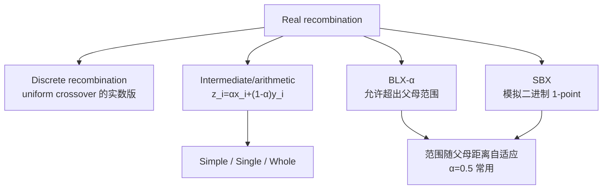

# Real 表示的重组

> 本页属于：CEG5302 / Lecture 03
>
> 前置知识：[[CEG5302-Lecture03-Real-Valued-Mutation]]
>
> 预计阅读时间：13 分钟

## 🎯 学习目标（Learning Objectives）

学完本页，你应该能：

1. 说明 real 表示的 **discrete recombination** 是 uniform crossover 的实数版、只能传播父代已有值。
2. 手算三种 **arithmetic recombination**（simple / single / whole）的一个例子。
3. 解释 **BLX-$\alpha$**：为什么允许 offspring 略超出父代范围、$\alpha=0.5$ 为何常用、为何具有 self-adaptive（探索/开发随父代距离切换）。
4. 解释 **SBX**：模拟 binary 1-point、offspring 对称于父代、$\eta_c$ 控制分散度。
5. 区分“能否产生新 allele”：binary/integer 只有 mutation 能；real 的 arithmetic/BLX/SBX 也能。

## 与 binary/integer 的区别

binary/integer 的 1-point/n-point/uniform crossover 只能传播父代已有的 allele；只有 mutation 能引入新 allele。实数表示下 uniform crossover 的对应物称 **discrete recombination**。（Lecture 3, slides 53–54）

> 📘 **关键差异（slide 53）**：binary/integer 的重组**只能用两个父代里已有的 allele 值**。因此在那些表示里，“只有 mutation 能引入新 allele”。而 real 表示下的 arithmetic / BLX / SBX **可以产生父代中没有的新实数值**——这是 real 重组“更强”的根本原因，也解释了为什么它比二进制 uniform 更可能需要“扩张范围”的算子来对冲过度平均。

## Real 表示的重组技术总览

（自制，依据课件第 53–67 页；核对 2026-09-07）

## Intermediate / Arithmetic recombination

$z_i = \alpha x_i + (1-\alpha)y_i$，$\alpha \in [0,1]$。它能产生新 allele，但只能落在两父代之间，随代数增加 allele 取值范围会因（加权）平均而缩小。三种形式：（slides 55–58）

- **Simple**：取随机切点 $k$，前 $k$ 个分量来自父代 1，其余分量取平均。
- **Single**：仅在第 $k$ 个分量取平均，其余照抄。
- **Whole**：所有分量并行加权平均。

> 🧪 **三个手算例子（slides 56–58，$\alpha=0.5$）**，父代 P1=`0.1 0.1 0.5 0.4 0.9`，P2=`0.7 0.9 1.0 0.2 0.1`：
> - **Simple（$k=3$）**：取前 3 个来自 P1（`0.1, 0.1, 0.5`），后 2 个取平均（$(0.4+0.2)/2=0.3$, $(0.9+0.1)/2=0.5$）→ child = `0.1 0.1 0.5 0.3 0.5`。
> - **Single（$k=2$）**：仅第 2 个取平均 $(0.1+0.9)/2=0.5$，其余照抄 → child = `0.1 0.5 0.5 0.4 0.9`。
> - **Whole（$\alpha=0.5$）**：全部分量并行加权平均 → `0.4 0.5 0.75 0.3 0.5`。（$0.75=(0.5+1.0)/2$）

## Blend recombination（BLX-$\alpha$）

允许 offspring 略微超出两父代范围。设 $d_i = y_i - x_i$（$x_i < y_i$），child 落在 $[x_i - \alpha d_i, y_i + \alpha d_i]$：（slides 59–64）

$$
\begin{aligned}
\gamma &= (1+2\alpha) \cdot u - \alpha \\
z_i &= (1-\gamma) \cdot x_i + \gamma \cdot y_i
\end{aligned}
$$

父代相距远时 offspring 范围也大（偏 exploration），相距近时 offspring 也在附近（偏 exploitation），因此具有 self-adaptive 特性；研究显示 $\alpha = 0.5$ 效果最好，使 child 落在两父代之内/之外的概率相当。

> 📘 **图意（slide 62）**：在二维决策变量空间里，图会展示 **whole arithmetic（0.5）**、**single arithmetic（0.5）**、**BLX-0.5** 三种 recombination 的 offspring 分布范围。
> - arithmetic 只在两父代连线的“矩形/线段”内产生后代；
> - **BLX-0.5 的区域略大于两父代张成的 n 维矩形**（每维多出的部分 $\alpha d_i$ 正比于该维父代距离）。
> - 因此 BLX 既能**保范围**、又能**略有扩张**，这就是它缓解“过度平均缩小范围”的机制。

## Simulated Binary Crossover (SBX)

用实数算子模拟 binary 的 1-point crossover（推导超出本课程范围）。与 BLX-$\alpha$ 一样，spread 依赖父代距离，但 offspring 更可能产生**小**变化。给定 $u \in [0,1)$ 与 distribution index $\eta_c$：（slides 65–67）

$$
\beta = \begin{cases}
(2u)^{\frac{1}{\eta_c+1}}, & u \le 0.5 \\
\left(\frac{1}{2(1-u)}\right)^{\frac{1}{\eta_c+1}}, & u > 0.5
\end{cases}
$$

$$
\begin{aligned}
x' &= 0.5 \cdot [(1+\beta) \cdot x + (1-\beta) \cdot y] \\
y' &= 0.5 \cdot [(1-\beta) \cdot x + (1+\beta) \cdot y]
\end{aligned}
$$

Offspring 关于两父代对称（不偏向任一父代），且 $\text{offspring}_2 - \text{offspring}_1 = \beta \cdot (\text{parent}_2 - \text{parent}_1)$，spread 与父代 spread 成正比。

## 各重组算子对比

（依据课件第 53–67 页整理；核对 2026-09-07）

| 算子 | 公式要点 | 能否产生新 allele | 范围/性质 |
|---|---|---|---|
| Discrete | 每位从某父代取 | 否（只传播已有值） | 相当于实数版 uniform crossover |
| Arithmetic | $z_i=\alpha x_i+(1-\alpha)y_i$ | 是，但只在 $[x_i,y_i]$ 之间 | 随代数范围缩小 |
| BLX-$\alpha$ | $z_i \in [x_i-\alpha d_i, y_i+\alpha d_i]$ | 是，可略超父母范围 | 探索/开发自适应；$\alpha=0.5$ 常用 |
| SBX | 由 $\beta$ 控制后代分布 | 是，对称于父母 | 更可能产生小改动；$\eta_c$ 控制分散 |

**数值示例（BLX-$\alpha$）**：设 $x_i=0.2$, $y_i=0.8$, $\alpha=0.5$，则 $d_i=0.6$，子代范围 $[0.2-0.3, 0.8+0.3]=[-0.1, 1.1]$。取 $u=0.7$，$\gamma=(1+1)\times 0.7-0.5=0.9$，$z_i=(1-0.9)\times 0.2+0.9\times 0.8=0.02+0.72=0.74$。超出父代区间的概率与落在区间内相当，正好平衡探索与开发。（依据 slide 61 公式演算）

**数值示例（SBX）**：设 $x=0.2$, $y=0.8$, $\eta_c=2$，取 $u=0.7>0.5$，则 $\beta = \left(\frac{1}{2(1-0.7)}\right)^{1/3} = \left(\frac{1}{0.6}\right)^{1/3} \approx 1.185$。$x'=0.5[(1+1.185)\times 0.2+(1-1.185)\times 0.8]=0.5[0.437-0.148]=0.1445$；$y'=0.5[(1-1.185)\times 0.2+(1+1.185)\times 0.8]=0.5[-0.037+1.748]=0.8555$。可见两个 offspring 关于父代中点 0.5 几乎对称分布；$\eta_c$ 越大，后代越可能靠近父代（小改动）。（依据 slide 66 公式演算）

**关于超界**：BLX-$\alpha$ 明显超出父代范围，可能越过 $[L_i, U_i]$ 边界。课件未给出统一截断规则——实践中常用“剪到边界”或重新采样，这属于开放设计选择（对应个人笔记中的 Open 问题）。

**一点补充**：与 binary/integer 相比，real 表示下的算术/BLX/SBX 能让子代产生父代中不存在的新实数值，因此“变异是唯一新 allele 来源”的说法在 real 表示下并不成立——引入新值的能力由 crossover 自己承担了一部分。这也是为什么 real 表示的 crossover 通常比二进制中的 uniform 更“强”，但它也更容易因过度平均而缩小范围，需要 BLX/SBX 这类能扩展范围的算子来对冲。（依据 slides 53–67 讨论，自拟总结）

## Exam Checklist（考试自查）

- **必须理解**：discrete recombination 传播已有值；arithmetic 只在父代之间；BLX/SBX 能扩张范围与“self-adaptive”特性。
- **必须手算**：simple/single/whole arithmetic（$k=3 / k=2$ / 全分量，$\alpha=0.5$）；BLX-$\alpha$（$\gamma=(1+2\alpha)u-\alpha$）；SBX（$\beta$ 公式、$x'/y'$）。
- **必须记忆**：$z_i=\alpha x_i+(1-\alpha)y_i$；BLX 区间 $[x_i-\alpha d_i, y_i+\alpha d_i]$；SBX 公式；$\alpha=0.5$ 常用、$\eta_c$ 控制分散。
- **了解即可**：SBX 如何“模拟” binary 1-point 的理论推导（课件明确 out of scope）。
- **明确 out of scope**：本讲不要求证明 BLX/SBX 的分布性质，也不要求给出“剪到边界 vs 重新采样”的统一规则（开放设计）。

## 下一步

- 上一页：[[CEG5302-Lecture03-Real-Valued-Mutation]]
- 下一页：[[CEG5302-Lecture03-Permutation-Representation]]
- 返回：[[Home]]

## 来源与更新日志

- 来源：[Lecture 3-Representation and Variation_27Aug2026.pdf](https://github.com/Kytolly/NUS-coursework-wiki/releases/download/CEG5302/Lecture.3-Representation.and.Variation_27Aug2026.pdf)，slides 53–67。
- 2026-09-03：从 Lecture 3 拆出“Real 表示的重组”短页。
- 2026-09-07：新增 Real 重组技术总览 Mermaid 图、各重组算子对比表与 BLX-α 数值示例。
- 2026-09-09：新增学习目标；补充 binary/integer vs real 的“新 allele 来源”差异；三个 arithmetic 手算例子（slide 56–58）；BLX-0.5 图意解析（父代矩形 vs BLX 扩张范围）；新增 Exam Checklist。
