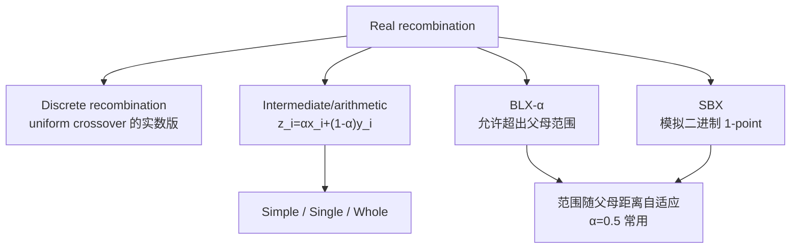

# Real 表示的重组

> 本页属于：CEG5302 / Lecture 03
>
> 前置知识：[[CEG5302-Lecture03-Real表示的变异]]
>
> 预计阅读时间：9 分钟

## 与 binary/integer 的区别

binary/integer 的 1-point/n-point/uniform crossover 只能传播父代已有的 allele；只有 mutation 能引入新 allele。实数表示下 uniform crossover 的对应物称 **discrete recombination**。（Lecture 3, slides 53–54）

## Real 表示的重组技术总览

（自制，依据课件第 53–67 页；核对 2026-09-07）



## Intermediate / Arithmetic recombination

`z_i = α·x_i + (1-α)·y_i`，`α ∈ [0,1]`。它能产生新 allele，但只能落在两父代之间，随代数增加 allele 取值范围会因（加权）平均而缩小。三种形式：（slides 55–58）

- **Simple**：取随机切点 k，前 k 个分量来自父代 1，其余分量取平均。
- **Single**：仅在第 k 个分量取平均，其余照抄。
- **Whole**：所有分量并行加权平均。

## Blend recombination（BLX-α）

允许 offspring 略微超出两父代范围。设 `d_i = y_i - x_i`（`x_i < y_i`），child 落在 `[x_i - α·d_i, y_i + α·d_i]`：（slides 59–64）

```
γ = (1+2α)·u - α
z_i = (1-γ)·x_i + γ·y_i
```

父代相距远时 offspring 范围也大（偏 exploration），相距近时 offspring 也在附近（偏 exploitation），因此具有 self-adaptive 特性；研究显示 `α = 0.5` 效果最好，使 child 落在两父代之内/之外的概率相当。

## Simulated Binary Crossover (SBX)

用实数算子模拟 binary 的 1-point crossover（推导超出本课程范围）。与 BLX-α 一样，spread 依赖父代距离，但 offspring 更可能产生**小**变化。给定 `u ∈ [0,1)` 与 distribution index `η_c`：（slides 65–67）

```
β = (2u)^(1/(η_c+1))                 (u ≤ 0.5)
β = (1/(2(1-u)))^(1/(η_c+1))         (u > 0.5)

x' = 0.5·[(1+β)·x + (1-β)·y]
y' = 0.5·[(1-β)·x + (1+β)·y]
```

Offspring 关于两父代对称（不偏向任一父代），且 `offspring2 - offspring1 = β·(parent2 - parent1)`，spread 与父代 spread 成正比。

## 各重组算子对比

（依据课件第 53–67 页整理；核对 2026-09-07）

| 算子 | 公式要点 | 能否产生新 allele | 范围/性质 |
|---|---|---|---|
| Discrete | 每位从某父代取 | 否（只传播已有值） | 相当于实数版 uniform crossover |
| Arithmetic | `z_i=αx_i+(1-α)y_i` | 是，但只在 `[x_i,y_i]` 之间 | 随代数范围缩小 |
| BLX-α | `z_i∈[x_i−αd_i, y_i+αd_i]` | 是，可略超父母范围 | 探索/开发自适应；α=0.5 常用 |
| SBX | 由 `β` 控制后代分布 | 是，对称于父母 | 更可能产生小改动；`η_c` 控制分散 |

**数值示例（BLX-α）**：设 `x_i=0.2`, `y_i=0.8`, `α=0.5`，则 `d_i=0.6`，子代范围 `[0.2−0.3, 0.8+0.3]=[-0.1, 1.1]`。取 `u=0.7`，`γ=(1+1)×0.7−0.5=0.9`，`z_i=(1−0.9)×0.2+0.9×0.8=0.02+0.72=0.74`。超出父代区间的概率与落在区间内相当，正好平衡探索与开发。（依据 slide 61 公式演算）

**数值示例（SBX）**：设 `x=0.2`, `y=0.8`, `η_c=2`，取 `u=0.7>0.5`，则 `a=(1/(2(1−0.7)))^(1/3)=(1/0.6)^(1/3)≈1.185`。`x'=0.5[(1+1.185)×0.2+(1−1.185)×0.8]=0.5[0.437−0.148]=0.1445`；`y'=0.5[(1−1.185)×0.2+(1+1.185)×0.8]=0.5[-0.037+1.748]=0.8555`。可见两个 offspring 关于父代中点 0.5 几乎对称分布；`η_c` 越大，后代越可能靠近父代（小改动）。（依据 slide 66 公式演算）

**关于超界**：BLX-α 明显超出父代范围，可能越过 `[L_i,U_i]` 边界。课件未给出统一截断规则——实践中常用“剪到边界”或重新采样，这属于开放设计选择（对应个人笔记中的 Open 问题）。

**一点补充**：与 binary/integer 相比，real 表示下的算术/BLX/SBX 能让子代产生父代中不存在的新实数值，因此“变异是唯一新 allele 来源”的说法在 real 表示下并不成立——引入新值的能力由 crossover 自己承担了一部分。这也是为什么 real 表示的 crossover 通常比二进制中的 uniform 更“强”，但它也更容易因过度平均而缩小范围，需要 BLX/SBX 这类能扩展范围的算子来对冲。（依据 slides 53–67 讨论，自拟总结）

## 下一步

- 上一页：[[CEG5302-Lecture03-Real表示的变异]]
- 下一页：[[CEG5302-Lecture03-Permutation表示]]
- 返回：[[Home]]

## 来源与更新日志

- 来源：[Lecture 3-Representation and Variation_27Aug2026.pdf](https://github.com/Kytolly/NUS-coursework-wiki/releases/download/CEG5302/Lecture.3-Representation.and.Variation_27Aug2026.pdf)，slides 53–67。
- 2026-09-03：从 Lecture 3 拆出“Real 表示的重组”短页。
- 2026-09-07：新增 Real 重组技术总览 Mermaid 图、各重组算子对比表与 BLX-α 数值示例。
