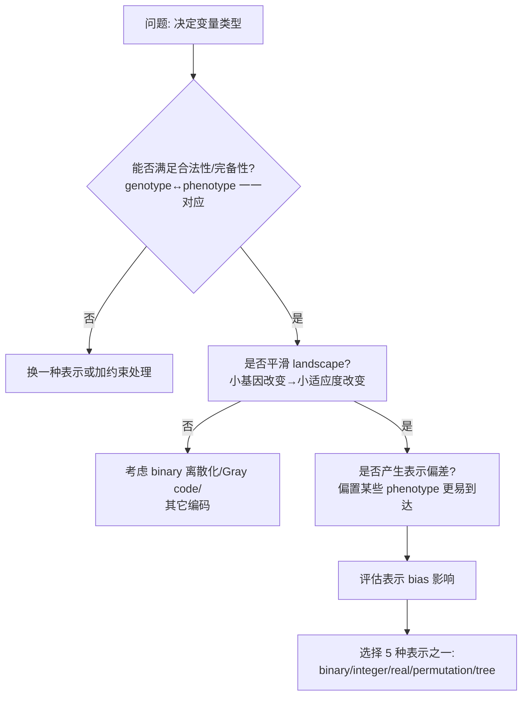

# 表示的概念与选择准则

> 本页属于：CEG5302 / Lecture 03
>
> 前置知识：[[CEG5302-Lecture02-CanonicalGA与手算示例]]
>
> 预计阅读时间：7 分钟

## 复习：表示与相关组件

- **Phenotype** 是原问题领域中的个体；**Genotype** 是 EA 领域中的个体。
- **Representation** 是 phenotype space 到 genotype space 的映射，应当可逆（invertible）。

表示只影响 **variation operators（mutation 与 recombination）**；evaluation function、parent selection、survivor selection 与 termination condition 是 **representation-independent** 的。（Lecture 3, slides 5, 10）

## 选择表示的准则

（Lecture 3, slides 6–9）

1. **合法性与完备性**：映射应保证所有可能 genotype 都对应一个合法 solution，反之所有可能 solution 都能被某个 genotype 表示。（slide 6）
2. **对 fitness landscape 的影响**：表示决定 landscape 的邻域结构。好的表示让 landscape 更平滑——小的遗传改变只带来小的 fitness 变化，从而提升搜索效率；这是问题相关的。例如对实数值 decision variable 使用 binary 表示会离散化搜索空间。（slides 7–8）
3. **Representation bias**：由于编码方式，某些 phenotype 更容易被生成，使搜索偏向特定区域，可能降低 diversity、导致 premature convergence 或陷入 local optima。两个使用相同 fitness function 与 selection 准则但不同表示的 EA 可能得到截然不同的结果。（slide 9）

## 表示相关 vs 无关

表示方案只影响 **variation（mutation 与 recombination）**；下列组件与表示无关（依据课件第 5、10 页整理；核对 2026-09-07）：

| 类别 | 组件 |
|---|---|
| 表示相关（representation-dependent） | Mutation、Recombination |
| 表示无关（representation-independent） | Evaluation function、Parent selection、Survivor selection、Termination condition |

## 选择表示的决策链路

选择表示时按以下链条检查（自制，依据课件第 6–9 页；核对 2026-09-07）：

## 好表示的检查清单

结合课件“合法性/完备性、landscape 平滑、bias”三条准则，可整理成实践时逐项核对的问题（依据 slides 6–9 整理；核对 2026-09-07）：

- [ ] 每个 genotype 都对应一个合法 phenotype？（合法性）
- [ ] 每个可行 phenotype 都能被某个 genotype 表示？（完备性）
- [ ] 小基因改变通常只带来小 fitness 改变吗？（平滑 landscape）
- [ ] 是否存在明显偏好某些区域/解、从而伤害多样性的表示 bias？
- [ ] 该表示下 mutation/recombination 是否容易定义且高效？（表示相关组件）

**示例（平滑性）**：对连续变量用二进制编码会把搜索空间离散化（如把 `[0,1]` 切成 256 级），相邻整数（如 3=011、4=100）Hamming 距离为 3，突变一位可能从数值附近跳到很远——landscape 显得“不平滑”。改用 Gray code（相邻整数只差 1 bit）或直接实数编码，可让单 bit 突变近似对应小步长。（依据 slides 8, 16–17 的二进制讨论，合并此处）

## 本讲范围

逐一介绍 5 种表示（binary、integer、real、permutation、tree）的常用 mutation 与 recombination 技术；这些不是穷尽列表，实践中可能需要 hybrid、problem-dependent 的表示。（Lecture 3, slide 11）

## 下一步

- 上一页：[[CEG5302-Lecture02-CanonicalGA与手算示例]]
- 下一页：[[CEG5302-Lecture03-Binary与Integer表示]]
- 返回：[[Home]]

## 来源与更新日志

- 来源：[Lecture 3-Representation and Variation_27Aug2026.pdf](https://github.com/Kytolly/NUS-coursework-wiki/releases/download/CEG5302/Lecture.3-Representation.and.Variation_27Aug2026.pdf)，slides 4–17。
- 2026-09-03：从 Lecture 3 拆出“表示的概念与选择准则”短页。
- 2026-09-07：新增表示相关/无关组件对照表与表示选择决策链路 Mermaid 图。
