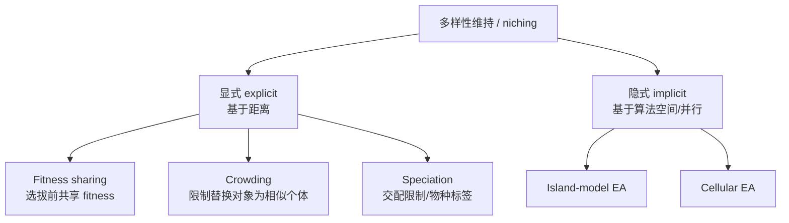
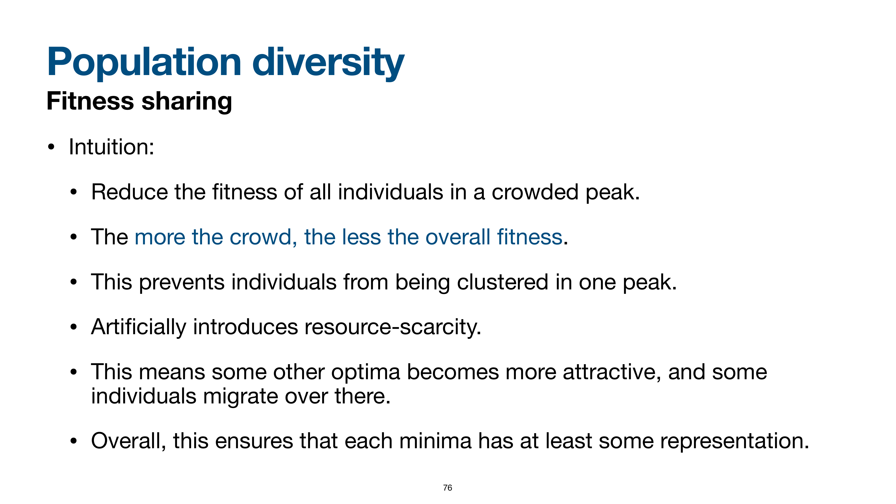
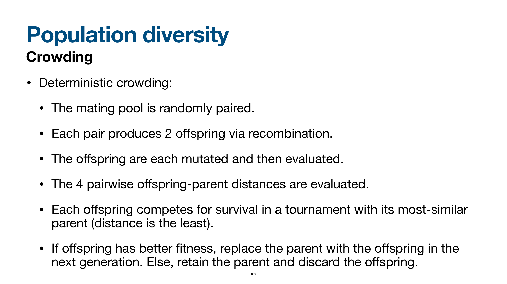

# 多样性维持与 Niching

> 本页属于：CEG5302 / Lecture 04
>
> 前置知识：[[CEG5302-Lecture04-Survivor-Selection-and-Selection-Pressure]]
>
> 预计阅读时间：13 分钟

## 🎯 学习目标（Learning Objectives）

学完本页，你应该能：

1. 说出需要 niching 的 4 个理由（multi-modal、fitness 不准确/变化、宽峰 vs 窄峰、panmictic mixing 导致单峰收敛）。
2. 区分多样性在 phenotype / genotype / algorithmic space 的度量。
3. 解释 **fitness sharing** 的机制（$F'(i) = \frac{F(i)}{\sum_j \text{sh}(d(i,j))}$）与直觉（人工资源稀缺），并手算一个 niche 的例子。
4. 解释 **crowding**（尤其是 deterministic crowding）与 **speciation**。
5. 判断什么时候用 explicit vs implicit niching。

## 为什么需要 niching

> 📘 **为什么要维护多样性？（slides 68–70 的四层理由）**
> 1. **multi-modal 问题有多个局部最优**：要平衡 exploration/exploitation 以**覆盖整个搜索空间**、**不遗漏任何 optima**，也便于我们做**主观判断/选择多个选项**。
> 2. **fitness function 可能无法准确反映真实问题**，或**随时间变化**：这时有一组可行的备选方案会很有帮助。
> 3. **窄峰可能不可靠**：窄峰可能暗示 **overfitting（过拟合）**，是 fitness function 的**伪影（artefact）**而非真实问题；此时**宽峰更可取**。
> 4. **panmictic mixing**：由于通常允许**任意父代之间**重组（panmictic mixing），整个种群会**收敛到单一峰**。所以我们希望个体**分散在多个峰上**，这类技术统称 **niching schemes（niching）**。

multi-modal 问题有多个 local optima，需平衡 exploration/exploitation 以覆盖整个搜索空间、避免遗漏 optima，并提供多个选项供主观判断；此外 fitness function 可能不够准确或随时间变化，且窄峰可能是 overfitting 的伪影（宽峰更可取）。由于通常允许任意父代重组（**panmictic mixing**），整个种群会收敛到单一峰，因此需要 niching 方案让个体分散在多个峰上。（Lecture 4, slides 67–71）

## 多样性在何处度量

（slide 72）

- **Phenotype space**：现实中的 Manhattan/Euclidean 距离。
- **Genotype space**：chromosome 间的 Hamming/Euclidean/Manhattan 距离。
- **Algorithmic space**：population 空间的概念划分，或跨多个 CPU core 的物理分布。

## 显式 vs 隐式方法

（slide 73）

- **显式（explicit）**：直接修改算子以保持多样性、基于 genotype/phenotype 距离（fitness sharing、crowding、speciation）。
- **隐式（implicit）**：提供促进（但不保证）多样性的框架、工作在 algorithmic space（island model、cellular EA）。

多样性维持方法分类（依据课件第 67–84、85–96 页整理；核对 2026-09-07）：

## Fitness sharing

niche 是一小块邻域；在 selection 前按个体所在 niche 的拥挤程度共享/削减 fitness，使 selection 按 niche fitness 成比例分配个体。直觉是“越拥挤 fitness 越低”，人为引入资源稀缺。（slides 74–76）

计算所有个体对（含自身）的距离 $d(i,j)$，调整后 fitness：

$$
F'(i) = \frac{F(i)}{\sum_j \text{sh}(d(i,j))}
$$

sharing function 常取 $\text{sh}(d) = 1 - (d/\sigma_{\text{share}})^\alpha$（当 $d < \sigma_{\text{share}}$，否则 0）。$\alpha=1$ 时线性，$\alpha>1$ 时相近个体的削减作用随距离衰减更快；$\sigma_{\text{share}}$（sharing radius）决定能维持多少个 niche，一般取 5–10。（slides 77–80）

**数值示例**：某 niche 内有 3 个个体，原始 fitness 均为 $F=10$，相互距离 $d=2$，取 $\sigma_{\text{share}}=5$、$\alpha=1$，则 $\text{sh}(2)=1-2/5=0.6$。对个体 1，$\sum_j \text{sh}(d(1,j))=\text{sh}(0)+2\times\text{sh}(2)=1+2\times 0.6=2.2$，$F'=10/2.2\approx 4.55$。同理逐个计算，越拥挤的 niche 中个体被削减得越多，从而把部分个体“挤”向其它尚未拥挤的峰。（依据 slides 77–80 公式演算）

### 图意与直觉（slides 74–76）

> 📘 **Fitness sharing 的图形直觉**：把 fitness landscape 上的峰看成“资源”，每个峰能“供养”的个体数是有限的。
> - 对**拥挤的峰**：**降低该峰上所有个体的 fitness**；“人越多，fitness 越低”。
> - 这**防止个体集中在一个峰**，人为引入**资源稀缺**。
> - 于是**别的峰（还没那么拥挤）变得更吸引人**，部分个体**迁移过去**。
> - 总体目标是 **每个局部最优（哪怕不是全局最优）都至少保持一些代表性**。

#### 课件原图对照：适应度共享机制 (Slide 76)

> **Figure Object: Slide 76**
> - **Source**: `Lecture 4-Selection and Population management_03Sept2026.pdf` Slide 76
> - **Locator**: Slide 76 "Fitness sharing"
> - **Explanation**: 展示了多峰适应度景观中，密集聚集在主峰上的个体由于小生境计数增大，其适应度被显著打压，从而迫使种群分流至次级峰（Secondary peaks），维持了多个局部最优解的共存。
> - **What to notice**: 峰的高度决定了该生态位能容纳的个体比例，但拥挤效应防止了单一最高峰被全部个体独占。

## 表：fitness sharing vs crowding

（依据 slide 83 整理；核对 2026-09-07）

| 方法 | 分配原则 | 关键参数 |
|---|---|---|
| Fitness sharing | 个体数按各峰 fitness 成比例分配 | $\sigma_{\text{share}}$、$\alpha$（敏感） |
| Crowding | 个体均匀分配到各峰 | 距离度量（最相似父代） |

## Crowding

限制 offspring 只能替换与之相似的个体，避免用与多数个体都相似的 offspring 替换掉唯一个体。**Deterministic crowding**：mating pool 随机配对，每对经 recombination 产生 2 个 offspring，mutation 并评估；计算 4 个 offspring-parent 两两距离，每个 offspring 与最相似父代竞争，更优者进入下一代。（slides 81–82）

#### 课件原图对照：确定性拥挤机制 (Slide 82)

> **Figure Object: Slide 82**
> - **Source**: `Lecture 4-Selection and Population management_03Sept2026.pdf` Slide 82
> - **Locator**: Slide 82 "Deterministic crowding"
> - **Explanation**: 图解了配对的两个父代 $p_1, p_2$ 产生子代 $c_1, c_2$ 后，通过计算交叉距离配对 $[(p_1, c_1), (p_2, c_2)]$ 或 $[(p_1, c_2), (p_2, c_1)]$，让每个子代仅与其最相似的近亲父代进行一对一锦标赛淘汰。
> - **What to notice**: “同类替换”（Like replaces like）消除了不同生态位个体之间的有害竞争，天然保护了种群异质性。

- **Fitness sharing vs crowding**：fitness sharing 按各峰 fitness 成比例分配个体；crowding 均匀地把个体分配到各峰。（slide 83）

## Speciation

施加交配限制——只有同/相近 species 的成员才能重组；可给 chromosome 加 species 标签并让其随 variation 进化；潜在配偶须在特定距离内，超出则拒绝。可与 fitness sharing 结合。（slide 84）

## 什么时候需要 niching

当问题存在**多个局部最优（multi-modal）**、fitness 函数会随时间变化、或希望给出多种可选方案时，niching 尤其重要（slides 68–70）。与之相对，若问题只有单一全局峰，niching 可能只是减缓收敛、增加运行时长。选择显式还是隐式方法，通常看“能否方便地定义个体间距离”：能定义距离（genotype/phenotype）就用 fitness sharing/crowding；否则（如超大种群、跨核分布）用 island/cellular 这类隐式结构。（依据 slides 68–73、85–86 整理；核对 2026-09-07）

## Exam Checklist（考试自查）

- **必须理解**：为什么需要 niching（4 层理由）；explicit vs implicit；fitness sharing vs crowding vs speciation 的区别。
- **必须手算**：fitness sharing 的数值示例（$F=10, d=2, \sigma_{\text{share}}=5, \alpha=1 \to F'\approx 4.55$）。
- **必须记忆**：$F'(i)=F(i)/\sum_j \text{sh}(d(i,j))$；$\text{sh}(d)=1-(d/\sigma_{\text{share}})^\alpha$（$d<\sigma_{\text{share}}$，否则 0）；$\sigma_{\text{share}}$ 取 5–10；deterministic crowding 的 4 步。
- **了解即可**：speciation 的 species 标签具体实现。
- **明确 out of scope**：本讲不要求证明 niching 一定改善收敛，也不给 $\sigma_{\text{share}}$ 的最优设定。

## 下一步

- 上一页：[[CEG5302-Lecture04-Survivor-Selection-and-Selection-Pressure]]
- 下一页：[[CEG5302-Lecture04-Island-Cellular-EA-and-MATLAB]]
- 返回：[[Home]]

## 来源与更新日志

- 来源：[Lecture 4-Selection and Population management_03Sept2026.pdf](https://github.com/Kytolly/NUS-coursework-wiki/releases/download/CEG5302/Lecture.4-Selection.and.Population.management_03Sept2026.pdf)，slides 67–84。
- 2026-09-03：从 Lecture 4 拆出“多样性维持与 Niching”短页。
- 2026-09-07：新增多样性维持方法分类 Mermaid 图、fitness sharing 数值示例与 sharing/crowding 对比表。
- 2026-09-09：新增学习目标；补齐“为什么需要 niching”4 层理由（overfitting 窄峰、fitness 变化）；新增 fitness sharing 图意/直觉（资源稀缺、跨峰迁移）；新增 Exam Checklist。
