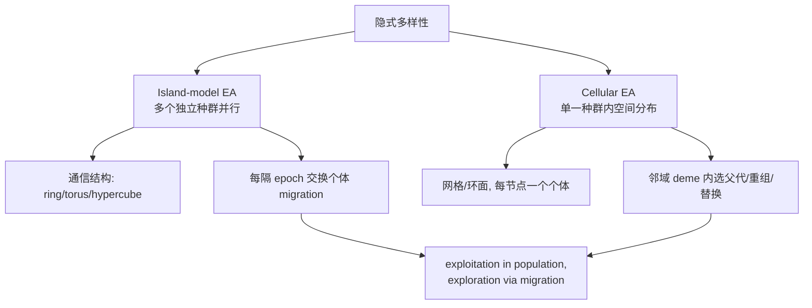

# Island 与 Cellular EA 及 MATLAB

> 本页属于：CEG5302 / Lecture 04
>
> 前置知识：[[CEG5302-Lecture04-多样性维持与Niching]]
>
> 预计阅读时间：8 分钟

## Island model EAs

（coarse-grained parallel EAs）并行运行多个种群，通过 ring/torus/hypercube 结构通信，每隔固定代数（**epoch**）与邻居交换个体（**migration**）：种群内 exploitation，种群间 exploration。（Lecture 4, slides 85–93）

两种隐式多样性方法的结构（依据课件第 87–96 页整理；核对 2026-09-07）：



设计问题：

- **多久交换一次**：太频繁会全部收敛到同一区域，太少则浪费算力；epoch 常取 25–150 代。
- **交换多少、哪些个体**：通常 2–5 个；随机选择更不易被新高 fitness 移民接管。
- **如何划分**：需满足最小 subpopulation 大小，subpopulation 越多性能越好。
- **各岛是否相同**：可以不同——subpopulation 大小、recombination/mutation 算子与概率都可各异。

| 设计要素 | 常见取值/原则 | 课件页 |
|---|---|---|
| 交换频率（epoch） | 25–150 代 | 89 |
| 交换个体数 | 2–5 个 | 90 |
| 交换何种个体 | 随机较不易被高 fitness 移民接管 | 90 |
| 子种群划分 | 尊重最小子种群大小，数目越多越好 | 91 |
| 岛是否同构 | 否，可各自不同参数 | 92 |

## Cellular EAs

在**单个种群内**维持空间分布，demes 形成于 algorithmic subspace（类比地理距离导致的信息缓慢扩散）。实现：个体置于（通常环面）网格顶点，每代对每个 deme（如方格网格上节点及其 8 个近邻，共 9 个）选择 2 个父代、recombination、mutation、评估，再用 offspring 替换 deme 内某个节点上的个体。（slides 94–96）

## MATLAB 中的 GA

MATLAB Global Optimization Toolbox 实现了 Simple GA（可带/不带约束），设置参数后直接调用 `ga` 函数即可，无需手写代码。语法与参数见 MathWorks 文档 <https://www.mathworks.com/help/gads/ga.html>，或在 MATLAB 中运行 `doc ga`。（slides 97–104）

示例（依据 slide 98–104 的文档引导，示意而非课程要求）：

```matlab
% 最大化 f(x)=x^2-2x+1 在 [-5,5] 内（MATLAB 默认求最小，故取负）
fun = @(x) -(x(1).^2 - 2*x(1) + 1);   % 转成最小化
[x_opt, fval] = ga(fun, 1, [], [], [], [], -5, 5);
% 也可用 options = optimoptions('ga', 'PopulationSize', 100, 'CrossoverFraction', 0.8);
```

## Island vs Cellular 对比

| 维度 | Island-model EA | Cellular EA |
|---|---|---|
| 种群 | 多个独立子种群并行 | 单一种群、空间分布 |
| 隔离方式 | 通过通信结构（ring/torus/hypercube） | 网格邻域 deme |
| 交互 | 每隔 epoch 迁移个体 | 每代在 deme 内重组/替换 |
| 探索/开发 | 种群内开发、迁移间探索 | 局部邻域扩散（信息慢速渗透） |
| 并行实现 | 天然适合多核/多机 | 可在单机内模拟 |

（依据 slides 87–96 整理；核对 2026-09-07）

## 关于 MATLAB `ga` 的约束支持

MATLAB 的 `ga` 支持带约束的最小化：可通过 `nonlcon` 传入非线性约束函数，或用 A、b、Aeq、beq 指定线性约束；返回的 `x, fval` 是最终个体与目标值。课件未展开语法细节，仅说明“可直接调用函数并设置参数”（slides 98–99, 104）。下面是一个带约束的示意（非课件示例）：

```matlab
fun = @(x) x(1).^2 + x(2).^2;          % 求最小
nonlcon = @(x) deal(x(1)+x(2)-1, []);  % x1+x2 >= 1 转为 <= 0 形式
[x, fval] = ga(fun, 2, [], [], [], [], [], [], nonlcon);
```

## 下一步

- 上一页：[[CEG5302-Lecture04-多样性维持与Niching]]
- 下一页：[[CEG5302-当前进度与待补内容]]
- 返回：[[Home]]

## 来源与更新日志

- 来源：[Lecture 4-Selection and Population management_03Sept2026.pdf](https://github.com/Kytolly/NUS-coursework-wiki/releases/download/CEG5302/Lecture.4-Selection.and.Population.management_03Sept2026.pdf)，slides 85–104。
- 2026-09-03：从 Lecture 4 拆出“Island 与 Cellular EA 及 MATLAB”短页。
- 2026-09-07：新增 Island/Cellular 结构对比 Mermaid 图、Island 设计参数表与 MATLAB ga 示例。
