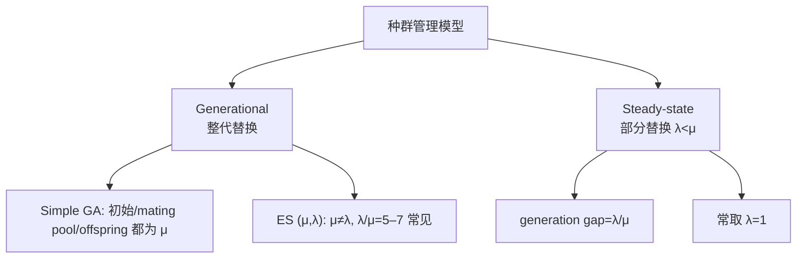

# 种群管理模型与 FPS 及 Ranking

> 本页属于：CEG5302 / Lecture 04
>
> 前置知识：[[CEG5302-Lecture03-Tree-Representation-and-Crossover-Conclusions]]
>
> 预计阅读时间：13 分钟

## 🎯 学习目标（Learning Objectives）

学完本页，你应该能：

1. 区分 generational 与 steady-state 两种种群管理模型，并说明 generation gap。
2. 解释 selection 为什么在 parent 与 survivor 两处发生、为何与表示无关。
3. 说明 FPS 的三个问题（杰出个体主导、后期压力低、transposing），并给出定量例子。
4. 说清 ranking selection 如何用相对名次保持恒定 selection pressure，以及线性/指数映射。
5. 排一个 FPS vs Ranking 在 $\mu=3$ 时的概率对比表。

## 复习与两种种群管理模型

📘 先回到 natural evolution：**选择是自然进化的核心过程**——个体（phenotype/genotype）竞争有限的资源，**通常更适应的个体有更高概率繁殖/存活**。（Lecture 4, slide 7）

本讲讨论 **selection（parent 与 survivor）**——它对表示是 agnostic 的——以及如何维持种群多样性。（Lecture 4, slides 5–6）

两类种群管理模型：（slides 7–11）

1. **Generational（代际）**：整代 population 在下一代被全部替换（Simple GA 的方式）。（slides 9–10）
   - 每代先有一个 $\mu$ 大小的种群，**选出大小相同的 mating pool**（可以有 1 个或多个父代副本，**重复允许**，fit 的父代出现次数更多）；
   - 从这个 mating pool 通过 recombination/crossover 生成 $\lambda$ 个 offspring；
   - **整个上一代 $\mu$ 个个体被“从 offspring 中选出的 $\mu$ 个”替换**，成为下一代。
   - 注意：Simple GA 中**初始种群大小、mating pool 大小、offspring 数量都相同**（都=$\mu$），但**并非所有 EA 都如此**——例如 Evolution Strategies 的 **$(\mu, \lambda)$** 策略里 $\mu \ne \lambda$（如 $\lambda/\mu = 5\text{--}7$）。
2. **Steady-state（稳态）**：每代只替换一部分个体，$\lambda$ 个旧个体被 offspring 替换；**generation gap** 指被替换的比例，研究中常取 $\lambda=1$。（slide 11）

Selection 出现在两处：parent selection 与 survivor selection。（slide 12）

两种种群管理模型对比（依据课件第 8–11 页整理；核对 2026-09-07）：

**代沟（generation gap）** $\lambda/\mu$ 是稳态模型每代被替换的比例；当只有 1 个个体被替换时 $\lambda=1$。世代模型把替换比例设为 1，而 $(\mu,\lambda)$ ES 等变体允许 $\lambda > \mu$。（slides 9–11）

## Fitness-proportional selection（FPS）

个体 $i$ 的选中概率 $p_i = f_i / \sum_j f_j$，基于绝对 fitness（Simple GA 与手算都用它）。（slides 13–14）

它的问题：（slide 15）

- 杰出个体迅速占据种群，导致 premature convergence 到局部区域/local minimum；
- 一旦所有个体 fitness 接近，selection pressure 变低，随机选择占主导，后期提升缓慢；
- **Transposing 问题**：对 fitness function 做平移（如加常数）会显著改变相对 selection probability，尽管 optimum 位置不变。

**数值示例（FPS 平移）**：设种群 fitness 为 $[10, 20, 30]$，则概率 $p=[1/6, 2/6, 3/6]=[0.167, 0.333, 0.5]$。若每个 fitness 都加 100 变为 $[110, 120, 130]$，则 $p=[110/360, 120/360, 130/360]=[0.306, 0.333, 0.361]$——最优与最差个体的概率差距从 0.333 缩到 0.055，optimum 位置虽不变，选择压力却明显下降。（依据 slide 16 思想演算）

### 解决平移问题

（slide 16）

- **Windowing**：从每个 fitness 减去某值 $\beta$（如当代最小 fitness，或过去若干代移动平均以减少波动）。
- **Sigma scaling**：$f'(x) = \max(f(x) - (\bar{f} - c \cdot \sigma_f), 0)$，常数 $c$ 通常取 2。

## Ranking selection

按 fitness 排序后，基于**名次**而非绝对值分配概率，从而保持恒定的 selection pressure（最差个体 rank 0，最优个体 rank $\mu-1$）。映射可线性或指数，所有概率之和必须为 1。（slides 17–19）

- **线性映射**：设参数 $s$ 为最优个体期望分配的 offspring 数（$1 < s \le 2$），rank $i$ 的概率：

$$
P(i) = \frac{2-s}{\mu} + \frac{2i(s-1)}{\mu(\mu-1)}
$$

第一项对所有个体恒定（保证 $\sum P=1$），第二项在最差个体（$i=0$）处为 0。中位 fitness 个体有 1 次繁殖机会；$s > 2$ 会使部分概率为负，因此 $s$ 上限为 2，selection pressure 受限。（slides 20–23）

- **指数映射**：$P(i) = \frac{1 - e^{-i}}{c}$（$c$ 为归一化常数），比线性映射给出更高 selection pressure。（slide 24）

## FPS 问题与对策对照

| 问题 | 表现 | 对策 |
|---|---|---|
| 杰出个体快速占据种群 | 过早收敛到局部 | 降低压力/用 ranking、tournament |
| 后期选择压力低 | 个体 fitness 相近 → 近乎随机选择 | windowing、sigma-scaling（相对化 fitness） |
| Transposing 影响大 | 加常数改变相对概率 | 去掉平移项、用排名/相对比较 |

（依据 slides 15–17 整理；核对 2026-09-07）

**数值示例（线性 ranking，$\mu=3$）**：设 $s=2$，则
$P(0)=(2-2)/3+0=0$；$P(1)=0/3+2\times 1\times(2-1)/(3\times 2)=1/3\approx 0.333$；$P(2)=0+2\times 2\times 1/6=4/6\approx 0.667$。全体概率和为 1，最差个体（rank 0）概率为 0（此处 $s=2$ 使最差个体完全不被选，实际可用 $1<s\le 2$，若要求最差有非零概率可取 $s<2$）。这与 FPS 相比对 fitness 绝对量不再敏感，只依赖相对排名，因此**选择压力恒定**。（依据 slides 20–23 演算）

### FPS vs 线性 Ranking 对比（$\mu=3$，slide 22）

📘 课件给了一个直观对比：设 $\mu=3$ 个个体，fitness 分别为 $f_1, f_2, f_3$。

| 个体（rank） | FPS $P(i)=f_i/\sum f_j$ | 线性 Ranking $P(i)=\frac{2-s}{\mu} + \frac{2i(s-1)}{\mu(\mu-1)}$（$s=2$） |
|---|---|---|
| 最差（rank 0） | 取决于绝对 fitness（可能很小） | 0 |
| 中间（rank 1） | 取决于绝对 fitness | $1/3 \approx 0.333$ |
| 最优（rank 2） | 取决于绝对 fitness（可能很大） | $2/3 \approx 0.667$ |

> 💡 **结论**：FPS 的概率**随绝对 fitness 变化**（fitness 相近时被“拉平”）；Ranking 的概率**只由排名决定**，因此**恒定选择压力**。这也是 Ranking 能缓解“后期选择压力低”的原因。

## Exam Checklist（考试自查）

- **必须理解**：generational vs steady-state 与 generation gap；FPS 的“杰出个体主导 / 后期压力低 / transposing”三大问题；ranking 为什么恒定压力。
- **必须手算**：FPS 平移例（$[10,20,30]$ vs $[110,120,130]$）；线性 ranking（$\mu=3, s=2$ 得 $0, 1/3, 2/3$）；windowing/sigma-scaling 公式。
- **必须记忆**：$p_i=f_i/\sum f$；$P(i)=\frac{2-s}{\mu} + \frac{2i(s-1)}{\mu(\mu-1)}$；$s \in (1,2]$；指数映射 $\propto 1-e^{-i}$。
- **了解即可**：moving-average windowing 的精确窗口设置。
- **明确 out of scope**：本讲不要求证明 ranking 一定优于 FPS，也不推导 s≤2 的数学。

## 下一步

- 上一页：[[CEG5302-Lecture03-Tree-Representation-and-Crossover-Conclusions]]
- 下一页：[[CEG5302-Lecture04-RWS-Tournament-and-Selection-Schemes]]
- 返回：[[Home]]

## 来源与更新日志

- 来源：[Lecture 4-Selection and Population management_03Sept2026.pdf](https://github.com/Kytolly/NUS-coursework-wiki/releases/download/CEG5302/Lecture.4-Selection.and.Population.management_03Sept2026.pdf)，slides 5–24。
- 2026-09-03：从 Lecture 4 拆出“种群管理模型与 FPS 及 Ranking”短页。
- 2026-09-07：新增种群管理模型对比 Mermaid 图、FPS 平移问题与线性 ranking 数值示例。
- 2026-09-09：新增学习目标；补充 selection 作为自然进化核心、generational 模型的分步（μ/mating pool/offspring）、FPS vs 线性 Ranking（μ=3）对比表；新增 Exam Checklist。
