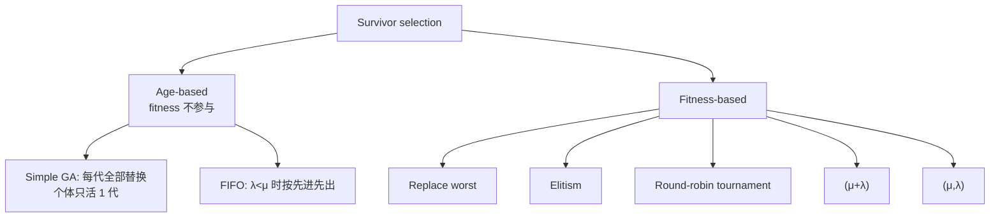
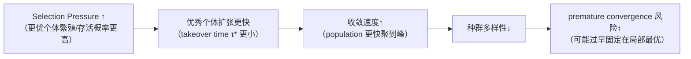

# Survivor Selection 与选择压力

> 本页属于：CEG5302 / Lecture 04
>
> 前置知识：[[CEG5302-Lecture04-RWS-Tournament-and-Selection-Schemes]]
>
> 预计阅读时间：13 分钟

## 🎯 学习目标（Learning Objectives）

学完本页，你应该能：

1. 说明 survivor selection（replacement）从 $\mu$ parents + $\lambda$ offspring 中选出 $\mu$ 个。
2. 区分 age-based 与 fitness-based 两类 replacement，并各举一例。
3. 解释 replace worst / elitism / round-robin / $(\mu+\lambda)$ / $(\mu,\lambda)$ 的做法与取舍。
4. 说清 **$(\mu,\lambda)$ vs $(\mu+\lambda)$** 在 multi-modal / adaptive landscape 与 self-adaptation 上的差异。
5. 理解 **selection pressure 可由 takeover time $\tau^*$** 量化，并说出“压力↑ → 收敛快 → 多样性↓ → premature convergence 风险↑”的因果链。

## Survivor selection

从 $\mu$ 个 parents 与 $\lambda$ 个 offspring 中选出 $\mu$ 个组成下一代，也称 **replacement**。分 **fitness-based** 与 **age-based** 两类。（Lecture 4, slides 53–55）

> 📘 **它与 parent selection 的关系（slide 53）**：总体上说，**parent selection 的方法大多也适用于 survivor selection**；但传统上还发展了一些专属策略。二者关键差异：parent selection 通常是 **stochastic**，survivor selection 很多时候是 **deterministic**（但也可能带随机性，如 round-robin）。

生存选择策略分类（依据课件第 55–64 页整理；核对 2026-09-07）：

### Age-based

每个个体在种群中存活相同的代数，不考虑 fitness。因为不直接用 fitness，下一代最佳 fitness 可能暂时下降；可通过 parent selection 施加足够 pressure、并避免过多破坏性 variation 来保证长期上升。Simple GA 是极端例子（每个个体只存活 1 代）；每代 offspring 少于种群时可用 FIFO 实现。（slides 56–57）

### Fitness-based

（slides 58–62）

- **Replace worst**：替换最差的若干成员，能快速提升最佳 fitness，但易 premature convergence；通常只用于大种群 + no-duplicates 政策。
- **Elitism**：始终保留当前最优个体；若它被选中替换且没有 offspring 相等或更好，就把它放回、淘汰一个 offspring。
- **Round-robin tournament**：每个个体与集合中的 $q$ 个其他个体比较，赢一场记一次胜，最终选胜场最多的 $\mu$ 个。有随机性（较弱个体也可能入选），$q$ 越大越不可能；课件写 **$q = \mu+\lambda$ 时变为确定性**（若把集合中“所有其他个体”都比一遍，即 $q$ 取到最大，则结果确定）。（slide 61；注：另一种文献口径写作 $q = \mu+\lambda-1$，即“比较全部其他个体”，两者在“确定性”这一点上一致。）
- **$(\mu+\lambda)$ selection**：parents 与 offspring 合并排序，取前 $\mu$ 个；preserve elitism，$\lambda$ 相对 $\mu$ 越大 pressure 越高。
- **$(\mu,\lambda)$ selection**：从 $\mu$ 个 parents 生成 $\lambda$ 个 offspring，全部 parents 被丢弃，offspring 排序取前 $\mu$ 个；同时考虑 age 与 fitness（要求 $\lambda > \mu$）。

### $(\mu,\lambda)$ 与 $(\mu+\lambda)$ 的比较

（slides 63–64）

- $(\mu,\lambda)$ 丢弃上一代，能离开 local maxima，适合 multi-modal 搜索与 adaptive landscape（旧解被迅速丢弃）。
- $(\mu+\lambda)$ 保留 elitism，收敛更快，但会**阻碍参数的 self-adaptation**。

| 策略 | 下一代组成 | 是否保留旧代 | 优点 | 缺点 |
|---|---|---|---|---|
| Replace worst | offspring 替换最差 $\lambda$ 个 | 保留大部分 | 最佳 fitness 提升快 | 易 premature convergence |
| Elitism | offspring 替换，但始终保留当前最优 | 保留最优 | 不丢失最好解 | 需要守卫最优个体 |
| (μ+λ) | 合并 parents+offspring，取 top $\mu$ | 保留（可视为 elitism） | 收敛快、精英保留 | 阻碍参数自适应 |
| (μ,λ) | 只用 offspring，top $\mu$ | 全部丢弃 | 可离开局部最大，适合多峰/自适应 landscape | 无 elitism |

## 选择压力（Selection pressure）

指 fitter 解相对较劣解被选中繁殖/存活的概率高低，可用 **takeover time** $\tau^*$ 量化：最优个体的一个拷贝通过 selection 填满整个种群所需代数。（slides 65–66）

课件给出：对 **simple GA + FPS**，$\tau^* = \lambda \ln \lambda$（其中 $\lambda$ 为每个最优个体的期望后代数/每代产生的 offspring 数）。（slide 66）

> [!NOTE] 公式口径
> 本页原按文献笔记写成 $\tau^* = \frac{\ln \mu}{\ln s}$（$s$ 为最优个体期望后代数）。以课件第 66 页为准，采用 $\tau^* = \lambda \ln \lambda$；两种写法来自不同文献/对 $\lambda$ 的定义差异，放在一起时需先说明清楚 $\lambda$ 的含义，否则容易混淆。

**数值示例**：若每代 offspring 数 $\lambda=8$，则 $\tau^* = 8 \times \ln 8 \approx 8 \times 2.079 = 16.6$ 代，即约 17 代后最优个体拷贝可填满种群；$\lambda=5$ 时 $\tau^* = 5 \times 1.609 \approx 8.05$ 代。$\lambda$ 越大（每代新生越多/选择压力越高），接管越快。

### 选择压力 → premature convergence 的因果链

**图：selection pressure 的双刃剑（自制，依据 Lecture 4 slides 47,65–66 与 Lecture 1 slides 34–36；核对 2026-09-09）。** 压力不是越大越好——它是“收敛速度”的函数，收敛太快会牺牲多样性、增加 premature convergence 风险。这正是理解 FPS/Ranking/Tournament/(μ,λ) 等选择设计的关键：**它们都在尝试“在够强的压力与足够的多样性之间取平衡”。**

> 🔍 联系到 [[CEG5302-Lecture04-Diversity-Maintenance-and-Niching]]：niching 正是**对冲 selection pressure 造成的多样性流失**的手段。

## Exam Checklist（考试自查）

- **必须理解**：age-based vs fitness-based；$(\mu,\lambda)$ vs $(\mu+\lambda)$ 的取舍；**selection pressure 因果链（压力↑→收敛↑→多样性↓→早熟风险↑）**。
- **必须手算**：$\tau^* = \lambda \ln \lambda$（$\lambda=5 \to \approx 8.05$ 代，$\lambda=8 \to \approx 16.6$ 代）。
- **必须记忆**：各策略的下一代组成与是否保留旧代；replace worst 只用于大种群+no-duplicates；elitism 的守卫规则。
- **了解即可**：round-robin 的 $q=\mu+\lambda$（或 $\mu+\lambda-1$）之细节。
- **明确 out of scope**：本讲不要求推导 $\tau^*$ 公式；不证明 $(\mu,\lambda)$ 一定优于 $(\mu+\lambda)$。

## 下一步

- 上一页：[[CEG5302-Lecture04-RWS-Tournament-and-Selection-Schemes]]
- 下一页：[[CEG5302-Lecture04-Diversity-Maintenance-and-Niching]]
- 返回：[[Home]]

## 来源与更新日志

- 来源：[Lecture 4-Selection and Population management_03Sept2026.pdf](https://github.com/Kytolly/NUS-coursework-wiki/releases/download/CEG5302/Lecture.4-Selection.and.Population.management_03Sept2026.pdf)，slides 53–66。
- 2026-09-03：从 Lecture 4 拆出“Survivor Selection 与选择压力”短页。
- 2026-09-07：新增生存选择策略分类 Mermaid 图、替换策略对照表；将取接管时间公式更正为课件口径 $\tau^* = \lambda \ln \lambda$ 并加注释。
- 2026-09-09：新增学习目标；补充“survivor selection 与 parent selection 的关系”、round-robin 确定性口径注释、**selection pressure 因果链图**；新增 Exam Checklist。
