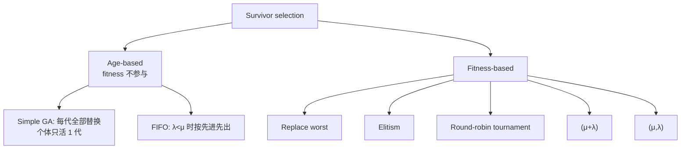

# Survivor Selection 与选择压力

> 本页属于：CEG5302 / Lecture 04
>
> 前置知识：[[CEG5302-Lecture04-RWS与Tournament等选择]]
>
> 预计阅读时间：9 分钟

## Survivor selection

从 μ 个 parents 与 λ 个 offspring 中选出 μ 个组成下一代，也称 **replacement**。分 **fitness-based** 与 **age-based** 两类。（Lecture 4, slides 53–55）

生存选择策略分类（依据课件第 55–64 页整理；核对 2026-09-07）：

### Age-based

每个个体在种群中存活相同的代数，不考虑 fitness。因为不直接用 fitness，下一代最佳 fitness 可能暂时下降；可通过 parent selection 施加足够 pressure、并避免过多破坏性 variation 来保证长期上升。Simple GA 是极端例子（每个个体只存活 1 代）；每代 offspring 少于种群时可用 FIFO 实现。（slides 56–57）

### Fitness-based

（slides 58–62）

- **Replace worst**：替换最差的若干成员，能快速提升最佳 fitness，但易 premature convergence；通常只用于大种群 + no-duplicates 政策。
- **Elitism**：始终保留当前最优个体；若它被选中替换且没有 offspring 相等或更好，就把它放回、淘汰一个 offspring。
- **Round-robin tournament**：每个个体与集合中的 q 个其他个体比较，赢一场记一次胜，最终选胜场最多的 μ 个。有随机性（较弱个体也可能入选），q 越大越不可能；q = μ+λ-1 时变为确定性。
- **(μ+λ) selection**：parents 与 offspring 合并排序，取前 μ 个；preserve elitism，λ 相对 μ 越大 pressure 越高。
- **(μ,λ) selection**：从 μ 个 parents 生成 λ 个 offspring，全部 parents 被丢弃，offspring 排序取前 μ 个；同时考虑 age 与 fitness（要求 λ > μ）。

### (μ,λ) 与 (μ+λ) 的比较

（slides 63–64）

- (μ,λ) 丢弃上一代，能离开 local maxima，适合 multi-modal 搜索与 adaptive landscape（旧解被迅速丢弃）。
- (μ+λ) 保留 elitism，收敛更快，但会**阻碍参数的 self-adaptation**。

| 策略 | 下一代组成 | 是否保留旧代 | 优点 | 缺点 |
|---|---|---|---|---|
| Replace worst | offspring 替换最差 λ 个 | 保留大部分 | 最佳 fitness 提升快 | 易 premature convergence |
| Elitism | offspring 替换，但始终保留当前最优 | 保留最优 | 不丢失最好解 | 需要守卫最优个体 |
| (μ+λ) | 合并 parents+offspring，取 top μ | 保留（可视为 elitism） | 收敛快、精英保留 | 阻碍参数自适应 |
| (μ,λ) | 只用 offspring，top μ | 全部丢弃 | 可离开局部最大，适合多峰/自适应 landscape | 无 elitism |

## 选择压力（Selection pressure）

指 fitter 解相对较劣解被选中繁殖/存活的概率高低，可用 **takeover time τ\*** 量化：最优个体的一个拷贝通过 selection 填满整个种群所需代数。（slides 65–66）

课件给出：对 **simple GA + FPS**，`τ* = λ·ln(λ)`（其中 `λ` 为每个最优个体的期望后代数/每代产生的 offspring 数）。（slide 66）

> [!NOTE] 公式口径
> 本页原按文献笔记写成 `τ* = ln μ / ln s`（s 为最优个体期望后代数）。以课件第 66 页为准，采用 `τ* = λ ln λ`；两种写法来自不同文献/对 `λ` 的定义差异，放在一起时需先说明清楚 `λ` 的含义，否则容易混淆。

**数值示例**：若每代 offspring 数 `λ=8`，则 `τ* = 8 × ln 8 ≈ 8 × 2.079 = 16.6` 代，即约 17 代后最优个体拷贝可填满种群；`λ=5` 时 `τ* = 5 × 1.609 ≈ 8.05` 代。`λ` 越大（每代新生越多/选择压力越高），接管越快。

## 下一步

- 上一页：[[CEG5302-Lecture04-RWS与Tournament等选择]]
- 下一页：[[CEG5302-Lecture04-多样性维持与Niching]]
- 返回：[[Home]]

## 来源与更新日志

- 来源：[Lecture 4-Selection and Population management_03Sept2026.pdf](https://github.com/Kytolly/NUS-coursework-wiki/releases/download/CEG5302/Lecture.4-Selection.and.Population.management_03Sept2026.pdf)，slides 53–66。
- 2026-09-03：从 Lecture 4 拆出“Survivor Selection 与选择压力”短页。
- 2026-09-07：新增生存选择策略分类 Mermaid 图、替换策略对照表；将取接管时间公式更正为课件口径 `τ* = λ ln λ` 并加注释。
