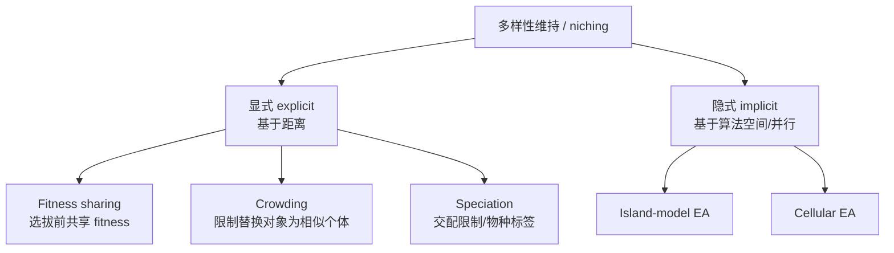

# 多样性维持与 Niching

> 本页属于：CEG5302 / Lecture 04
>
> 前置知识：[[CEG5302-Lecture04-SurvivorSelection与选择压力]]
>
> 预计阅读时间：9 分钟

## 为什么需要 niching

multi-modal 问题有多个 local optima，需平衡 exploration/exploitation 以覆盖整个搜索空间、避免遗漏 optima，并提供多个选项供主观判断；此外 fitness function 可能不够准确或随时间变化，且窄峰可能是 overfitting 的伪影（宽峰更可取）。由于通常允许任意父代重组（**panmictic mixing**），整个种群会收敛到单一峰，因此需要 niching 方案让个体分散在多个峰上。（Lecture 4, slides 67–71）

## 多样性在何处度量

（slide 72）

- **Phenotype space**：现实中的 Manhattan/Euclidean 距离。
- **Genotype space**：chromosome 间的 Hamming/Euclidean/Manhattan 距离。
- **Algorithmic space**：population 空间的概念划分，或跨多个 CPU core 的物理分布。

## 显式 vs 隐式方法

（slide 73）

- **显式（explicit）**：直接修改算子以保持多样性、基于 genotype/phenotype 距离（fitness sharing、crowding、speciation）。
- **隐式（implicit）**：提供促进（但不保证）多样性的框架、工作在 algorithmic space（island model、cellular EA）。

多样性维持方法分类（依据课件第 67–84、85–96 页整理；核对 2026-09-07）：



## Fitness sharing

niche 是一小块邻域；在 selection 前按个体所在 niche 的拥挤程度共享/削减 fitness，使 selection 按 niche fitness 成比例分配个体。直觉是“越拥挤 fitness 越低”，人为引入资源稀缺。（slides 74–76）

计算所有个体对（含自身）的距离 `d(i,j)`，调整后 fitness：

```
F'(i) = F(i) / Σ_j sh(d(i,j))
```

sharing function 常取 `sh(d) = 1 - (d/σ_share)^α`（当 `d < σ_share`，否则 0）。α=1 时线性，α>1 时相近个体的削减作用随距离衰减更快；`σ_share`（sharing radius）决定能维持多少个 niche，一般取 5–10。（slides 77–80）

**数值示例**：某 niche 内有 3 个个体，原始 fitness 均为 `F=10`，相互距离 `d=2`，取 `σ_share=5`、`α=1`，则 `sh(2)=1−2/5=0.6`。对个体 1，`Σ_j sh(d(1,j))=sh(0)+2×sh(2)=1+2×0.6=2.2`，`F'=10/2.2≈4.55`。同理逐个计算，越拥挤的 niche 中个体被削减得越多，从而把部分个体“挤”向其它尚未拥挤的峰。（依据 slides 77–80 公式演算）

## 表：fitness sharing vs crowding

（依据 slide 83 整理；核对 2026-09-07）

| 方法 | 分配原则 | 关键参数 |
|---|---|---|
| Fitness sharing | 个体数按各峰 fitness 成比例分配 | `σ_share`、`α`（敏感） |
| Crowding | 个体均匀分配到各峰 | 距离度量（最相似父代） |

## Crowding

限制 offspring 只能替换与之相似的个体，避免用与多数个体都相似的 offspring 替换掉唯一个体。**Deterministic crowding**：mating pool 随机配对，每对经 recombination 产生 2 个 offspring，mutation 并评估；计算 4 个 offspring-parent 两两距离，每个 offspring 与最相似父代竞争，更优者进入下一代。（slides 81–82）

- **Fitness sharing vs crowding**：fitness sharing 按各峰 fitness 成比例分配个体；crowding 均匀地把个体分配到各峰。（slide 83）

## Speciation

施加交配限制——只有同/相近 species 的成员才能重组；可给 chromosome 加 species 标签并让其随 variation 进化；潜在配偶须在特定距离内，超出则拒绝。可与 fitness sharing 结合。（slide 84）

## 什么时候需要 niching

当问题存在**多个局部最优（multi-modal）**、fitness 函数会随时间变化、或希望给出多种可选方案时，niching 尤其重要（slides 68–70）。与之相对，若问题只有单一全局峰，niching 可能只是减缓收敛、增加运行时长。选择显式还是隐式方法，通常看“能否方便地定义个体间距离”：能定义距离（genotype/phenotype）就用 fitness sharing/crowding；否则（如超大种群、跨核分布）用 island/cellular 这类隐式结构。（依据 slides 68–73、85–86 整理；核对 2026-09-07）

## 下一步

- 上一页：[[CEG5302-Lecture04-SurvivorSelection与选择压力]]
- 下一页：[[CEG5302-Lecture04-Island与CellularEA及MATLAB]]
- 返回：[[Home]]

## 来源与更新日志

- 来源：[Lecture 4-Selection and Population management_03Sept2026.pdf](https://github.com/Kytolly/NUS-coursework-wiki/releases/download/CEG5302/Lecture.4-Selection.and.Population.management_03Sept2026.pdf)，slides 67–84。
- 2026-09-03：从 Lecture 4 拆出“多样性维持与 Niching”短页。
- 2026-09-07：新增多样性维持方法分类 Mermaid 图、fitness sharing 数值示例与 sharing/crowding 对比表。
