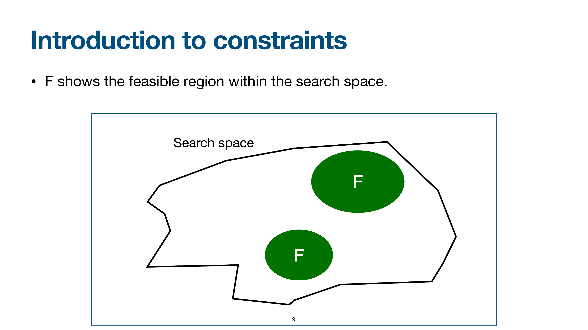
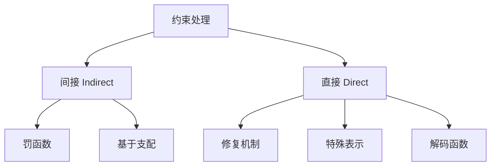

# 约束处理概览与分类

> 本页属于：CEG5302 / Lecture 05
> 前置知识：[[CEG5302-Lecture-Index]]
> 预计阅读时间：11 分钟

## 🎯 学习目标（Learning Objectives）

学完本页，你应该能：

1. 说明为什么 EA 本质上不能直接处理约束（它是开放研究问题）。
2. 写出约束优化问题的一般形式（$\min f(\mathbf{x}) \text{ s.t. } g_i(\mathbf{x}) \le 0, h_j(\mathbf{x}) = 0$），并理解可行域 $\mathcal{F}$。
3. 区分约束处理的**间接**（罚函数、基于支配）与**直接**（修复、特殊表示、解码）两大类及其动机。
4. 针对不同问题（可行域大小、能否量化违反程度）给出处理方式的选择建议。
5. 理解“边界与可行域形状会直接改变最优解定义”（$f(x)=x^3+x^2-4x$ 例子）。

进化算法（Evolutionary Algorithm, EA）对**无约束（free/unconstrained）优化**问题表现很好，但**本质上不能直接处理约束**；如何让 EA 处理约束，至今仍是开放研究问题。本讲围绕不等式与等式约束（线性或非线性）的常见处理思路展开，参考文献包括 Eiben & Smith《Introduction to Evolutionary Computing》、Coello Coello（GECCO 2007）、Pönisch 等（2008）与 Bean & Alouane（1992）。

> 📘 **动机（slide 6）**：EAs 在自由优化问题上表现很好，但**天生不会处理约束**；如何让 EA 处理约束**仍是一个开放的 research question**。有大量研究专门处理**不等式与等式约束（可以是线性或非线性）**。

## 约束优化问题（Constrained Optimisation Problem）

求最小化目标函数，同时满足约束：

$$
\begin{aligned}
\min \quad & f(\mathbf{x}) \\
\text{subject to} \quad & g_i(\mathbf{x}) \le 0, \quad i = 1, 2, \dots, m \quad (\text{不等式约束}) \\
& h_j(\mathbf{x}) = 0, \quad j = 1, 2, \dots, p \quad (\text{等式约束})
\end{aligned}
$$

其中所有函数与约束假设为非线性，$\mathbf{x} = [x_1, x_2, \dots, x_n]^T$ 是决策变量向量。**可行域（feasible region）** $\mathcal{F}$ 是搜索空间中满足全部约束的 $\mathbf{x}$ 的集合。类比：把可行域想成房间内能落脚的“地板”，EA 只能在 $\mathcal{F}$ 内寻找答案。

> 📘 **图意（slide 9）**：课件画一个**搜索空间（Search space）**的大方块，里面标出 **$\mathcal{F}$（可行域）**。
> - 搜索空间 = 所有可能的 $\mathbf{x}$；
> - $\mathcal{F}$ = 满足全部约束的 $\mathbf{x}$ 的集合；
> - **$\mathcal{F}$ 之外就是 infeasible**（不可行），EA 不允许/不应该把答案放在那里。
> 直观上，**可行域通常只占搜索空间的一小部分**，而且可能**不连通**或**紧贴边界**——这正是处理约束的难点。

#### 课件原图对照：搜索空间与可行域划分 (Slide 9)

> **Figure Object: Slide 9**
> - **Source**: `Lecture 5-Constraint Handling 1_10Sept2026.pdf` Slide 9
> - **Locator**: Slide 9 "Introduction to constraints"
> - **Explanation**: 展示了全局搜索空间（Search Space）与由不等式及等式约束共同界定的可行域 $\mathcal{F}$（Feasible Region）。
> - **What to notice**: 可行域往往是不规则几何体，且只占据整个决策空间极其狭窄的子集；大量初始随机生成的解落在不可行域，因此算法必须具备引导种群穿越不可行荒漠的能力。

## 两大类处理方法

> 📘 **图意（slide 11）**：课件把约束处理分成**间接**（Penalty functions / Dominance-based）与**直接**（Repair mechanisms / Special representations / Decoder functions）两大分支。这是本讲（罚函数）与后续（多目标/支配）的框架。

- **间接（Indirect）**：在 EA 运行**之前**把约束转化为优化目标，问题变成自由优化问题。子方法：罚函数、基于支配的方法。
- **直接（Direct）**：在 EA 运行**过程中**显式强制约束。子方法：修复机制、特殊表示、解码函数。

两种思路的直觉（依据课件第 10 页整理；核对 2026-09-07）：**间接法**把“满足约束”变成目标的一部分，让 EA 自行权衡；**直接法**则在每个个体上“先保证可行再谈优化”，因此常需要额外的修复/解码步骤，或对表示与算子做特殊设计。

## 子方法对比

| 方法 | 类别 | 做法 | 特点 |
| --- | --- | --- | --- |
| 罚函数 | 间接 | 修改适应度，按违反约束的数量/程度加罚 | 最常用，尤其适合不等式约束 |
| 基于支配 | 间接 | 用多目标优化思想处理不可行解 | 把“可行”当成一个目标来权衡 |
| 修复机制 | 直接 | 可行解不变；不可行解加一个阶段转为可行 | 尽量接近原不可行解 |
| 特殊表示 | 直接 | 选表示+初始化+繁殖算子，使每个基因型都可行 | 不必改适应度；难找，且受限基因型未必覆盖全部表现型空间 |
| 解码函数 | 直接 | 替换原映射，使考虑的所有表现型都可行 | 只搜索保证可行的子集；基因型空间与适应度不变 |

## 选择建议

- **可行域很大、违反约束不严重**：罚函数（尤其静态/自适应）最简单，直接改适应度即可。（slides 12, 18）
- **可行域极小、可行解稀少**：修复机制或特殊表示可避免大量不可行个体浪费计算，但要小心偏离真实解空间。（slides 14–16）
- **无法量化违反程度、只能比较相对优劣**：基于支配的方法（多目标化）更自然，为后续第 6 周内容铺垫。（slide 13）

**数值示例（约束）**：求 $\min f(x)=x^3+x^2-4x$，约束 $-2 \le x \le 2$。无约束时全局最优在 $x\to -\infty$；加入约束后可行域 $\mathcal{F}=[-2,2]$，局部最小 $x\approx 0.868$ 成为全局最小。说明**边界与可行域形状会直接改变“最优解”的定义**，这正是约束处理要解决的问题。（依据 Lecture 2a slides 23–28 与 Lecture 5 slide 8 的约束形式，合并梳理）

## Exam Checklist（考试自查）

- **必须理解**：为什么 EA 不能直接处理约束；间接 vs 直接的动机；可行域 $\mathcal{F}$ 与 infeasible 的区分。
- **必须记忆**：$\min f(\mathbf{x}) \text{ s.t. } g_i(\mathbf{x}) \le 0, h_j(\mathbf{x}) = 0$；两类/五子方法（罚函数、基于支配；修复、特殊表示、解码）；选择建议（可行域大→罚函数；可行域小→修复/特殊表示；无法量化违反→基于支配）。
- **了解即可**：Coello Coello（GECCO 2007）、Pönisch、Bean & Alouane 等参考文献细节。
- **明确 out of scope**：本讲不证明罚函数最优性；不经由支配的完整多目标理论（后续讲次）。

## 下一步

- 上一页：[[CEG5302-Lecture04-Island-Cellular-EA-and-MATLAB]]
- 下一页：[[CEG5302-Lecture05-Penalty-Functions-Principles]]
- 返回：[[Home]]

## 来源与更新日志

- 来源：[Lecture 5-Constraint Handling 1_10Sept2026.pdf](https://github.com/Kytolly/NUS-coursework-wiki/releases/download/CEG5302/Lecture%205-Constraint%20Handling%201_10Sept2026.pdf)，slide 4–16。
- 2026-09-07：从 Lecture 5 课件拆出该主题短页。
- 2026-09-07：补充间接/直接法直觉说明、选择建议与约束数值示例，完善页面。
- 2026-09-09：新增学习目标；补充动机（开放研究问题）、可行域 F 图意、约束处理层级图意；新增 Exam Checklist。
