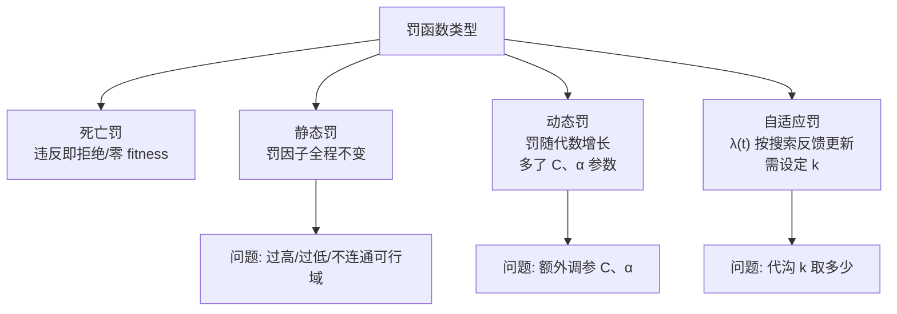
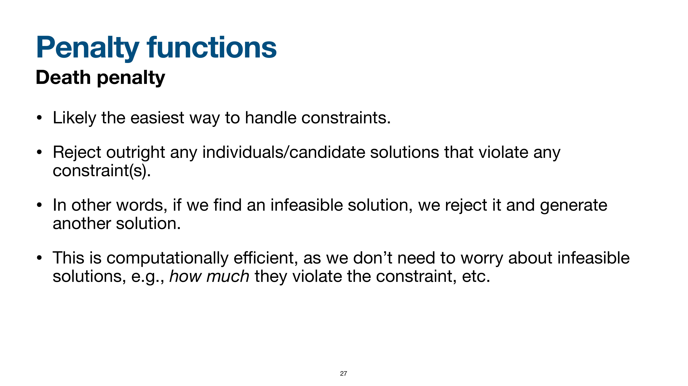
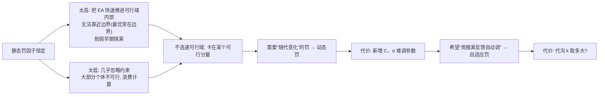

# 罚函数类型与要点

> 本页属于：CEG5302 / Lecture 05
> 前置知识：[[CEG5302-Lecture05-Penalty-Functions-Principles]]
> 预计阅读时间：13 分钟

## 🎯 学习目标（Learning Objectives）

学完本页，你应该能：

1. 列出 4 种罚函数（death / static / dynamic / adaptive）并说明其“罚因子是否/如何随代变化”。
2. 说清每种罚函数**为什么出现**（解决前一种的什么问题）、**优缺点**与**关键参数**。
3. 写出动态罚与自适应罚公式，并解释 $\lambda(t)$ 的更新逻辑（#1 全可行 $\to \lambda/\beta_1$，#2 全不可行 $\to \lambda \times \beta_2$，混合不变）。
4. 解释自适应罚里 $\beta_1 \ne \beta_2$、$\beta_1 < \beta_2$ 的原因，以及“最好个体”是按 $f(\mathbf{x})$（而非 $\Phi$）。
5. 记住自适应罚的优点（不用逐约束设罚因子）与问题（代沟 $k$ 取值）。

课件介绍的类型：**死亡罚（death penalty）**、**静态罚（static penalty）**、**动态罚（dynamic penalty）**、**自适应罚（adaptive penalty）**；另有自适应性适应度构造（self-adaptive fitness formulation）、随机排序（stochastic ranking）等思路。

> 📘 **为什么会有“递进”**：静态罚“罚因子恒定”会陷入“太高/太低都伤”的困境（见下）；动态罚随代数增大可缓解，但引入 $C, \alpha$ 两个难调参数；自适应罚则用**搜索反馈**来调 $\lambda(t)$，但又要面对“代沟 $k$ 多大”的问题。**每一种都是解决前一种问题的代价。**

罚函数类型之间的递进关系（依据课件第 26–38 页整理；核对 2026-09-07）：



## 死亡罚

最简单的处理方式：违反任一约束就**直接拒绝**，另生成新解；实现上常给不可行解**零适应度**。计算高效，因为无需衡量违反程度。只在可行域较大时用；否则搜索会在很小的可行域内停滞，且浪费不可行点的信息。

#### 课件原图对照：死亡罚思想与适用局限 (Slide 27)



> **Figure Object: Slide 27**
> - **Source**: `Lecture 5-Constraint Handling 1_10Sept2026.pdf` Slide 27
> - **Locator**: Slide 27 "Penalty functions: Death penalty"
> - **Explanation**: 图解了死亡罚的极端拒绝逻辑。只要候选点越过可行边界一步，立即被判定死亡并赋予极差适应度，算法完全不评估其违反约束的程度。
> - **What to notice**: 当可行域所占比例极低时，种群几乎全军覆没，算法退化为盲目随机投针，丧失了引导收敛的梯度信息。

## 静态罚

罚因子不随代数变化，全程恒定。罚过高：过度限制搜索空间，漏掉微违约束附近的好区，把 EA 迅速推入可行域内部而无法靠近边界（最优常在边界），削弱早期探索；可行域不相连时会卡在某个可行分量。罚过低：几乎忽略约束，大部分个体不可行，浪费计算。

## 动态罚
 
惩罚随代数增加。例：
 
$$
\Phi(\mathbf{x}) = f(\mathbf{x}) + (C \cdot t)^\alpha \left[ \sum_{i} r_i G_i + \sum_{j} c_j L_j \right]
$$
 
其中 $(C \cdot t)^\alpha$ 随代数 $t$ 增长。缺点：引入 $C$、$\alpha$ 两个难调参数。
 
## 自适应罚
 
$$
\Phi(\mathbf{x}) = f(\mathbf{x}) + \lambda(t) \left[ \sum_{i} g_i^2(\mathbf{x}) + \sum_{j} |h_j(\mathbf{x})| \right]
$$
 
$\lambda(t)$ 每代按最近 $k$ 代“最优个体”是否总是可行（#1）或从不可行（#2）更新：总是可行 $\lambda \leftarrow \lambda / \beta_1$；从不可行 $\lambda \leftarrow \lambda \times \beta_2$；混合不变。“最好”指原目标函数值 $f(\mathbf{x})$ 的个体，而非修正后的适应度。约定 $\beta_1 > 1$、$\beta_2 > 1$、$\beta_1 < \beta_2$、$\beta_1 \ne \beta_2$：$\beta_1 \ne \beta_2$ 避免罚项循环，$\beta_1 < \beta_2$ 因初始罚因子低、增快于减以便早期改善可行性。优点：更精细处理罚因子，无需为每条约束单独设罚因子。问题：代沟 $k$ 取多大？
 
> 📘 **为什么 $\beta_1 \ne \beta_2$ / $\beta_1 < \beta_2$（slide 37）**：
> - **$\beta_1 \ne \beta_2$**：否则罚项会在两个值之间**循环**（今天变大、明天变小，来回振荡）。
> - **$\beta_1 < \beta_2$**：开始时罚因子**很低**；让**增大因子（$\beta_2$）大于减小因子（$\beta_1$）**，以便在**算法早期快速改善可行性**。

> 💡 **自适应罚的额外好处（slide 38）**：它**比其它方式更精细地处理罚因子**，并且**不需要为每条约束单独设罚因子**——所以它**不只是“全可行”或“全不可行”两种极端**，而是能随着搜索反馈动态平衡。

## 罚函数类型对比

（依据课件第 27–38 页整理；核对 2026-09-07）

| 类型 | 罚因子是否随代变化 | 优点 | 缺点 | 关键参数 |
|---|---|---|---|---|
| Death | n/a | 简单、计算省（不衡量违反程度） | 可行域小则停滞，浪费不可行信息 | 无 |
| Static | 不变 | 易实现 | 过高/过低都伤；不连通可行域会卡死 | $r_i$, $c_j$, $\beta$, $\gamma$ |
| Dynamic | 随代数 $t$ 增长 | 缓解静态罚过高/过低 | 新增 $C$, $\alpha$ 难调 | $C$, $\alpha$ |
| Adaptive | 由搜索反馈 $\lambda(t)$ 更新 | 无需逐个约束设罚因子 | 需定代沟 $k$ | $k$, $\beta_1$, $\beta_2$ |

自适应罚更新伪代码（依据 slide 35 整理；核对 2026-09-07）：

```text
for t = 1,2,...:
    best_t = argmin f(x)   # 只看原目标函数
    记录其可行性
    if 过去 k 代 best 都可行:   λ(t+1) = λ(t)/β_1
    elif 过去 k 代 best 都不可行: λ(t+1) = λ(t)×β_2
    else:                       λ(t+1) = λ(t)
```

## 关键要点

- EA 本质不能直接处理约束，约束处理是活跃研究区。
- 两大类：间接（罚函数、基于支配）与直接（修复、特殊表示、解码）。
- 罚函数最常用；外点从不可行向里，内点从可行向外。
- 静态罚恒定易过/欠约束；动态罚随代增长但加参数；自适应用搜索反馈但需 $k$。

### 从“静态罚”到“自适应罚”的推理链



**图：罚函数类型的演进与代价（自制，依据 Lecture 5 slides 29–38；核对 2026-09-09）。** 每一次“解决前一个问题的痛点”都会引入新的调参/设计负担——这是本讲最重要的设计直觉。

## 课堂测验 1 与考核提示（提示，不展开答案）

讲义第 3 页安排了 Quiz-1，与本讲约束处理相关，涉及约束优化问题形式、可行域、罚函数基本式 $\Phi(\mathbf{x})=f(\mathbf{x})+\text{罚项}$、$G_i=\max[0,g_i(\mathbf{x})]$、$L_j=|h_j(\mathbf{x})|$、外/内点法思想。后续“带约束多目标优化”与本讲罚函数（尤其静态/自适应罚）相关。仅作提示，不展开答案。

## Exam Checklist（考试自查）

- **必须理解**：四种罚函数的“为什么出现 → 解决什么 → 新代价”；外点/内点；$\lambda(t)$ 更新逻辑。
- **必须记忆**：death（零 fitness/直接拒绝）；static（恒定）；dynamic $(C \cdot t)^\alpha$；adaptive $\lambda(t)$；$\beta_1>1, \beta_2>1, \beta_1<\beta_2, \beta_1 \ne \beta_2$；自适应罚不需逐约束设罚因子、但需 $k$。
- **必须手算**：动态罚/静态罚对一个简单问题的 $\Phi$ 计算（参照罚函数原理页）。
- **了解即可**：self-adaptive fitness formulation、stochastic ranking 的细节。
- **明确 out of scope**：本讲不证明自适应罚的收敛性，也不给 $k$ / $C$ / $\alpha$ 的最优取值。

## 下一步

- 上一页：[[CEG5302-Lecture05-Penalty-Functions-Principles]]
- 下一页：[[CEG5302-Course-Progress]]
- 返回：[[Home]]

## 来源与更新日志

- 来源：[Lecture 5-Constraint Handling 1_10Sept2026.pdf](https://github.com/Kytolly/NUS-coursework-wiki/releases/download/CEG5302/Lecture%205-Constraint%20Handling%201_10Sept2026.pdf)，slide 26–38。
- 2026-09-07：从 Lecture 5 课件拆出该主题短页。
- 2026-09-07：新增罚函数类型递进 Mermaid 图、四种罚对比表与自适应罚更新伪代码。
- 2026-09-09：新增学习目标；补充“为什么会出现递进”（解决前一种问题+新代价）、$\beta_1 \ne \beta_2$ / $\beta_1 < \beta_2$ 原因、自适应罚“不只是全可行/全不可行”补充；新增“静态罚→动态罚→自适应罚”推理链图；新增 Exam Checklist。
