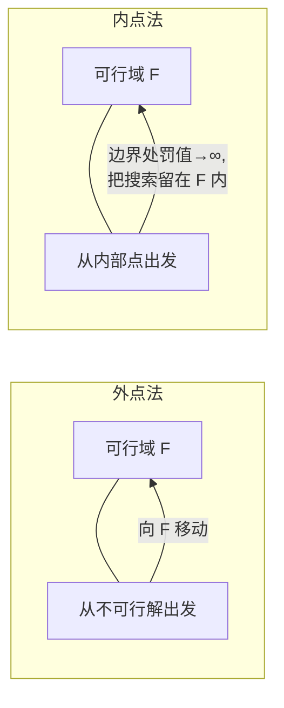
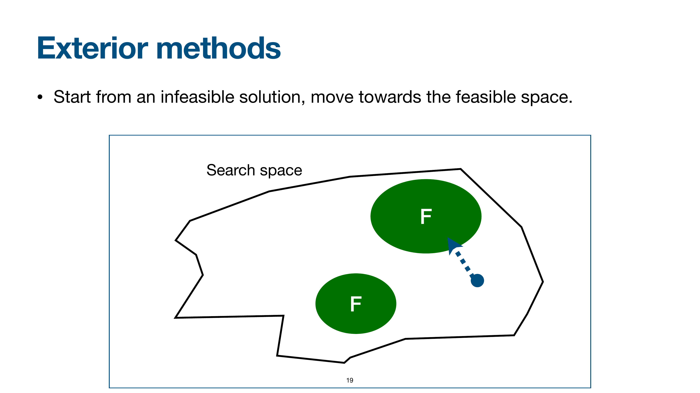

# 罚函数原理

> 本页属于：CEG5302 / Lecture 05
> 前置知识：[[CEG5302-Lecture05-Constraint-Handling-Overview]]
> 预计阅读时间：11 分钟

## 🎯 学习目标（Learning Objectives）

学完本页，你应该能：

1. 说明罚函数为何是 EA 中最常见的约束处理方式（把约束优化转成自由优化）。
2. 区分外点法（从不可行出发）与内点法（从内部出发、边界罚∞ 像“墙”）并说明各自适用/依赖。
3. 写出一般罚函数式 $\Phi(\mathbf{x}) = f(\mathbf{x}) + \sum r_i G_i + \sum c_j L_j$，并解释每个符号（含 $G_i = \max[0, g_i(\mathbf{x})]^\beta$、$L_j = |h_j(\mathbf{x})|^\gamma$）。
4. 解释“等式转不等式”与“归一化”的意义。
5. 手算一个简单例子，理解“罚值过高/过低”的权衡。

罚函数（penalty function）是 EA 中最常见处理约束的方式。**基本思想**：把有约束优化问题转化为自由优化问题；根据个体违反约束的“数量/程度”，在目标函数上加减一个值。

> 📘 **动机（slide 18）**：罚函数把 **Constrained Optimisation Problem** 转化为 **Free Optimisation Problem**——即**添加/减去一个值**，其大小取决于该个体/解**违反了多少约束、以及违反程度多深**。这是 EA 直接能用的方式，因此“最常见”。

## 外点法与内点法

- **外点法（Exterior）**：从**不可行解**出发，向可行域移动。类比：从房间外往房间内地板走。
- **内点法（Interior）**：从可行域内部的点出发，向边界移动；内部罚值小、边界处趋于无穷，仿佛一堵“墙”，使搜索始终留在可行域内。类比：一条被限制在房间内的路线，靠近墙就被弹回。

外点与内点的差异（依据课件第 19–20 页整理；核对 2026-09-07）：

> 📘 **图意（slides 19–20）**：两张图都画“搜索空间 + F”。
> - **外点法（slide 19）**：起点在 **F 之外**（不可行），随探索**向 F 移动** ——它允许 EA 从不可行区域“被拽回”可行域。
> - **内点法（slide 20）**：起点在 **F 内部**，越靠近边界罚值越大、直至**趋于无穷**（像一堵墙）；因此搜索**始终留在 F 内**。
> 二者都要付出代价：外点法要容忍不可行解；内点法**必须先找到一个可行初始点**。

#### 课件原图对照：外点法搜索轨迹向可行域收敛 (Slide 19)

> **Figure Object: Slide 19**
> - **Source**: `Lecture 5-Constraint Handling 1_10Sept2026.pdf` Slide 19
> - **Locator**: Slide 19 "Exterior methods"
> - **Explanation**: 展示了外点法从不可行域中的随机初始解出发，在罚函数施加的惩罚梯度驱动下，逐步向可行域 $\mathcal{F}$ 逼近并穿入可行边界的典型迭代过程。
> - **What to notice**: 外点法不需要保证初始种群完全可行，但需要承受中间搜索阶段产生不可行解的代价值。

## 一般罚函数形式

$$
\begin{aligned}
\Phi(\mathbf{x}) &= f(\mathbf{x}) + \sum_{i=1}^{m} r_i \cdot G_i + \sum_{j=1}^{p} c_j \cdot L_j \\
G_i &= \max[0, g_i(\mathbf{x})]^\beta \\
L_j &= |h_j(\mathbf{x})|^\gamma
\end{aligned}
$$

符号含义：

- $\Phi(\mathbf{x})$：修正后的**适应度函数（fitness function）**；$f(\mathbf{x})$：原**目标函数（objective function）**。
- $G_i$：度量第 $i$ 个不等式约束的违反量；未违反时 $G_i = 0$。
- $L_j$：度量第 $j$ 个等式约束的违反量；未违反时 $L_j = 0$。
- $\beta$、$\gamma$：通常取 1 或 2。
- $r_i$、$c_j$：正的常量，称为**罚因子（penalty factors）**，给每个违反项加权。

类比：$G_i$ 像“超出的距离”，$L_j$ 像“偏离 0 的误差”，$r_i$/$c_j$ 像每种误差的“单价”。

## 等式转不等式

等式约束几乎不可能被精确满足，因此可改写为：

$$
|h_j(\mathbf{x})| - \varepsilon \le 0, \quad j = 1, 2, \dots, p
$$

其中 $\varepsilon$ 是一个非常小的正数。含义：允许“误差不超过 $\varepsilon$”，把严格的等式放宽成便于处理的“小不等式”。

## 归一化

不同约束的量级可能相差很大，需要**归一化**使它们在罚项中影响力相等。例如将 $g_i(\mathbf{x}) \le b_i$ 归一为：

$$
\frac{g_i(\mathbf{x})}{b_i} - 1 \le 0
$$

若 $b_i = 0$，无法除以 0，则直接使用原约束。类比：把不同量纲的“超标分”换算成统一比例的“超标率”，避免量纲大的约束主导罚项。

## 目标函数 vs 适应度函数

为免混淆：$f(\mathbf{x})$ 是**原目标函数**，$\Phi(\mathbf{x})$ 是**修正后的适应度函数**——EA 实际用它来计算个体的适应度值。

## 数值示例

设问题为 $\min f(x)=x^2$，约束 $x \ge 1$（即 $g(x)=1-x \le 0$）。取 $\beta=1$、罚因子 $r=2$，则：

$$
\Phi(x) = x^2 + 2 \cdot \max[0, 1-x]^1
$$

- $x=2$（可行）：$G=0$，$\Phi=4$。
- $x=0.5$（不可行）：$G=1-0.5=0.5$，$\Phi=0.25+2\times 0.5=1.25$。
- $x=-1$（不可行）：$G=2$，$\Phi=1+4=5$。

可见违反越严重，罚项越大；但 $x=0.5$ 的 $\Phi=1.25$ 仍优于可行 $x=2$ 的 $\Phi=4$，因此若罚因子太小，算法可能仍偏向不可行区。这就是“罚值过高/过低”权衡的直观来源。（依据 slide 21–22、27 公式演算，自拟数值）

## 外点 vs 内点小结

| 维度 | 外点法 | 内点法 |
|---|---|---|
| 初始点 | 不可行区域 | 可行域内部 |
| 罚值行为 | 罚越违反越大 | 内部小、边界趋 ∞ |
| 搜索方向 | 从外向内 | 从内向外，“墙”挡住 |
| 依赖可行初始点 | 否 | 是（须先找出一个可行点） |

（依据 slides 19–20 整理；核对 2026-09-07）

**有关罚因子与 $\varepsilon$ 的说明**：罚因子 $r_i, c_j$ 与指数 $\beta, \gamma$ 通常取 1 或 2，$\varepsilon$ 用于把等式约束放宽成小不等式。课件未给出通用调参规则；过小的 $\varepsilon$ 可能让可行域几乎为空，过大则把真正的最优解排除在外。这一点在个人笔记中被记为 Open 问题（见 `notebook/week-05`）。

## Exam Checklist（考试自查）

- **必须理解**：为什么罚函数是“最常见”的约束处理；外点 vs 内点的本质差别；$\Phi$ 是 fitness、$f$ 是 objective。
- **必须手算**：$\min f=x^2, x \ge 1$（$\beta=1, r=2$）在 $x=2/0.5/-1$ 下的 $\Phi$ 值。
- **必须记忆**：$\Phi(\mathbf{x}) = f(\mathbf{x}) + \sum r_i G_i + \sum c_j L_j$；$G_i = \max[0, g_i]^\beta$；$L_j = |h_j|^\gamma$；$\beta, \gamma \in \{1, 2\}$；等式转不等式 $|h_j| - \varepsilon \le 0$；归一化 $g_i/b_i - 1 \le 0$。
- **了解即可**：调参（$\varepsilon$、$r_i$）的开放问题。
- **明确 out of scope**：本讲不证明罚函数的收敛性，也不给最优罚因子取值。

## 下一步

- 上一页：[[CEG5302-Lecture05-Constraint-Handling-Overview]]
- 下一页：[[CEG5302-Lecture05-Penalty-Function-Types-and-Key-Points]]
- 返回：[[Home]]

## 来源与更新日志

- 来源：[Lecture 5-Constraint Handling 1_10Sept2026.pdf](https://github.com/Kytolly/NUS-coursework-wiki/releases/download/CEG5302/Lecture%205-Constraint%20Handling%201_10Sept2026.pdf)，slides 17–27。
- 2026-09-07：从 Lecture 5 课件拆出该主题短页。
- 2026-09-07：新增外点/内点 Mermaid 图与罚函数数值示例，补全页面。
- 2026-09-09：新增学习目标；补充“最常见”动机（Constrain→Free 转化）、外点/内点图意（起点、墙、依赖可行初始点）；新增 Exam Checklist。
