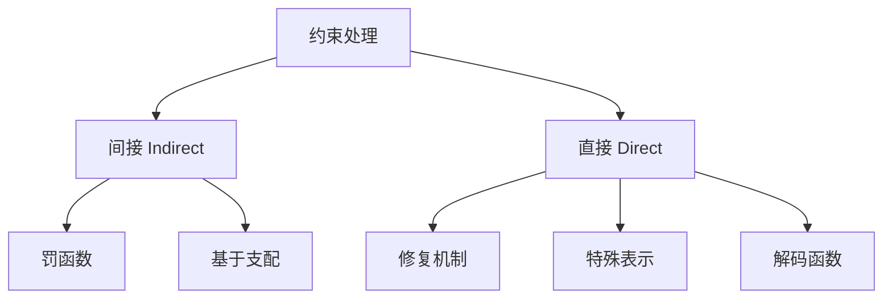

# 约束处理概览与分类

> 本页属于：CEG5302 / Lecture 05
> 前置知识：[[CEG5302-讲义与笔记索引]]
> 预计阅读时间：8 分钟

进化算法（Evolutionary Algorithm, EA）对**无约束（free/unconstrained）优化**问题表现很好，但**本质上不能直接处理约束**；如何让 EA 处理约束，至今仍是开放研究问题。本讲围绕不等式与等式约束（线性或非线性）的常见处理思路展开，参考文献包括 Eiben & Smith《Introduction to Evolutionary Computing》、Coello Coello（GECCO 2007）、Pönisch 等（2008）与 Bean & Alouane（1992）。

## 约束优化问题（Constrained Optimisation Problem）

求最小化目标函数，同时满足约束：

```text
min f(x)
subject to
  g_i(x) ≤ 0,  i = 1,2,...,m    (不等式约束)
  h_j(x) = 0,  j = 1,2,...,p    (等式约束)
```

其中所有函数与约束假设为非线性，`x = [x_1, x_2, ..., x_n]^T` 是决策变量向量。**可行域（feasible region）F** 是搜索空间中满足全部约束的 `x` 的集合。类比：把可行域想成房间内能落脚的“地板”，EA 只能在 F 内寻找答案。

## 两大类处理方法



- **间接（Indirect）**：在 EA 运行**之前**把约束转化为优化目标，问题变成自由优化问题。子方法：罚函数、基于支配的方法。
- **直接（Direct）**：在 EA 运行**过程中**显式强制约束。子方法：修复机制、特殊表示、解码函数。

两种思路的直觉（依据课件第 10 页整理；核对 2026-09-07）：**间接法**把“满足约束”变成目标的一部分，让 EA 自行权衡；**直接法**则在每个个体上“先保证可行再谈优化”，因此常需要额外的修复/解码步骤，或对表示与算子做特殊设计。

## 子方法对比

| 方法 | 类别 | 做法 | 特点 |
| --- | --- | --- | --- |
| 罚函数 | 间接 | 修改适应度，按违反约束的数量/程度加罚 | 最常用，尤其适合不等式约束 |
| 基于支配 | 间接 | 用多目标优化思想处理不可行解 | 把“可行”当成一个目标来权衡 |
| 修复机制 | 直接 | 可行解不变；不可行解加一个阶段转为可行 | 尽量接近原不可行解 |
| 特殊表示 | 直接 | 选表示+初始化+繁殖算子，使每个基因型都可行 | 不必改适应度；难找，且受限基因型未必覆盖全部表现型空间 |
| 解码函数 | 直接 | 替换原映射，使考虑的所有表现型都可行 | 只搜索保证可行的子集；基因型空间与适应度不变 |

## 选择建议

- **可行域很大、违反约束不严重**：罚函数（尤其静态/自适应）最简单，直接改适应度即可。（slides 12, 18）
- **可行域极小、可行解稀少**：修复机制或特殊表示可避免大量不可行个体浪费计算，但要小心偏离真实解空间。（slides 14–16）
- **无法量化违反程度、只能比较相对优劣**：基于支配的方法（多目标化）更自然，为后续第 6 周内容铺垫。（slide 13）

**数值示例（约束）**：求 `min f(x)=x^3+x^2−4x`，约束 `-2 ≤ x ≤ 2`。无约束时全局最优在 `x→−∞`；加入约束后可行域 `F=[-2,2]`，局部最小 `x≈0.868` 成为全局最小。说明**边界与可行域形状会直接改变“最优解”的定义**，这正是约束处理要解决的问题。（依据 Lecture 2a slides 23–28 与 Lecture 5 slide 8 的约束形式，合并梳理）

## 下一步

- 上一页：[[CEG5302-Lecture04-Island与CellularEA及MATLAB]]
- 下一页：[[CEG5302-Lecture05-罚函数原理]]
- 返回：[[Home]]

## 来源与更新日志

- 来源：[Lecture 5-Constraint Handling 1_10Sept2026.pdf](https://github.com/Kytolly/NUS-coursework-wiki/releases/download/CEG5302/Lecture%205-Constraint%20Handling%201_10Sept2026.pdf)，slide 4–16。
- 2026-09-07：从 Lecture 5 课件拆出该主题短页。
- 2026-09-07：补充间接/直接法直觉说明、选择建议与约束数值示例，完善页面。
