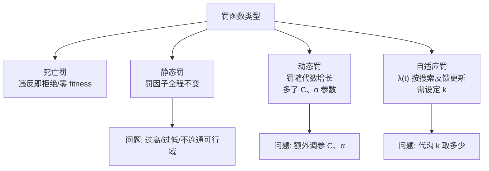

# 罚函数类型与要点

> 本页属于：CEG5302 / Lecture 05
> 前置知识：[[CEG5302-Lecture05-罚函数原理]]
> 预计阅读时间：9 分钟

课件介绍的类型：**死亡罚（death penalty）**、**静态罚（static penalty）**、**动态罚（dynamic penalty）**、**自适应罚（adaptive penalty）**；另有自适应性适应度构造（self-adaptive fitness formulation）、随机排序（stochastic ranking）等思路。

罚函数类型之间的递进关系（依据课件第 26–38 页整理；核对 2026-09-07）：



## 死亡罚

最简单的处理方式：违反任一约束就**直接拒绝**，另生成新解；实现上常给不可行解**零适应度**。计算高效，因为无需衡量违反程度。只在可行域较大时用；否则搜索会在很小的可行域内停滞，且浪费不可行点的信息。

## 静态罚

罚因子不随代数变化，全程恒定。罚过高：过度限制搜索空间，漏掉微违约束附近的好区，把 EA 迅速推入可行域内部而无法靠近边界（最优常在边界），削弱早期探索；可行域不相连时会卡在某个可行分量。罚过低：几乎忽略约束，大部分个体不可行，浪费计算。

## 动态罚

惩罚随代数增加。例：

```text
φ(x) = f(x) + (C·t)^α × [ Σ r_i·G_i + Σ c_j·L_j ]
```

其中 `(C·t)^α` 随代数 `t` 增长。缺点：引入 `C`、`α` 两个难调参数。

## 自适应罚

```text
φ(x) = f(x) + λ(t) × [ Σ g_i²(x) + Σ |h_j(x)| ]
```

`λ(t)` 每代按最近 `k` 代“最优个体”是否总是可行（#1）或从不可行（#2）更新：总是可行 `λ←λ/β_1`；从不可行 `λ←λ×β_2`；混合不变。“最好”指原目标函数值 `f(x)` 的个体，而非修正后的适应度。约定 `β_1>1`、`β_2>1`、`β_1<β_2`、`β_1≠β_2`：`β_1≠β_2` 避免罚项循环，`β_1<β_2` 因初始罚因子低、增快于减以便早期改善可行性。优点：更精细处理罚因子，无需为每条约束单独设罚因子。问题：代沟 `k` 取多大？

## 罚函数类型对比

（依据课件第 27–38 页整理；核对 2026-09-07）

| 类型 | 罚因子是否随代变化 | 优点 | 缺点 | 关键参数 |
|---|---|---|---|---|
| Death | n/a | 简单、计算省（不衡量违反程度） | 可行域小则停滞，浪费不可行信息 | 无 |
| Static | 不变 | 易实现 | 过高/过低都伤；不连通可行域会卡死 | `r_i`, `c_j`, β, γ |
| Dynamic | 随代数 `t` 增长 | 缓解静态罚过高/过低 | 新增 `C`, `α` 难调 | `C`, `α` |
| Adaptive | 由搜索反馈 `λ(t)` 更新 | 无需逐个约束设罚因子 | 需定代沟 `k` | `k`, `β_1`, `β_2` |

自适应罚更新伪代码（依据 slide 35 整理；核对 2026-09-07）：

```text
for t = 1,2,...:
    best_t = argmin f(x)   # 只看原目标函数
    记录其可行性
    if 过去 k 代 best 都可行:   λ(t+1) = λ(t)/β_1
    elif 过去 k 代 best 都不可行: λ(t+1) = λ(t)×β_2
    else:                       λ(t+1) = λ(t)
```

## 关键要点

- EA 本质不能直接处理约束，约束处理是活跃研究区。
- 两大类：间接（罚函数、基于支配）与直接（修复、特殊表示、解码）。
- 罚函数最常用；外点从不可行向里，内点从可行向外。
- 静态罚恒定易过/欠约束；动态罚随代增长但加参数；自适应用搜索反馈但需 `k`。

## 课堂测验 1 与考核提示（提示，不展开答案）

讲义第 3 页安排了 Quiz-1，与本讲约束处理相关，涉及约束优化问题形式、可行域、罚函数基本式 `φ(x)=f(x)+罚项`、`G_i=max[0,g_i(x)]`、`L_j=|h_j(x)|`、外/内点法思想。后续“带约束多目标优化”与本讲罚函数（尤其静态/自适应罚）相关。仅作提示，不展开答案。

## 下一步

- 上一页：[[CEG5302-Lecture05-罚函数原理]]
- 下一页：[[CEG5302-当前进度与待补内容]]
- 返回：[[Home]]

## 来源与更新日志

- 来源：[Lecture 5-Constraint Handling 1_10Sept2026.pdf](https://github.com/Kytolly/NUS-coursework-wiki/releases/download/CEG5302/Lecture%205-Constraint%20Handling%201_10Sept2026.pdf)，slide 26–38。
- 2026-09-07：从 Lecture 5 课件拆出该主题短页。
- 2026-09-07：新增罚函数类型递进 Mermaid 图、四种罚对比表与自适应罚更新伪代码。
