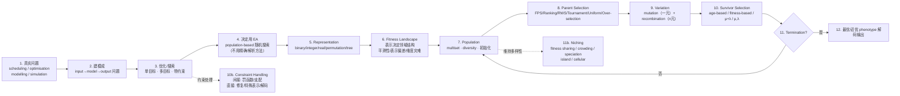
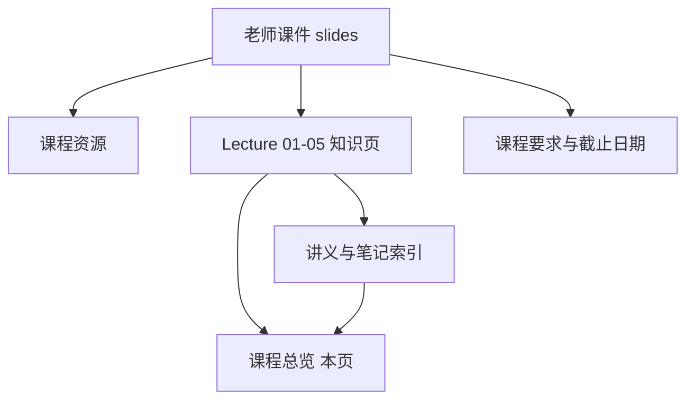

# CEG5302 课程总览

> 本页属于：CEG5302 课程入口
>
> 前置知识：无
>
> 预计阅读时间：8 分钟

## 这门课在做什么：一张 Knowledge Map

CEG5302 *Evolutionary Computation and Applications*（进化计算与应用，EC）不是一门“背算法的课”，它的主线是：**把一个真实工程问题，逐步翻译成一个可以持续演化、搜索的进化算法（EA），并理解每一次设计选择在“探索 ↔ 开发”上的后果。**

下面把「问题 → 优化/搜索 → EA → 表示 → 适应度景观 → 种群 → 选择 → 变异 → 约束处理 → 幸存者选择 → 演化」连成一整条链，并标出每讲在链条上的位置。

**图 1：CEG5302 知识地图（自制，依据 Lecture 1–5 课件整理；核对 2026-09-09）。** 读法：从左上真实问题出发，往右是算法骨架（5–11），下方两条虚线是「多样性维持」与「约束处理」两个横切主题；选择（8）与幸存者（10）在课程里被合称为 selection，而它们之间靠 exploitation/exploration 与 selection pressure 串起来。

### 每条连线对应的因果逻辑

- **1→2 → 3**：先分清是哪类问题（`input→model→output` 中未知的是哪一格），才能决定用 optimization 还是 modeling/simulation，以及是否要处理约束或目标冲突。
- **3→4**：当搜索空间巨大、数学上难处理、为建模做的简化会偏离真实问题、或需要同时优化多个互相冲突的目标时，才考虑用 EC（而非精确解析法）。
- **4→5 → 6**：决定用 EA 后，**第一个设计选择是表示（representation）**；表示同时决定了 genotype 空间和 fitness landscape 的邻域结构，进而决定一次小变异对 fitness 的影响是“平滑”还是“跳变”。
- **6→7 → 8**：landscape 上有峰、有谷、有不可行区；种群把这些可搜索的点装进来，parent selection 决定“往哪个峰走”，selection pressure 决定“走得有多快”。
- **8→9**：选出父代后，variation 负责产生新点；**mutation 引入父代没有的新 allele，recombination 重新组合已有 building blocks**——这是探索与开发的直接来源。
- **9→10**：offspring 与旧代竞争，survivor selection 决定留下谁；它与 parent selection 共同塑造下一代种群的多样性。
- **10→11**：何时停？靠终止条件（预算 / 收敛阈值 / 多样性阈值）。停止后解码 best genotype 得到原问题解。
- **横切（diversity）**：selection 每代都在降低多样性，所以需要 niching 让个体分散在多个峰上。
- **横切（constraints）**：EA 本质不能直接处理约束，需要间接（罚函数）或直接（修复/特殊表示/解码）方法把可行性并进搜索。

## 每讲在链条中的位置与依赖

| 讲次 | 覆盖主题 | 链条上的角色 | 前置依赖 | 贡献给后续 |
|---|---|---|---|---|
| **Lecture 1** | EC 定义、历史（Turing/Rechenberg/Fogel/Holland/Koza）、自然进化隐喻（Darwin 三要素）、基本循环、四类问题与工程应用 | 回答「什么是 EC、为什么用 EC、用来解决哪类问题」 | 无 | 基本循环与 fitness/selection 隐喻（L2 形式化）；四类问题（L2 的 input→model→output） |
| **Lecture 2a** | 问题类型（modelling/simulation/optimisation）、单目标优化、P/NP/NPC/NPH 与维度灾难、heuristic/metaheuristic、EC 动机、EC vs SI | 把「问题」形式化成可搜索的 optimization/search 问题 | L1 的四类问题 | 单目标形式（L5 的约束优化）；EC 动机与 exploration/exploitation（贯穿全课） |
| **Lecture 2b** | EA 七大组件、Simple/Canonical GA、手算示例（max x², x∈[0,31]）、MOO 入门、 anytime 行为、Memetic | 给出 EA 的**统一骨架**（representation/evaluation/population/parent selection/variation/survivor/termination） | L2a 问题与动机、L1 基本循环 | 七大组件被 L3/L4/L5 逐项展开（表示、选择、变异、约束）；MOO（项目 Part-I 的 NSGA-II 前置） |
| **Lecture 3** | 表示选择准则（合法性/完备性、landscape 平滑、representation bias）、五种表示（binary/integer/real/permutation/tree）各自的 mutation 与 recombination | 展开组件中的 **representation + variation**；说明「表示决定 landscape、表示相关 vs 无关」 | L2b 的 representation/variation 组件 | 表示偏差与多样性（L4）相连；树表示（GP，后讲）；重组对 diversity 的影响 |
| **Lecture 4** | 两种种群管理模型（generational/steady-state）、parent selection（FPS/Ranking/RWS/SRWS/SUS/Tournament/Uniform/Over-selection）、survivor selection（age/fitness/μ+λ/μ,λ）、selection pressure（takeover time）、多样性维持与 niching（fitness sharing/crowding/speciation/island/cellular）、MATLAB GA | 展开 **selection（parent+survivor）与种群管理**；处理 selection vs diversity 的矛盾 | L2b selection/survivor 组件；L3 表示相关 vs 无关（selection 与表示无关） | selection pressure 是理解 premature convergence 的核心；niching 为约束/多目标（L5、项目）铺垫 |
| **Lecture 5** | 约束处理：间接（罚函数：死亡/静态/动态/自适应、基于支配）vs 直接（修复/特殊表示/解码）、外点/内点、罚函数原理（G_i/L_j、归一化、等式转不等式） | 回答「EA 不能直接处理约束怎么办」——把可行性并进优化 | L2a 约束形式（g_i≤0, h_j=0）；L2b selection/fitness；L4 selection pressure | 直接服务项目 Part-II（带约束优化）、并为后续多目标/NSGA-II 铺垫 |

> 🧪 说明：Lecture 2b slides 4–7 其实先引入 **multi-objective optimisation（MOO）** 的概念（买 iPhone：满足使用需求 vs 成本，极端解 Pro Max vs SE，希望算法给出 trade-off 解再主观选择），这是项目 Part-I（NSGA-II/ZDT3）与后续多目标讲次的关键前置。当前 Wiki 把它并入 [[CEG5302-Lecture02-Problem-Types-and-Single-Objective]]，避免新增孤立页面。

## 反复出现的四个核心概念（横切主线）

1. **Exploration ↔ Exploitation（探索 ↔ 开发）**：探索是去新区域，开发是深挖有希望区域。所有精炼都会在两者间权衡；开发过强→过早收敛（premature convergence），探索过强→运行时间变长、收敛变慢。它由表示（landscape 平滑度）、选择（pressure）、变异/重组（步长与结构）、种群管理（代际 vs 稳态）共同控制。
2. **Selection Pressure（选择压力）**：fitness 高的个体相对 fitness 低者被选中/存活概率的高/低。用 **takeover time τ\*** 量化。压力↑ → 优秀个体扩张更快 → convergence↑ → diversity↓ → premature convergence 风险↑。这正是 FPS 早期快、后期低，Ranking 恒定，Tournament 随 k 增大压力的原因。
3. **Diversity（多样性）**：种群中不同个体（基因型/表型/fitness）的丰富程度。selection 天然降低 diversity，crossover 应在一定程度上抵消它；niching 显式/隐式维持它（fitness sharing/crowding/speciation/island/cellular）。
4. **Feasibility（可行性）**：约束（不等式/等式）定义了可行域 F。EA 不能直接处理约束，罚函数把违反量变成目标的一部分；表示/解码可保证每个基因型可行。可行域太小、不连通、或最优在边界，都会改变“最优解”的定义。

## 目标、内容与考核（来自 Lecture 1 / list.md）

- **课程目标**：① 建立用「进化原理」解决问题系统（problem-solving systems）的广泛理解，并通过 project 加深；② 能应用 EC 技术到优化、调度、建模等问题。
- **覆盖内容**：① EC 导论与生物学原理 / 基本 GA（表示、选择、fitness、种群评估）；② EC 技术（EA、Swarm Intelligence、单/多目标、Differential Evolution）；③ 多目标优化（MOO 目标、性能指标、Pareto 支配 MOEA、约束多目标优化）；④ EC 应用（排课、项目分配、能源网格优化、路由等）。
- **考核**：3 次个人测试（65%：20/25/20）+ 个人编程作业（10%：写一个简单 EA）+ 小组 project（25%：NSGA-II，Part-I 无约束 ZDT3，Part-II 带约束）。详见 [[CEG5302-Course-Requirements]]。

## 资料与页面关系

**图 2：CEG5302 页面关系（自制，依据课程文件整理；2026-09-03）。**

## 快速入口

- [[CEG5302-Quiz-Overview]]：随堂测验与考核总览（3 次测试 65%、平时测验归档）。
- [[CEG5302-Quiz-Past-Paper]]：往年随堂测验真题与推导题解（`quiz1.docx` 满分 20 分手算）。
- [[CEG5302-Project-Overview]]：多目标优化小组大作业（NSGA-II 算法实现与 ZDT3/VCW/MW7/RCM 测试集）。
- [[CEG5302-Lecture01-Introduction-to-EC]]：EC 定义、历史与「为什么用 EC」。
- [[CEG5302-Lecture02-Canonical-GA-Worked-Example]]：可直接跟着手算的标准 GA 示例（max x²）。
- [[CEG5302-Lecture03-Permutation-Representation]]：PMX / Order / Cycle 等排列重组算子（含完整手算与原课件图）。
- [[CEG5302-Lecture04-Survivor-Selection-and-Selection-Pressure]]：selection pressure 与 takeover time。
- [[CEG5302-Lecture05-Penalty-Functions-Principles]]：约束处理如何把违反量并入目标。
- [[CEG5302-Course-Resources]]：老师课件、个人笔记与工具入口。
- [[CEG5302-Course-Requirements]]：权重、时间线、提交物与 Open Questions。
- [[CEG5302-Lecture-Index]]：Lecture 01–05 主题拆分页与阅读顺序。

## 来源

- 课件目录：[CEG5302 Assets Release](https://github.com/Kytolly/NUS-coursework-wiki/releases/tag/CEG5302)（PDF 原件；本机核对）。
- 个人笔记：[CEG5302 Assets Release](https://github.com/Kytolly/NUS-coursework-wiki/releases/tag/CEG5302)（中文/英文成对，仅作辅助参考）。
- 课程要求：[list.md](https://github.com/Kytolly/NUS-coursework-wiki/releases/download/CEG5302/list.md)（行政/考核信息）。
- 核对日期：2026-09-09。

## 下一步

- 上一页：[[Home]]
- 下一页：[[CEG5302-Course-Resources]]
- 返回：[[Home]]

## 更新日志

- 2026-09-03：建立课程入口，覆盖 Lecture 01–04 并记录当前状态。
- 2026-09-09：升级为 Knowledge Map——加入完整 chain 图、每讲在链条中的位置/依赖表、四个横切核心概念、课程目标/内容/考核映射；保留原有页面关系、快速入口与来源。
