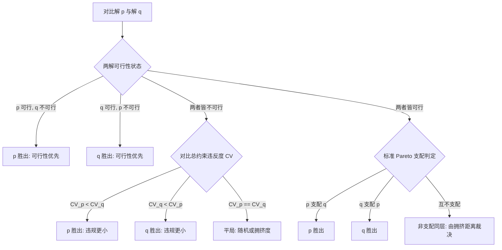

# CEG5302 项目 Part-II：有约束多目标优化 (Constrained MOO)

> [!NOTE]
> **模块目标**：将 NSGA-II 拓展至处理有约束多目标优化问题（CMOOP），集成 Deb 约束支配准则，并在 **MW7** 与 **RCM** 复杂约束基准问题上进行求解与鲁棒性实验评估。

---

## 1. 理论基础：有约束多目标优化与 Deb 约束支配准则

在实际工程问题中，大多数优化任务均受到物理条件、安全规范或资源边界的约束：
$$\begin{aligned}
\min \quad & F(x) = [f_1(x), f_2(x), \dots, f_M(x)]^T \\
\text{s.t.} \quad & g_j(x) \le 0, \quad j = 1, 2, \dots, J \\
& h_k(x) = 0, \quad k = 1, 2, \dots, K \\
& x \in \Omega
\end{aligned}$$

### 1.1 总体约束违反度 (Overall Constraint Violation, $CV$)
对于任意候选解 $x$，其总约束违反度定义为所有不等式约束违反量之和（等式约束可转化为 $|h_k(x)| - \epsilon \le 0$）：
$$CV(x) = \sum_{j=1}^J \max(0, g_j(x)) + \sum_{k=1}^K \max(0, |h_k(x)| - \epsilon)$$
- 若 $CV(x) = 0$，则 $x$ 为**可行解 (Feasible Solution)**；
- 若 $CV(x) > 0$，则 $x$ 为**不可行解 (Infeasible Solution)**。

---

### 1.2 Deb 约束支配原理 (Constrained Dominance Principle)
NSGA-II 采用 Kalyanmoy Deb 提出的**约束支配原理（无需预先设定人工惩罚因子，彻底规避了罚函数参数调优难题）**。

定义解 $p$ **约束支配**解 $q$（记作 $p \prec_c q$），当且仅当满足以下三条规则之一：
1. **可行解永远优于不可行解**：
   $$CV(p) = 0 \quad \text{且} \quad CV(q) > 0$$
2. **两解皆为不可行解时，违反度更小者优胜**：
   $$CV(p) > 0, \quad CV(q) > 0 \quad \text{且} \quad CV(p) < CV(q)$$
3. **两解皆为可行解时，按标准 Pareto 支配关系判定**：
   $$CV(p) = 0, \quad CV(q) = 0 \quad \text{且} \quad \forall m, f_m(p) \le f_m(q) \ \wedge \ \exists m, f_m(p) < f_m(q)$$



---

## 2. 基准优化问题定义 (Benchmark Problems)

### 2.1 MW7 测试问题 (Ma-Wang Constrained Benchmark 7)
MW 系列测试集（Ma & Wang, 2019）是目前国际公认最严苛的约束多目标基准之一。MW7 具有狭窄的非凸可行带与复杂的非线性约束边界，极度考验算法跳出局部不可行陷阱的能力。

- **问题特征**：
  - 目标空间存在由多条非线性曲线围成的孤立可行区域；
  - 许多不可行解在目标函数上数值极佳，对演化种群产生强烈的“不可行海市蜃楼引诱（Infeasible Basin Attraction）”；
  - 算法必须依靠约束支配机制引导种群从不可行域安全“穿越”回真实 Pareto 前沿。

---

### 2.2 RCM 测试问题 (Ray-Crossley-Marks Benchmark / Real-world Constrained MOO)
RCM 问题源自工程机械结构设计（如梁结构或桁架优化），具有实际的物理应力极限与形变约束：
- 决策变量包含构件几何尺寸、板厚或选材参数；
- 目标通常为**结构自重极小化**与**最大变形位移极小化**；
- 约束包含材料屈服强度限制、临界屈曲载荷与几何容差；
- 真实的 Pareto 前沿往往完全紧贴在活动约束边界上（Active Constraints），解的搜索极度敏感。

---

## 3. 算法修改要点：NSGA-II 约束扩展实现

将 Part-I 的 `NSGA2` 升级为支持 Part-II 的约束支配，核心修改位于**非支配排序 (Fast Non-dominated Sort)** 与 **锦标赛选择 (Tournament Selection)** 中：

```python
def constrained_dominates(p_fx, p_cv, q_fx, q_cv):
    """
    Deb 约束支配判断:
    返回 True 表示 p 约束支配 q, 否则返回 False
    """
    # 规则 1: p 可行, q 不可行
    if p_cv <= 1e-6 and q_cv > 1e-6:
        return True
    # 规则 2: q 可行, p 不可行
    if p_cv > 1e-6 and q_cv <= 1e-6:
        return False
    # 规则 3: 两者皆不可行 -> 比较 CV
    if p_cv > 1e-6 and q_cv > 1e-6:
        return p_cv < q_cv
    # 规则 4: 两者皆可行 -> 标准 Pareto 支配
    p_better_or_equal = np.all(p_fx <= q_fx)
    p_strictly_better = np.any(p_fx < q_fx)
    return p_better_or_equal and p_strictly_better
```

> [!TIP]
> **与 Lecture 5 罚函数机制的呼应**：
> 在讲义 [[CEG5302-Lecture05-Penalty-Functions-Principles|Lecture 5: 约束处理机制]] 中讨论了外部罚函数（Exterior Penalty）和死亡罚（Death Penalty）。死亡罚由于直接丢弃不可行解导致算法丧失了搜索边界的有用信息；而固定罚函数因难以确定超参数 $r$ 容易导致收敛失败。Deb 的约束支配法则在数学本质上相当于一种**免调参的自适应分层罚函数**，完美兼顾了不可行信息的利用与可行解的最高优先级。
