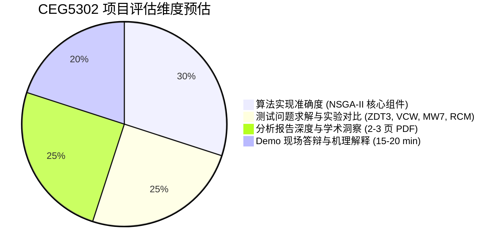

# CEG5302 项目交付规范与评分准则 (Project Requirements & Grading Criteria)

> [!NOTE]
> 本页面整合了来自官方项目文档 `materials/CEG5302 -  project overview.pdf` 的所有硬性格式规范、代码运行准则与学术报告结构要求。

---

## 1. 交付件硬性约束 (Hard Constraints)

### 1.1 压缩包封装 (Archive Spec)
- **唯一文件名**：`EC_Group_<xy>.zip`（其中 `<xy>` 必须为纯两位数字或实际分配组号，如 `EC_Group_05.zip`）。
- **根目录扁平化**：解压后直接包含 2 个目标文件，绝对不允许出现 `EC_Group_05/` 这样的父级或子级嵌套文件夹。
- **文件白名单**：
  - `report_<xy>.pdf`
  - `CEG5302_Group_Project_<xy>.ipynb`
  - 严禁携带 `.git/`、`__pycache__/`、`.DS_Store`、虚拟环境目录等无用附件。

### 1.2 Jupyter Notebook 执行规范
1. **代码整洁度与依赖**：
   - 依赖项仅允许使用标准的 Python 数据科学栈：`numpy`, `scipy`, `matplotlib`（以及基础工具库）。
   - 必须设置随机种子（Random Seed）以确保核心结果具有统计可复现性。
2. **执行状态保存**：
   - 提交的 `.ipynb` 必须在本地执行 `Restart & Run All`，确保所有单元格均有输出序号（例如 `[1], [2], ...`）。
   - 严禁提交未运行的空白输出 Notebook。
3. **动态图像生成**：
   - 所有散点图（Scatter Plot）、Pareto 前沿投影图、收敛迭代曲线必须由代码原生画出（如 `plt.scatter(...)`）。
   - 严禁使用 Markdown `` 形式插入外部截图。

### 1.3 学术研究报告规范 (`report_<xy>.pdf`)
- **页数**：严格 2 至 3 页（2-3 pages）。
- **版式**：单栏排版 (Single column)，不采用双栏会议格式。
- **字体与字号**：Times New Roman，正文字号 12 pt，行距单倍或 1.15 倍。
- **核心重点**：
  - 重点不是单纯罗列代码，而是对算法性能进行**机理分析（Mechanism Analysis）**；
  - 必须给出为什么在特定问题（如不连通前沿的 ZDT3 或存在边界约束的 MW7）上算法表现出某种收敛轨迹的深层原因。

---

## 2. 评分维度与评审重点 (Evaluation Rubrics)

根据课程大纲与指导说明，大作业从以下 4 个核心维度进行综合评审：

1. **算法实现的完整性与规范性 (Algorithmic Implementation - 30%)**：
   - 非支配排序算法（Fast Non-dominated Sorting）时间复杂度与分层逻辑；
   - 拥挤距离（Crowding Distance）在极值点与中间点的精确分配；
   - 模拟二进制交叉（SBX）与多项式变异（PM）的参数化实现；
   - 针对有约束优化的约束支配规则（Constrained Dominance Principle）。
2. **基准测试与可视化呈现 (Benchmarks & Experiments - 25%)**：
   - 四大基准函数（ZDT3、VCW、MW7、RCM）上的最终非支配解集分布；
   - 与理论真实 Pareto Front (True PF) 的对比图；
   - 收敛性与分布性评估指标（如 IGD、Spacing、Hypervolume）。
3. **技术报告洞察力 (Technical Insights & Report - 25%)**：
   - 分析 ZDT3 不连通 Pareto 边界对解分布均匀性的影响；
   - 讨论约束处理技术在不可行域穿越中的作用与退化现象；
   - 参数敏感度讨论（如交叉变异分布指数 $\eta_c, \eta_m$、种群规模）。
4. **Demo 现场表现 (Demo Presentation - 20%)**：
   - 15-20 分钟清晰汇报与代码走查；
   - 面对助教与老师关于算子细节与收敛机理的随机问答。
