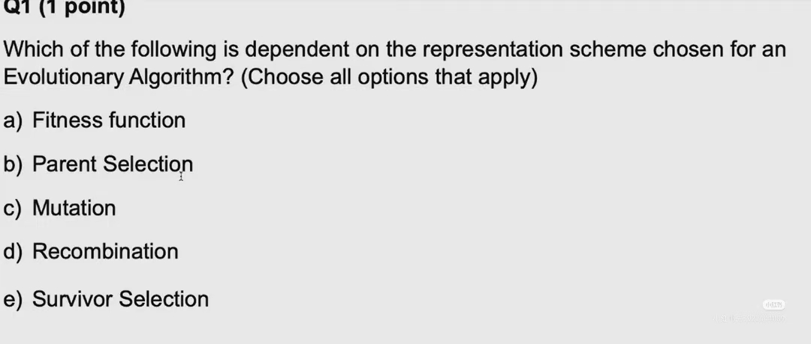
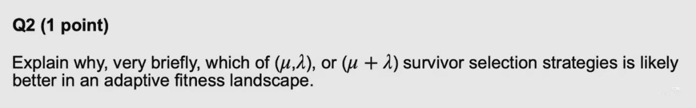
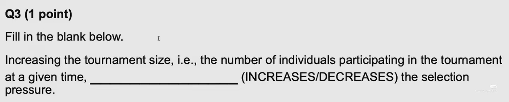
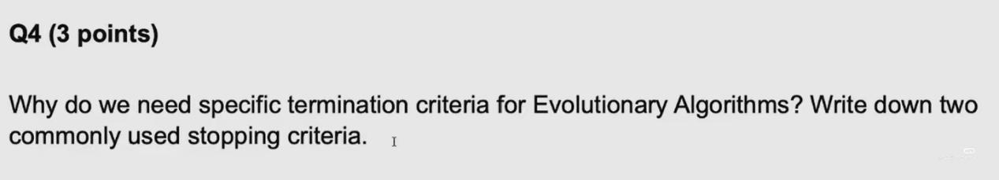
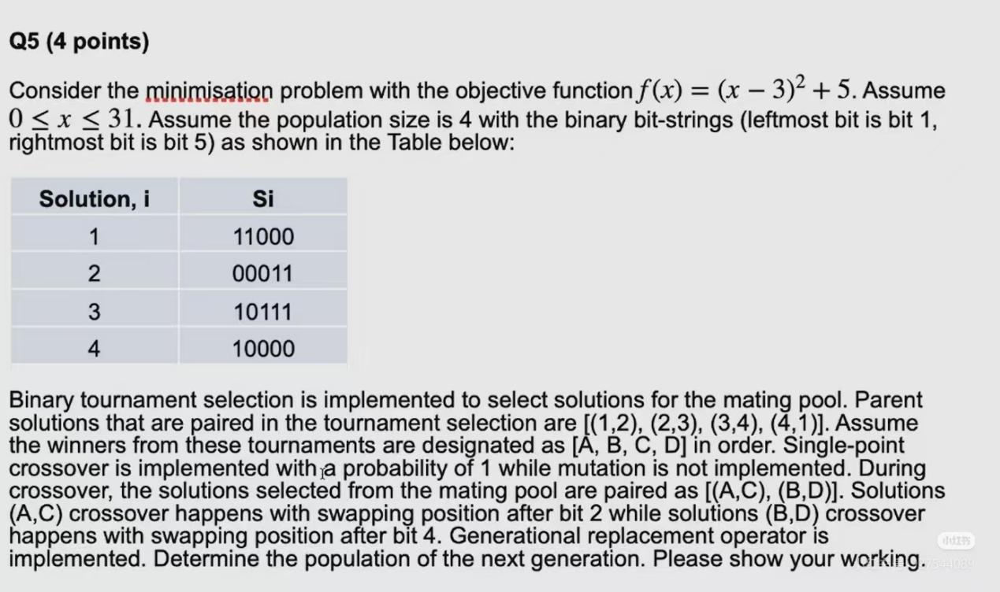
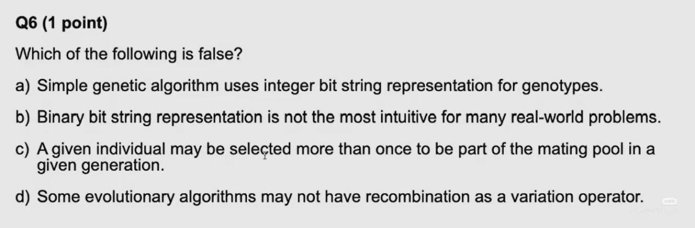
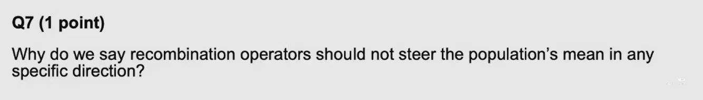
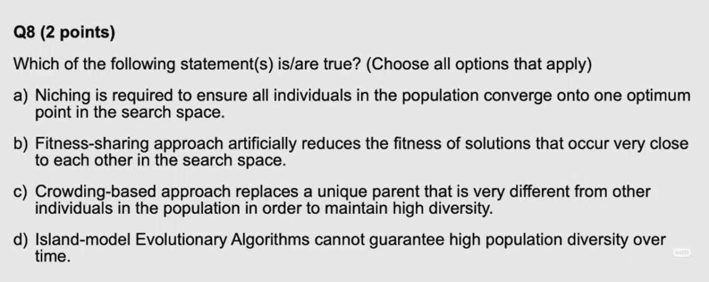
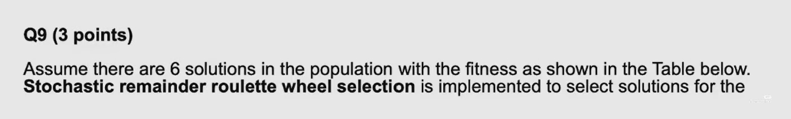
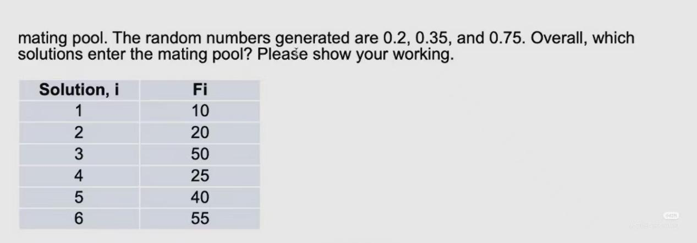

# CEG5302 往年测验真题与详细推导 (Past Quiz Archive & Worked Solutions)

> [!WARNING]
> **解题状态声明 (Solution Status)**：本页面所有题目解析与计算步骤均为学者与助教视角重构推导（`Solution status: derived / reconstructed`），非任课教师发布的官方评分标准。题目来源于历年随堂测验归档，仅供复习备考与算法机理推演。

---

## 测验基本信息 (Exam Metadata)

- **课程代码**：CEG5302 / EE5904
- **题目来源**：`materials/Repository of ungraded quizzes/quiz1.docx`
- **满分分值**：20 分 (20 Points)
- **题目数量**：11 道题目 (Q1 至 Q11)
- **考点覆盖**：编码表示 (Representation)、变异与重组算子 (Variation)、选择算子 (Selection)、适应度景观 (Fitness Landscape)、多样性保持与小生境 (Niching & Diversity)

---

## 题目总览表 (Question Map)

| 题号 | 分值 | 题型 | 核心考点 | 对应讲义 |
| :---: | :---: | :--- | :--- | :--- |
| **Q1** | 1 pt | 多项选择题 (MCQ) | 算子对编码表示方案的依赖性 | [[CEG5302-Lecture03-Binary-and-Integer-Representation\|Lecture 3: 编码与表示]] |
| **Q2** | 1 pt | 简答题 (Short Answer) | 自适应适应度景观下的 $(\mu, \lambda)$ 与 $(\mu+\lambda)$ 优劣 | [[CEG5302-Lecture04-Survivor-Selection-and-Selection-Pressure\|Lecture 4: 存活选择]] |
| **Q3** | 1 pt | 填空题 (Fill in Blank) | 锦标赛规模对选择压力的影响 | [[CEG5302-Lecture04-Survivor-Selection-and-Selection-Pressure\|Lecture 4: 选择压力]] |
| **Q4** | 3 pts | 简答题 (Short Answer) | 算法终止判据的必要性与常用指标 | [[CEG5302-Lecture02-EA-Seven-Components\|Lecture 2b: 算法框架]] |
| **Q5** | 4 pts | 完整计算题 (Calculation) | 位串二元锦标赛选择、单点交叉与代际替代全流程 | [[CEG5302-Lecture02-Canonical-GA-Worked-Example\|Lecture 2b]] / [[CEG5302-Lecture04-RWS-Tournament-and-Selection-Schemes\|Lecture 4]] |
| **Q6** | 1 pt | 单项选择题 (MCQ) | 标准遗传算法 (SGA) 的规范定义辨析 | [[CEG5302-Lecture02-Canonical-GA-Worked-Example\|Lecture 2b]] / [[CEG5302-Lecture03-Binary-and-Integer-Representation\|Lecture 3]] |
| **Q7** | 1 pt | 简答题 (Short Answer) | 交叉重组算子为何不应改变种群均值 | [[CEG5302-Lecture03-Real-Valued-Recombination\|Lecture 3: 算子设计原则]] |
| **Q8** | 2 pts | 多项选择题 (MCQ) | 适应度共享、拥挤机制与孤岛模型辨析 | [[CEG5302-Lecture04-Diversity-Maintenance-and-Niching\|Lecture 4: 多样性保持]] |
| **Q9** | 3 pts | 完整计算题 (Calculation) | 随机余数轮盘赌选择 (Stochastic Remainder RWS) 计算 | [[CEG5302-Lecture04-Population-Models-FPS-and-Ranking\|Lecture 4: 轮盘赌与随机余数]] |
| **Q10** | 1 pt | 简答题 (Short Answer) | 精英保留策略 (Elitism) 的优缺点分析 | [[CEG5302-Lecture04-Survivor-Selection-and-Selection-Pressure\|Lecture 4: 存活选择]] |
| **Q11** | 2 pts | 简答题 (Short Answer) | 锦标赛选择优于轮盘赌选择的典型应用场景 | [[CEG5302-Lecture04-RWS-Tournament-and-Selection-Schemes\|Lecture 4: 锦标赛机制]] |

---

## 逐题解析与详细推导 (Questions and Worked Solutions)

---

### Q1 (1 point) - 算子对表示方案的依赖性 (Representation Dependency)

**题目原文 (Original Question)**:
> Which of the following is dependent on the representation scheme chosen for an Evolutionary Algorithm? (Choose all options that apply)  
> a) Fitness function  
> b) Parent Selection  
> c) Mutation  
> d) Recombination  
> e) Survivor Selection  

**重构答案 (Reconstructed Answer)**:
- **正确选项**：**c) Mutation** 和 **d) Recombination**

**深入解析 (Detailed Rationale)**:
1. **变异算子 (Mutation) 与重组算子 (Recombination)**：属于**变异算子 (Variation Operators)**，它们直接作用于染色体基因型编码空间（Genotype Space）。例如：
   - 二进制编码使用位翻转变异（Bit-flip Mutation）与单点/两点交叉；
   - 实数编码使用高斯扰动（Gaussian Mutation）、多项式变异（Polynomial Mutation）与算术交叉（Arithmetic Crossover）；
   - 排列编码（如 TSP）必须使用保持无重复排列特性的算子，如交换变异（Swap）、逆转变异（Inversion）以及 PMX / OX 交叉。
   因此变异和重组算子的设计**高度依赖于具体的表示方案**。
2. **选择算子 (Parent Selection & Survivor Selection)**：选择算子工作在**适应度空间 (Fitness / Objective Space)**。无论是轮盘赌选择、锦标赛选择还是截断选择，算法只需读取每个个体的一个标量适应度值 $f(x)$，完全不需要了解个体底层是由 0/1 位串、浮点数组还是图结构表示的。因此选择算子是**独立于表示方案 (Representation-agnostic)** 的。
3. **适应度函数 (Fitness Function)**：适应度函数评估的是候选解的表现型（Phenotype）或解码后的解在目标函数中的表现，衡量解的优劣，其数学定义由优化问题本身决定，而选择算子与表示方式是算法解耦的模块。

---

### Q2 (1 point) - 自适应景观下的存活选择策略 ($(\mu,\lambda)$ vs $(\mu+\lambda)$)

**题目原文 (Original Question)**:
> Explain why, very briefly, which of $(\mu,\lambda)$, or $(\mu + \lambda)$ survivor selection strategies is likely better in an adaptive fitness landscape.

**重构答案 (Reconstructed Answer)**:
- **结论**：**$(\mu, \lambda)$ 策略更优**。

**深入解析 (Detailed Rationale)**:
- **$(\mu, \lambda)$ 策略（逗号选择 / 纯子代存活）**：每一代从 $\lambda$ 个新生成的子代中选出 $\mu$ 个优胜者，**上一代的所有父代个体被无条件丢弃**。
- **$(\mu + \lambda)$ 策略（加号选择 / 父子混合竞争）**：将 $\mu$ 个父代与 $\lambda$ 个子代合并为一个大小为 $\mu+\lambda$ 的池子，保留最好的 $\mu$ 个个体（具备完全的精英保留性质）。
- **在自适应/动态适应度景观（Adaptive / Dynamic Fitness Landscape）中**：
  - 目标函数的极值点和景观地形随时间动态改变。
  - 在 $(\mu+\lambda)$ 策略下，在过去的静态景观中取得高适应度的“旧父代”会因为历史分数霸占种群名额，无法被及时淘汰，从而导致种群**陷入对过去最优点的固守（Elitism Trap）**，降低了追踪移动目标的能力。
  - 相比之下，$(\mu,\lambda)$ 强制进行代际更迭，旧解被彻底遗弃，迫使种群持续产生新解并在当前更新后的景观上进行筛选，具备更好的动态自适应追踪能力与寿命容忍度。

---

### Q3 (1 point) - 锦标赛规模对选择压力的影响 (Tournament Size & Selection Pressure)

**题目原文 (Original Question)**:
> Fill in the blank below.  
> Increasing the tournament size, i.e., the number of individuals participating in the tournament at a given time, _______________ (INCREASES/DECREASES) the selection pressure.

**重构答案 (Reconstructed Answer)**:
- **填空**：**INCREASES**

**深入解析 (Detailed Rationale)**:
- 锦标赛规模 $k$ 代表每次随机抽取的竞争个体数量。
  - 当 $k = 1$ 时，每次抽取 1 个个体，该个体必定胜出，此时选择压力为 0（等概率均匀随机选择，毫无适应度偏差）。
  - 当 $k$ 增大时，任意一个适应度较低的个体要想胜出，要求它所遇到的其他 $k-1$ 个对手都比它还要差，这种概率随着 $k$ 的增加呈指数衰减。
  - 当 $k = N$ 时，锦标赛退化为纯确定性最佳选择，只有种群中真正的第一名才能在锦标赛中胜出，选择压力达到最大。
- 因此，增大锦标赛规模会**增加 (INCREASES)** 选择压力。

---

### Q4 (3 points) - 进化算法的终止判据 (Termination Criteria)

**题目原文 (Original Question)**:
> Why do we need specific termination criteria for Evolutionary Algorithms? Write down two commonly used stopping criteria.

**重构答案 (Reconstructed Answer)**:
1. **为什么需要明确的终止判据 (Why needed)**：
   - 进化算法是一类**随机启发式搜索算法 (Stochastic Heuristic Search)**。与具有确定性收敛证明的传统数学规划算法（如凸优化单纯形法或梯度下降法判别梯度的范数 $\nabla f \approx 0$）不同，EA 在运行过程中**无法内生性地知晓全局理论最优解是否已经达到**。如果没有显式的外部终止判据，算法将会陷入无休止的“选择-变异-评估”死循环。
2. **两类常用终止判据 (Two Commonly Used Stopping Criteria)**：
   - **计算预算耗尽判据 (Computational Budget / Limit)**：达到预设的最大迭代代数（Maximum Generations $G_{max}$）或最大适应度评估次数（Maximum Fitness Evaluations $N_{eval}$）。
   - **停滞收敛判据 (Stagnation / Convergence Threshold)**：种群的多样性低于预设阈值（如基因多样性崩溃），或者最优适应度在连续若干代（如连续 $k$ 代）内未发生显著提升（$\Delta f < \epsilon$）。
   - *(其他合理备选)*：已发现满足工程精度要求的解（$f(x) \le f_{target}$）。

---

### Q5 (4 points) - 种群进化手算全流程 (Full Evolutionary Step Calculation)

**题目原文 (Original Question)**:
> Consider the minimisation problem with the objective function $f(x) = (x - 3)^2 + 5$. Assume $0 \le x \le 31$. Assume the population size is 4 with the binary bit-strings (leftmost bit is bit 1, rightmost bit is bit 5) as shown in the Table below:
> 
> | Solution, $i$ | $s_i$ |
> | :---: | :---: |
> | 1 | 11000 |
> | 2 | 00011 |
> | 3 | 10111 |
> | 4 | 10000 |
> 
> Binary tournament selection is implemented to select solutions for the mating pool. Parent solutions that are paired in the tournament selection are $[(1,2), (2,3), (3,4), (4,1)]$. Assume the winners from these tournaments are designated as $[A, B, C, D]$ in order.  
> Single-point crossover is implemented with a probability of 1 while mutation is not implemented. During crossover, the solutions selected from the mating pool are paired as $[(A,C), (B,D)]$. Solutions $(A,C)$ crossover happens with swapping position after bit 2 while solutions $(B,D)$ crossover happens with swapping position after bit 4.  
> Generational replacement operator is implemented. Determine the population of the next generation. Please show your working.

**完整推导过程与题解 (Step-by-Step Worked Solution)**:

#### 步骤 1：解码位串并计算目标函数值 (Decoding & Objective Evaluation)
染色体为 5 位二进制无符号整数，最左侧为最高位（Bit 1，权重 $2^4=16$），最右侧为最低位（Bit 5，权重 $2^0=1$）。  
注意：本题为**极小化问题 (Minimisation problem)**，目标函数为 $f(x) = (x-3)^2 + 5$。**目标函数值越小，解越优！**

- **解 1 ($s_1 = 11000_2$)**：
  $$x_1 = 16 + 8 = 24$$
  $$f(x_1) = (24 - 3)^2 + 5 = 21^2 + 5 = 441 + 5 = 446$$
- **解 2 ($s_2 = 00011_2$)**：
  $$x_2 = 2 + 1 = 3$$
  $$f(x_2) = (3 - 3)^2 + 5 = 0^2 + 5 = 0 + 5 = 5$$
- **解 3 ($s_3 = 10111_2$)**：
  $$x_3 = 16 + 4 + 2 + 1 = 23$$
  $$f(x_3) = (23 - 3)^2 + 5 = 20^2 + 5 = 400 + 5 = 405$$
- **解 4 ($s_4 = 10000_2$)**：
  $$x_4 = 16$$
  $$f(x_4) = (16 - 3)^2 + 5 = 13^2 + 5 = 169 + 5 = 174$$

汇总初始种群评估表：

| 解 $i$ | 位串 $s_i$ | 十进制值 $x_i$ | 目标函数值 $f(x_i)$ | 优劣排序 (Minimization) |
| :---: | :---: | :---: | :---: | :---: |
| 1 | `11000` | 24 | 446 | 第 4 名 (最差) |
| 2 | `00011` | 3 | 5 | 第 1 名 (最好) |
| 3 | `10111` | 23 | 405 | 第 3 名 |
| 4 | `10000` | 16 | 174 | 第 2 名 |

---

#### 步骤 2：二元锦标赛选择生成交配池 (Binary Tournament Selection)
根据题目设定的锦标赛对决列表 $[(1,2), (2,3), (3,4), (4,1)]$，极小化问题中小者获胜：
1. **对决 1**：解 1 ($f=446$) vs 解 2 ($f=5$) $\implies$ 解 2 胜出。因此：
   $$A = s_2 = 00011$$
2. **对决 2**：解 2 ($f=5$) vs 解 3 ($f=405$) $\implies$ 解 2 胜出。因此：
   $$B = s_2 = 00011$$
3. **对决 3**：解 3 ($f=405$) vs 解 4 ($f=174$) $\implies$ 解 4 胜出。因此：
   $$C = s_4 = 10000$$
4. **对决 4**：解 4 ($f=174$) vs 解 1 ($f=446$) $\implies$ 解 4 胜出。因此：
   $$D = s_4 = 10000$$

因此，交配池中按序胜出的 4 个父代为：
$$[A, B, C, D] = [00011, 00011, 10000, 10000]$$

---

#### 步骤 3：执行单点交叉 (Single-Point Crossover)
交叉概率 $p_c = 1$，不执行变异。交配配对为 $[(A, C), (B, D)]$。

1. **配对 $(A, C)$ 交叉（切点在 Bit 2 之后）**：
   - 父代 $A = 00 \mid 011$
   - 父代 $C = 10 \mid 000$
   - 交换切点后面的片段（Bits 3-5）：
     - **子代 1 ($O_1$)**：取 $A$ 的前 2 位 + $C$ 的后 3 位：
       $$O_1 = 00000$$
     - **子代 2 ($O_2$)**：取 $C$ 的前 2 位 + $A$ 的后 3 位：
       $$O_2 = 10011$$

2. **配对 $(B, D)$ 交叉（切点在 Bit 4 之后）**：
   - 父代 $B = 0001 \mid 1$
   - 父代 $D = 1000 \mid 0$
   - 交换切点后面的片段（Bit 5）：
     - **子代 3 ($O_3$)**：取 $B$ 的前 4 位 + $D$ 的后 1 位：
       $$O_3 = 00010$$
     - **子代 4 ($O_4$)**：取 $D$ 的前 4 位 + $B$ 的后 1 位：
       $$O_4 = 10001$$

---

#### 步骤 4：代际替代确定下一代种群 (Generational Replacement)
根据**代际替代 (Generational Replacement)** 规则，新生成的 4 个子代完全替代上一代种群。

**下一代种群最终结果**：
- **个体 1**：`00000` (对应 $x = 0$, $f(0) = 14$)
- **个体 2**：`10011` (对应 $x = 19$, $f(19) = 261$)
- **个体 3**：`00010` (对应 $x = 2$, $f(2) = 6$)
- **个体 4**：`10001` (对应 $x = 17$, $f(17) = 201$)

---

### Q6 (1 point) - 遗传算法基础概念正误辨析 (GA Fundamentals)

**题目原文 (Original Question)**:
> Which of the following is false?  
> a) Simple genetic algorithm uses integer bit string representation for genotypes.  
> b) Binary bit string representation is not the most intuitive for many real-world problems.  
> c) A given individual may be selected more than once to be part of the mating pool in a given generation.  
> d) Some evolutionary algorithms may not have recombination as a variation operator.  

**重构答案 (Reconstructed Answer)**:
- **错误陈述（正确选项）**：**a) Simple genetic algorithm uses integer bit string representation for genotypes.**

**深入解析 (Detailed Rationale)**:
- **选项 a 为假**：由 Holland 提出并经 Goldberg 规范化的**标准遗传算法 (Simple Genetic Algorithm, SGA)** 严格采用**二进制位串 (Binary Bit String, $\{0, 1\}^L$)** 作为基因型表示，并非整数字符串（Integer String）。
- **选项 b 为真**：对于绝大多数实际工程优化问题（如高维连续变量、机器调度、路径规划），纯二进制位串存在汉明悬崖（Hamming Cliff）和冗余编解码开销，往往实数编码或排列编码更加直观有效。
- **选项 c 为真**：在锦标赛选择或轮盘赌选择中，抽样是有放回的（Selection with replacement），一个适应度高的优秀个体完全可以多次获胜并复制多份进入交配池。
- **选项 d 为真**：例如进化策略（Evolution Strategies, ES）或某些演化规划（Evolutionary Programming, EP）中，可以仅依靠变异（如高斯变异）而不启用重组算子。

---

### Q7 (1 point) - 交叉重组算子的设计统计哲学 (Recombination Population Mean)

**题目原文 (Original Question)**:
> Why do we say recombination operators should not steer the population's mean in any specific direction?

**重构答案 (Reconstructed Answer)**:
- **核心论点**：
  重组算子（Recombination / Crossover）的本质职责是**多样性重组与构件混合（Exploration / Exchanging Building Blocks）**，必须在期望上保持**统计无偏性（Unbiased）**。进化的**定向驱动力（Directional Steering）**必须完全交由**选择算子（Selection Pressure）**依据适应度景观来主导。

**深入解析 (Detailed Rationale)**:
- 如果重组算子自身引入了某种系统性偏置（Directional Bias / Algorithmic Drift，例如总是倾向于生成使变量变大或变小的子代），算法就会沿着算子的内生几何偏差漂移，而不是顺着适应度景观的指引前进。
- 因此，良好的算子正交化设计要求：**重组算子只负责在父代之间创造合理的中介点或组合，保证期望均值等于父代均值；而选择算子负责根据适应度淘汰劣解，决定演化的前进方向**。

---

### Q8 (2 points) - 小生境与种群多样性保持机制 (Niching & Diversity Maintenance)

**题目原文 (Original Question)**:
> Which of the following statement(s) is/are true? (Choose all options that apply)  
> a) Niching is required to ensure all individuals in the population converge onto one optimum point in the search space.  
> b) Fitness-sharing approach artificially reduces the fitness of solutions that occur very close to each other in the search space.  
> c) Crowding-based approach replaces a unique parent that is very different from other individuals in the population in order to maintain high diversity.  
> d) Island-model Evolutionary Algorithms cannot guarantee high population diversity over time.  

**重构答案 (Reconstructed Answer)**:
- **正确选项**：**b) Fitness-sharing approach artificially reduces the fitness of solutions that occur very close to each other in the search space.** 和 **d) Island-model Evolutionary Algorithms cannot guarantee high population diversity over time.**

**深入解析 (Detailed Rationale)**:
- **陈述 a 错误**：小生境（Niching）的核心目标是解决**多峰优化（Multimodal Optimization）**问题，即在多个不同的局部或全局最优峰处**同时维持多个子种群**，恰恰是为了**防止**所有个体全部坍缩收敛到单一极值点。
- **陈述 b 正确**：适应度共享（Fitness Sharing）通过计算每个个体在其小生境半径 $\sigma_{share}$ 内的邻居数量（小生境计数 $m_i = \sum \operatorname{sh}(d_{ij})$），将个体的原始适应度降级为共享适应度 $f'_i = \frac{f_i}{m_i}$。聚集在同一区域的个体越多，$m_i$ 越大，其被人工惩罚削减的幅度就越大。
- **陈述 c 错误**：拥挤机制（Crowding）的基本原则是“同类替换”（Like replaces like）——新个体生成后，在种群中找到与其**最相似（距离最近）**的父代进行竞争替换，以保护那些具有独特基因型的差异个体不被轻易消灭，陈述 c 颠倒了这一逻辑。
- **陈述 d 正确**：孤岛模型（Island Model）虽然通过隔离演化减缓了基因同质化，但在长期运行中，若迁移策略设置不当（如迁移率过高或拓扑全连接），或者在无限长时间极限下，各个孤岛依然会逐步同化，无法在无外部机制保障下永久锁死高多样性。

---

### Q9 (3 points) - 随机余数轮盘赌选择手算 (Stochastic Remainder RWS Calculation)

**题目原文 (Original Question)**:
> Assume there are 6 solutions in the population with the fitness as shown in the Table below. Stochastic remainder roulette wheel selection is implemented to select solutions for the mating pool. The random numbers generated are 0.2, 0.35, and 0.75. Overall, which solutions enter the mating pool? Please show your working.
> 
> | Solution, $i$ | $F_i$ |
> | :---: | :---: |
> | 1 | 10 |
> | 2 | 20 |
> | 3 | 50 |
> | 4 | 25 |
> | 5 | 40 |
> | 6 | 55 |

**完整推导过程与题解 (Step-by-Step Worked Solution)**:

#### 步骤 1：计算种群总适应度与个体期望复制数 (Expected Number of Copies)
- 种群大小 $N = 6$。
- 种群总适应度：
  $$\sum_{k=1}^{6} F_k = 10 + 20 + 50 + 25 + 40 + 55 = 200$$
- 每个解的期望复制数公式为：
  $$e_i = N \cdot \frac{F_i}{\sum F_k} = 6 \cdot \frac{F_i}{200} = 0.03 \cdot F_i$$

逐个计算期望值：
- $e_1 = 0.03 \times 10 = 0.30$
- $e_2 = 0.03 \times 20 = 0.60$
- $e_3 = 0.03 \times 50 = 1.50$
- $e_4 = 0.03 \times 25 = 0.75$
- $e_5 = 0.03 \times 40 = 1.20$
- $e_6 = 0.03 \times 55 = 1.65$
*(校验和：$0.30 + 0.60 + 1.50 + 0.75 + 1.20 + 1.65 = 6.00$)*

---

#### 步骤 2：第一阶段——整数部分确定性分配 (Deterministic Allocation)
每个解根据其期望复制数的整数部分 $\lfloor e_i \rfloor$ 直接获得确定性入选配额：
- 解 1：$\lfloor 0.30 \rfloor = 0$ 份
- 解 2：$\lfloor 0.60 \rfloor = 0$ 份
- 解 3：$\lfloor 1.50 \rfloor = 1$ 份（解 3 确定入选 1 次）
- 解 4：$\lfloor 0.75 \rfloor = 0$ 份
- 解 5：$\lfloor 1.20 \rfloor = 1$ 份（解 5 确定入选 1 次）
- 解 6：$\lfloor 1.65 \rfloor = 1$ 份（解 6 确定入选 1 次）

第一阶段已确定分配名额：$0 + 0 + 1 + 0 + 1 + 1 = 3$ 份。  
交配池剩余待分配名额：$N - 3 = 6 - 3 = 3$ 个空位。

---

#### 步骤 3：第二阶段——小数余数轮盘赌分配 (Roulette Wheel on Remainders)
计算每个解的小数余数 $r_i = e_i - \lfloor e_i \rfloor$：
- $r_1 = 0.30$
- $r_2 = 0.60$
- $r_3 = 0.50$
- $r_4 = 0.75$
- $r_5 = 0.20$
- $r_6 = 0.65$

余数总和为：
$$\sum_{i=1}^{6} r_i = 0.30 + 0.60 + 0.50 + 0.75 + 0.20 + 0.65 = 3.00$$

根据**随机余数轮盘赌机制**，将小数余数归一化构建轮盘赌选择区间，归一化概率 $p'_i = \frac{r_i}{\sum r_k} = \frac{r_i}{3.00}$：

| 解 $i$ | 余数 $r_i$ | 相对概率 $p'_i$ | 累积区间 (Cumulative Range $[C_{low}, C_{high})$) |
| :---: | :---: | :---: | :---: |
| **1** | 0.30 | $0.30 / 3.00 = 0.1000$ | $[0.0000, 0.1000)$ |
| **2** | 0.60 | $0.60 / 3.00 = 0.2000$ | $[0.1000, 0.3000)$ |
| **3** | 0.50 | $0.50 / 3.00 \approx 0.1667$ | $[0.3000, 0.4667)$ |
| **4** | 0.75 | $0.75 / 3.00 = 0.2500$ | $[0.4667, 0.7167)$ |
| **5** | 0.20 | $0.20 / 3.00 \approx 0.0667$ | $[0.7167, 0.7833)$ |
| **6** | 0.65 | $0.65 / 3.00 \approx 0.2167$ | $[0.7833, 1.0000)$ |

---

#### 步骤 4：根据给定随机数判定入选个体 (Random Number Mapping)
题目给定的 3 个随机数为：$0.2, 0.35, 0.75$。逐一查表投针：
1. **随机数 0.2**：
   $$0.2 \in [0.1000, 0.3000) \implies \text{选中 } \mathbf{Solution\ 2}$$
2. **随机数 0.35**：
   $$0.35 \in [0.3000, 0.4667) \implies \text{选中 } \mathbf{Solution\ 3}$$
3. **随机数 0.75**：
   $$0.75 \in [0.7167, 0.7833) \implies \text{选中 } \mathbf{Solution\ 5}$$

---

#### 步骤 5：最终交配池汇总 (Final Mating Pool Composition)
综合确定性阶段与随机余数轮盘赌阶段的结果：

| 解编号 $i$ | 第一阶段 (确定分配) | 第二阶段 (余数轮盘赌) | 最终交配池副本总数 |
| :---: | :---: | :---: | :---: |
| **Solution 1** | 0 | 0 | **0** |
| **Solution 2** | 0 | 1 (来自随机数 0.2) | **1** |
| **Solution 3** | 1 | 1 (来自随机数 0.35) | **2** |
| **Solution 4** | 0 | 0 | **0** |
| **Solution 5** | 1 | 1 (来自随机数 0.75) | **2** |
| **Solution 6** | 1 | 0 | **1** |
| **合计 (Total)** | **3** | **3** | **6** |

**最终结论**：
进入交配池的解为：**1 个 Solution 2、2 个 Solution 3、2 个 Solution 5、1 个 Solution 6**。

> [!NOTE]
> *(备选解析视角 - 伯努利独立试验法)*：在某些文献变体中，余数 $r_i$ 直接作为独立投掷伯努利试验的接受概率（若随机数小于 $r_i$ 则入选）。但在本题中，题目明确命名为 "Stochastic remainder **roulette wheel selection**" 并严格给出 3 个随机数对应 3 个剩余空位，上述归一化轮盘赌映射为最严谨标准推导。

---

### Q10 (1 point) - 精英保留策略的优缺点 (Elitism Trade-offs)

**题目原文 (Original Question)**:
> Write down one advantage and one disadvantage of having Elitism in an Evolutionary Algorithm.

**重构答案 (Reconstructed Answer)**:
- **优点 (Advantage)**：
  **确保单调非递减的收敛性（Preserves Historical Best Fitness）**。保证了演化历史中迄今为止发现的最优解绝不会因为随机交叉、突变或选择抽样的随机性而意外丢失，从而在理论上保证全局最优解不会退化。
- **缺点 (Disadvantage)**：
  **导致种群多样性过快流失与早熟收敛（Premature Convergence）**。若精英个体处于局部极值附近，反复克隆进入下一代会施加过高的选择压力，导致整个种群迅速被该局部次优解的“后代”占领，失去跳出局部最优的能力。

---

### Q11 (2 points) - 锦标赛选择优于轮盘赌选择的场景 (Tournament vs Roulette Wheel Selection)

**题目原文 (Original Question)**:
> Write down two scenarios in which Tournament Selection is preferred over Roulette Wheel Selection.

**重构答案 (Reconstructed Answer)**:
写出以下任意两点即可得分：

1. **适应度存在负值、零值或具有大常数偏移的场景 (Negative, Zero, or Arbitrarily Scaled Fitness)**：
   - 轮盘赌选择要求每个解的适应度必须是严格非负的（$F_i > 0$），以便计算累加概率 $\frac{F_i}{\sum F_k}$。当遇到极小化问题、适应度为负数或适应度差异极小时，轮盘赌需要依赖复杂的线性尺度变换（Scaling / Windowing）；
   - 而锦标赛选择**仅依赖于解之间的相对排序（$f(A) < f(B)$）**，对适应度的绝对数值、平移和单调递增变换完全不敏感。

2. **多目标优化（MOO）或非标量比较场景 (Pareto Ranking / Multi-Objective Scenarios)**：
   - 在如 NSGA-II 等多目标进化算法中，解的优劣是通过非支配分层（Non-dominated Rank）与拥挤距离（Crowding Distance）进行偏序比较的，并不存在单一标量适应度值之和；
   - 锦标赛选择天然支持这种多准则分层偏序对决（Crowded Comparison Operator），而基于总和比例的轮盘赌无法直接应用。

3. **大规模并行与分布式计算场景 (Parallel / Distributed Computing)**：
   - 轮盘赌选择每次抽样都需要全种群全局同步以计算适应度总和 $\sum_{i=1}^N F_i$，通信开销极大；
   - 锦标赛选择只需在 $k$ 个局部个体之间进行局部通信和比较，易于实现高效的异步分布式与 GPU 并行加速。
