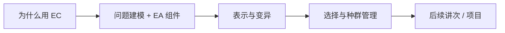
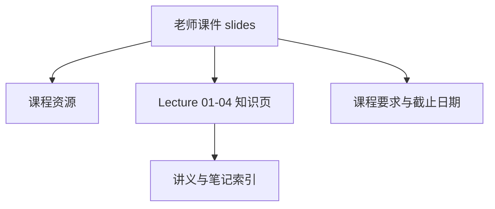

# CEG5302 课程总览

> 本页属于：CEG5302 课程入口
>
> 前置知识：无
>
> 预计阅读时间：5 分钟

## 课程范围

CEG5302 *Evolutionary Computation and Applications*（进化计算与应用）围绕进化计算（EC）的原理与工程应用展开。当前 Wiki 覆盖到 Lecture 4（截至 2026-09-03），知识点按 lecture 拆分，来源以老师课件（slides）为准，个人笔记仅作辅助核对。

| 项目 | 当前状态 |
|---|---|
| 课程进度 | Lecture 4（2026-09-03） |
| 讲义覆盖 | Lecture 01–04，已按主题拆页 |
| 授课安排 | 第 1–11 周每周四 18:00–20:45 |
| 当前 assessment | 3 次测试 + 编程作业 + 小组 project |
| 材料版本 | AY2026/27 |

## 课程主线

图 1：CEG5302 四讲主线（自制，依据课件整理；2026-09-03）。

- **Lecture 1**：EC 的动机、四类问题、基本循环。
- **Lecture 2**：`input → model → output` 的问题分类、单目标优化、复杂度、EA 七大组件与 canonical GA。
- **Lecture 3**：五种表示（binary / integer / real / permutation / tree）各自的变异与重组算子。
- **Lecture 4**：parent/survivor selection、选择压力与多样性维持（niching）。

## 资料与页面关系

图 2：CEG5302 页面关系（自制，依据课程文件整理；2026-09-03）。

## 快速入口

- [[CEG5302-课程资源总览]]：老师课件、个人笔记与工具入口。
- [[CEG5302-课程要求与截止日期]]：权重、时间线、提交物和 Open Questions。
- [[CEG5302-讲义与笔记索引]]：以老师课件为准的 Lecture 01–04 主题拆分页。
- [[CEG5302-当前进度与待补内容]]：已完成、待补内容和开放问题。

## 来源

- 课件目录：本地 `D:\AAA-xqy\NUS\CEG5302\slides\`（PDF 原件；本机核对）。
- 个人笔记：`D:\AAA-xqy\NUS\CEG5302\notes\lecture\`（中文/英文成对，仅作辅助参考）。
- 课程要求：`D:\AAA-xqy\NUS\CEG5302\list.md`（行政/考核信息）。
- 核对日期：2026-09-03。

## 下一步

- 上一页：[[Home]]
- 下一页：[[CEG5302-课程资源总览]]
- 返回：[[Home]]

## 更新日志

- 2026-09-03：建立课程入口，覆盖 Lecture 01–04 并记录当前状态。
