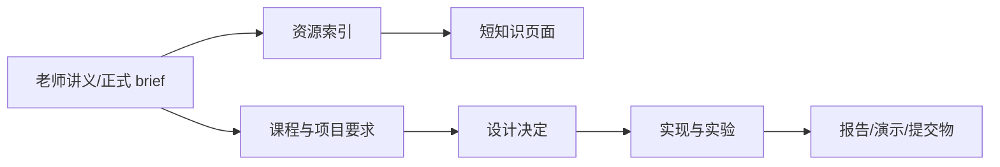

# NUS Coursework Wiki

> AY2026/27 · CEG5104（Week 3）· CEG5201（Week 04）· CEG5301（Week 4）· CEG5302（Lecture 05）  
> 记录课程要求、老师讲义、CA/consultation 与个人 coursework 产出。

## 当前概览

| 项目 | 当前状态 |
|---|---|
| 进行中的课程 | CEG5104、CEG5201、CEG5301、CEG5302 |
| CEG5104 进度 | Week 3 |
| CEG5201 进度 | Week 04 |
| CEG5301 进度 | Week 4（Part I） |
| CEG5302 进度 | Lecture 05 |
| Wiki 知识覆盖 | CEG5104 Week 01–03；CEG5201 Week 01–03；CEG5301 Week 01–04；CEG5302 Lecture 01–05 |
| 全站健康度 | [[Wiki状态]] |

> [!IMPORTANT]
> CEG5201 的 CA1 report 提交渠道/文件命名及 2026-10-06 in-person evaluation 地点变更，仍需以最新 Canvas 公告为准。CEG5302 的三次测试与编程作业细则仍待 Canvas 公布（NSGA-II 项目已由 project overview 明确）。CEG5301 的作业/期末考试时间表与细则尚未公告。CEG5104 的期末日期在课件中标注为 2024 与 2026 假期冲突，需核实。

## 课程工作台

### CEG5104

- [[CEG5104-课程总览]]：进入 CEG5104 课程入口与当前状态。
- [[CEG5104-课程资源总览]]：查找课件、个人笔记与工具入口。
- [[CEG5104-课程要求与截止日期]]：核对考核构成、考试规则与 Open Questions。
- [[CEG5104-讲义与笔记索引]]：以老师课件为准，按周阅读 Week 01–03 短页面。

### CEG5201

- [[CEG5201-课程总览]]：进入 CEG5201 课程入口与当前状态。
- [[CEG5201-课程资源总览]]：查找课件、CA brief、Topics Guide、Canvas 入口和工具。
- [[CEG5201-课程要求与截止日期]]：核对权重、提交物、时间线与仍未确认的规则。
- [[CEG5201-讲义与笔记索引]]：以老师讲义为准，按主题阅读 Week 01–03 短页面。

### CEG5301

- [[CEG5301-课程总览]]：进入 CEG5301 课程入口与当前状态。
- [[CEG5301-课程资源总览]]：查找课件、个人笔记与工具入口。
- [[CEG5301-课程要求与截止日期]]：核对考核构成与 Open Questions。
- [[CEG5301-讲义与笔记索引]]：以老师课件为准，按周阅读 Week 01–04 短页面。

### CEG5302

- [[CEG5302-课程总览]]：进入 CEG5302 课程入口与当前状态。
- [[CEG5302-课程资源总览]]：查找课件、个人笔记与工具入口。
- [[CEG5302-课程要求与截止日期]]：核对权重、时间线、提交物与 Open Questions。
- [[CEG5302-讲义与笔记索引]]：以老师课件为准，按讲阅读 Lecture 01–05 短页面。

## 学习与产出链

图 1：课程资料到 coursework 产出的追踪流程（自制，依据课程文件整理；2026-09-01）。

## 使用规则

| 内容 | 主来源 | Wiki 的处理方式 |
|---|---|---|
| 课程与提交要求 | 最新 brief、rubric、Canvas/教师公告 | 记录依据、核实日期和 Open Questions |
| 课堂知识 | 老师讲义 | 将长 PDF 按主题拆页；注明文件与页码 |
| Consultation | 实际教师/TA 答复 | 记录答复、日期、影响和行动项 |
| 个人 notebook | 自己的课堂参考 | 用于定位重点和疑问，不作为正式知识主来源 |

> [!NOTE]
> 未来新增课程时，沿用“资源 / 要求 / 讲次·周次知识 / 项目产出”结构，并同步 Home、`_Sidebar.md`、`_META.md` 与 [[Wiki状态]]。

## 下一步

- 当前页：Home
- 下一页：[[Wiki状态]]
- 课程入口：[[CEG5104-课程总览]] · [[CEG5201-课程总览]] · [[CEG5301-课程总览]] · [[CEG5302-课程总览]]

## 更新日志

- 2026-09-01：改用 Markdown、Wiki 链接、表格和引用组织首页，移除内容层的 HTML 卡片与容器。
- 2026-09-01：建立首批 CEG5201 导航、资源、要求、CA1 Consultation 和 Week 01–03 页面。
- 2026-09-03：新增 CEG5302 课程命名空间与 Lecture 01–04 知识页，并在首页建立双课程工作台。
- 2026-09-07：新增 CEG5301 课程命名空间与 Week 01–04 知识页（Part I 神经网络），并在首页建立三课程工作台。
- 2026-09-07：新增 CEG5104 课程命名空间与 Week 01–03 知识页，并将 CEG5302 扩展至 Lecture 05（约束处理）与项目细则，首页建立四课程工作台。
