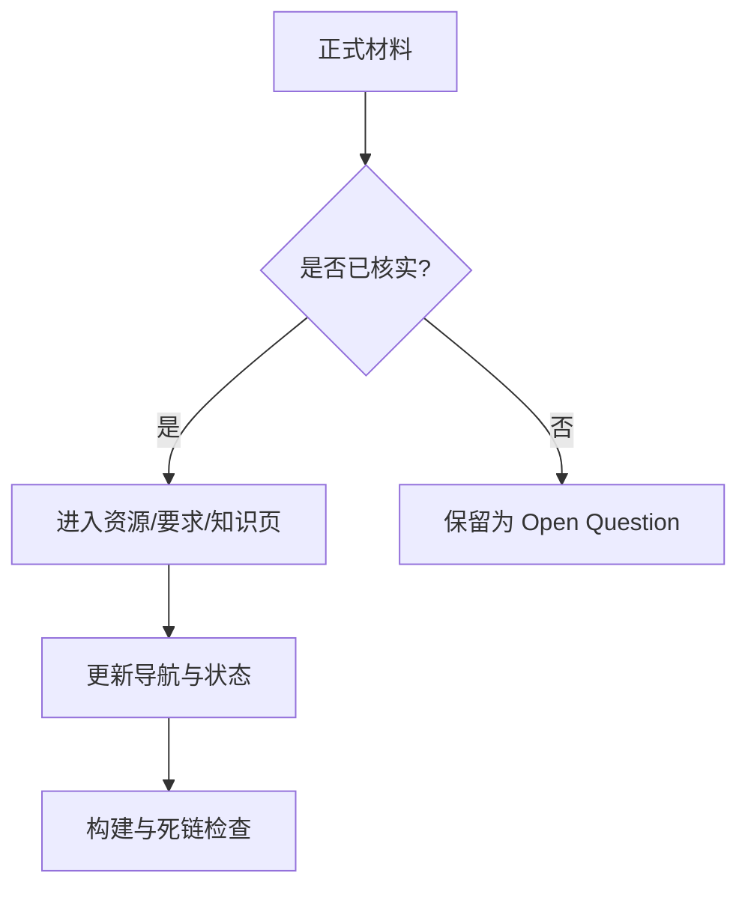

# Wiki 状态

> 本页属于：首页 / 状态
> 前置知识：[[Home]]
> 预计阅读时间：5 分钟

| 指标 | 当前值 |
|---|---:|
| 进行中的课程 | 1 |
| 公开内容页 | 25 |
| 已知内部死链 | 0 |
| 最新课程进度 | Week 04 |

## 当前覆盖

| 板块 | 状态 | 覆盖范围 |
|---|---|---|
| 首页与全站导航 | 已建立 | 课程仪表盘、Wiki 状态、侧边栏 |
| CEG5201 课程资源 | 已建立 | Week 01–03 讲义、CA 文件、Canvas/工具入口 |
| 课程要求 | 已建立，持续核实 | CA1/CA2 时间线、权重和已知提交规则 |
| CA1 Consultation | 页面已建立 | 要求、Topics Guide、提交物、问题与答复模板 |
| Week 01–03 | 已拆页 | 每周 3 个主题短页 |
| Week 04 及以后 | 待补 | 取得并核对正式讲义后增量生成 |
| CA1 个人产出 | 待补 | 选题、论文、分析、报告和 PPT |
| CA2 | 等待 brief | 不提前推断项目题目和评分 |

## 内容健康度

图 1：Wiki 增量更新检查流程（自制；2026-09-01）。

> [!TIP]
> **当前构建状态：**本地 MkDocs 严格构建通过；内部 Wiki 链接检查未发现死链。Mermaid 11.17.2 已固定在仓库构建依赖中，可离线渲染为 SVG。

> [!NOTE]
> **GitHub Wiki 的图表限制：**本地 MkDocs 会渲染 Mermaid。GitHub Wiki 原生页面可能把 Mermaid fenced block 显示为代码；需要远端一致显示时，应将关键图导出为 PNG/SVG 并作为附件发布。

## 来源与维护边界

- `_META.md` 是维护者使用的详细状态账本；本页是面向阅读者的状态摘要。
- 正式来源优先级：assessment brief/rubric/公告 → 老师讲义 → 教师/TA 答复 → 个人笔记。
- 原始课程文件保留在 `D:\Desktop\xqy\NUS\CEG5201`；Wiki 默认只保存 Markdown 和经过选择的公开附件。
- 每次增加页面时同步更新 Home、`_Sidebar.md`、`_META.md` 和本页。

## 近期维护队列

1. 根据实际 CA1 consultation 填写教师答复、最终选题和行动项。
2. 获取 Week 04 正式讲义后按主题拆页。
3. 为最依赖课堂图形的页面选择老师原图，并注明文件与页码。
4. 在 CA1 个人产出出现后建立要求 → 证据 → 提交物的追踪页。

## 下一步

- 上一页：[[Home]]
- 下一页：[[CEG5201-课程总览]]
- 返回：[[Home]]

## 更新日志

- 2026-09-01：新增首页子 tab，用于展示覆盖范围、构建健康度和近期维护队列。
