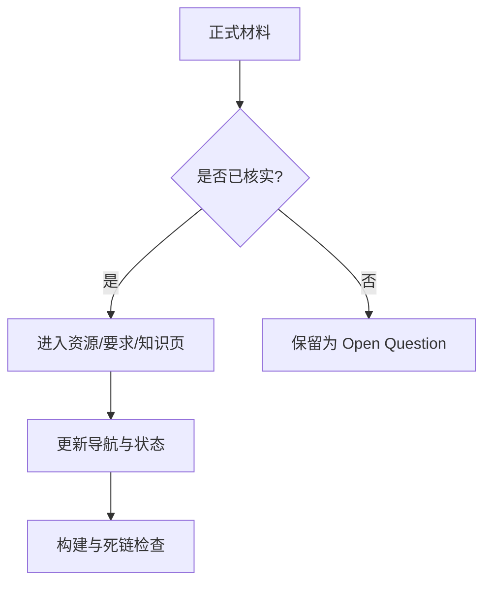

# Wiki 状态

> 本页属于：首页 / 状态
> 前置知识：[[Home]]
> 预计阅读时间：5 分钟

| 指标 | 当前值 |
|---|---:|
| 进行中的课程 | 4 |
| 公开内容页 | 89 |
| 已知内部死链 | 0 |
| 最新课程进度 | CEG5104 Week 3；CEG5201 Week 04；CEG5301 Week 4（Part I）；CEG5302 Lecture 05 |

## 当前覆盖

| 板块 | 状态 | 覆盖范围 |
|---|---|---|
| 首页与全站导航 | 已建立 | 课程仪表盘、Wiki 状态、侧边栏 |
| CEG5104 课程资源 | 已建立 | Week 01–03 课件、双语笔记、list.md |
| CEG5104 课程要求 | 已建立 | CA1/CA2 权重、期末日期（待核实）、考试范围 |
| CEG5104 Week 01 | 已拆页 | 4 个主题短页 |
| CEG5104 Week 02 | 已拆页 | 4 个主题短页 |
| CEG5104 Week 03 | 已拆页 | 4 个主题短页 |
| CEG5104 Week 4 及以后 | 待补 | 取得正式课件后增量生成 |
| CEG5201 课程资源 | 已建立 | Week 01–03 讲义、CA 文件、Canvas/工具入口 |
| CEG5201 课程要求 | 已建立，持续核实 | CA1/CA2 时间线、权重和已知提交规则 |
| CEG5201 CA1 Consultation | 页面已建立 | 要求、Topics Guide、提交物、问题与答复模板 |
| CEG5201 Week 01–03 | 已拆页 | 每周 3 个主题短页 |
| CEG5201 Week 04 及以后 | 待补 | 取得并核对正式讲义后增量生成 |
| CEG5201 CA1/CA2 产出 | 待补 | 不提前推断项目题目和评分 |
| CEG5301 课程资源 | 已建立 | Part I Week 01–04 课件、双语笔记索引 |
| CEG5301 课程要求 | 已建立 | 考核构成（CA 50% / Final 50%）与开放问题 |
| CEG5301 Week 01 | 已拆页 | 3 个主题短页 |
| CEG5301 Week 02 | 已拆页 | 3 个主题短页 |
| CEG5301 Week 03 | 已拆页 | 3 个主题短页 |
| CEG5301 Week 04 | 已拆页 | 4 个主题短页 |
| CEG5301 Week 5–6（Part I）及 Part II | 待补 | 取得正式课件后增量生成 |
| CEG5302 课程资源 | 已建立 | Lecture 01–05 课件、project overview、quiz、笔记索引 |
| CEG5302 课程要求 | 已建立 | 测试/编程作业/project 细则（NSGA-II 已明确） |
| CEG5302 Lecture 01 | 已拆页 | 3 个主题短页 |
| CEG5302 Lecture 02 | 已拆页 | 4 个主题短页（2a + 2b） |
| CEG5302 Lecture 03 | 已拆页 | 6 个主题短页 |
| CEG5302 Lecture 04 | 已拆页 | 5 个主题短页 |
| CEG5302 Lecture 05 | 已拆页 | 3 个主题短页（约束处理） |
| CEG5302 Lecture 06 及以后 | 待补 | 取得正式课件后增量生成 |

## 内容健康度

图 1：Wiki 增量更新检查流程（自制；2026-09-01）。

> [!TIP]
> **当前构建状态：**本地 MkDocs 严格构建通过；内部 Wiki 链接检查未发现死链。Mermaid 11.17.2 已固定在仓库构建依赖中，可离线渲染为 SVG。

> [!NOTE]
> **GitHub Wiki 的图表限制：**本地 MkDocs 会渲染 Mermaid。GitHub Wiki 原生页面可能把 Mermaid fenced block 显示为代码；需要远端一致显示时，应将关键图导出为 PNG/SVG 并作为附件发布。

## 来源与维护边界

- `_META.md` 是维护者使用的详细状态账本；本页是面向阅读者的状态摘要。
- 正式来源优先级：assessment brief/rubric/公告 → 老师讲义 → 教师/TA 答复 → 个人笔记。
- CEG5104、CEG5201、CEG5301 与 CEG5302 原始课程文件以各自的 GitHub Release 资产提供；Wiki 默认只保存 Markdown 和经过选择的公开附件。
- 每次增加页面时同步更新 Home、`_Sidebar.md`、`_META.md` 和本页。

## 近期维护队列

1. 根据实际 CA1 consultation 填写 CEG5201 教师答复、最终选题和行动项。
2. 获取 CEG5201 Week 04 正式讲义后按主题拆页。
3. 复核 CEG5302 Lecture 1（扫描版课件）的 slide 编号引用。
4. 取得 CEG5302 Lecture 06 及以后课件后增量拆页。
5. 在 CEG5302 三次测试/编程作业细则公布后更新要求页。
6. 取得 CEG5301 Week 5–6（Part I）与 Part II 强化学习课件后增量拆页。
7. 在 CEG5301 作业/期末考试细则公布后更新要求页。
8. 取得 CEG5104 Week 4 及以后（移动性/5G）课件后增量拆页；核实期末日期与 CA1/CA2 细则。

## 下一步

- 上一页：[[Home]]
- 下一页：[[CEG5104-课程总览]]
- 返回：[[Home]]

## 更新日志

- 2026-09-01：新增首页子 tab，用于展示覆盖范围、构建健康度和近期维护队列。
- 2026-09-03：纳入 CEG5302（Lecture 01–04），内容页增至 49，更新覆盖表与维护队列。
- 2026-09-07：纳入 CEG5301（Part I Week 01–04），内容页增至 68，更新覆盖表与维护队列。
- 2026-09-07：纳入 CEG5104（Week 01–03）与 CEG5302 Lecture 05，内容页增至 89，更新覆盖表与维护队列。
- 2026-09-07：全站图解装修——知识页扩写至约 700–1000 字，新增 54 页 Mermaid 与 16 张课件原图（page/assets），引入资产管道并保证预览/发布可解析。
